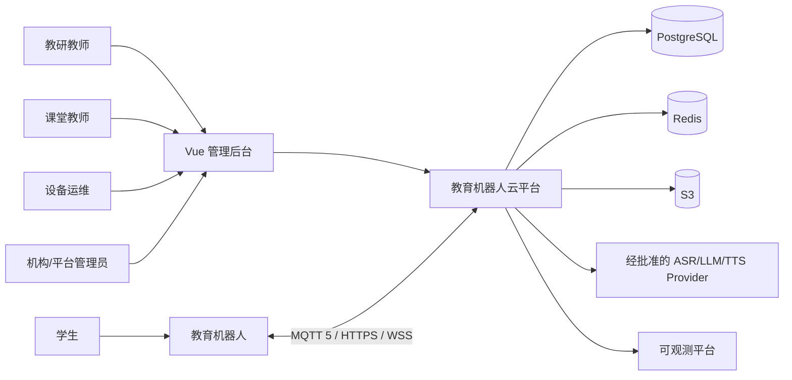
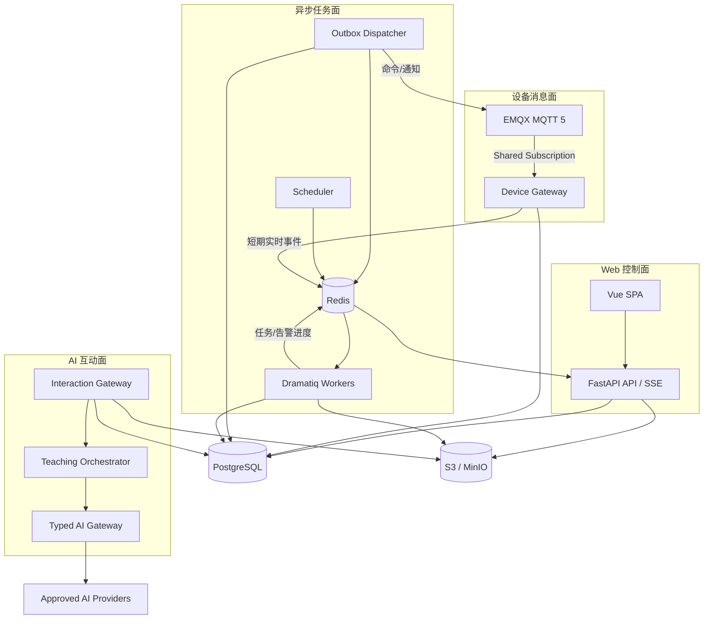
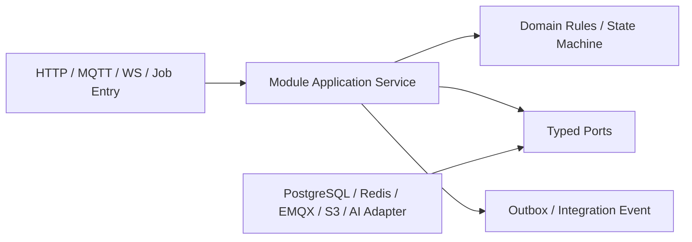
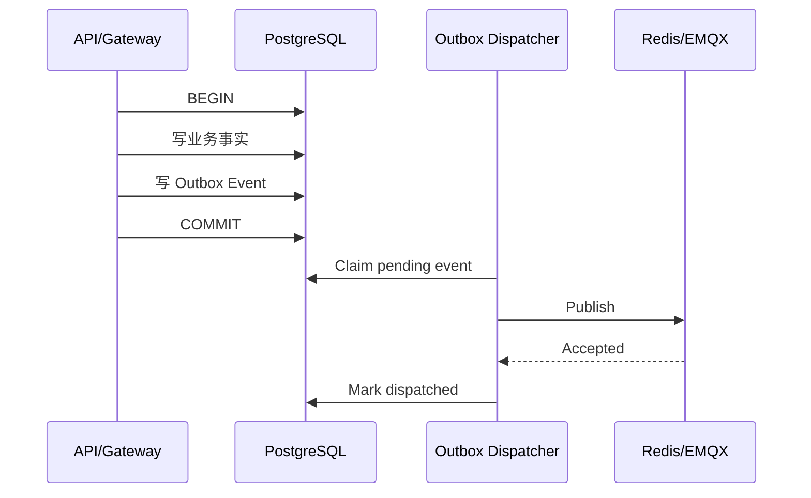
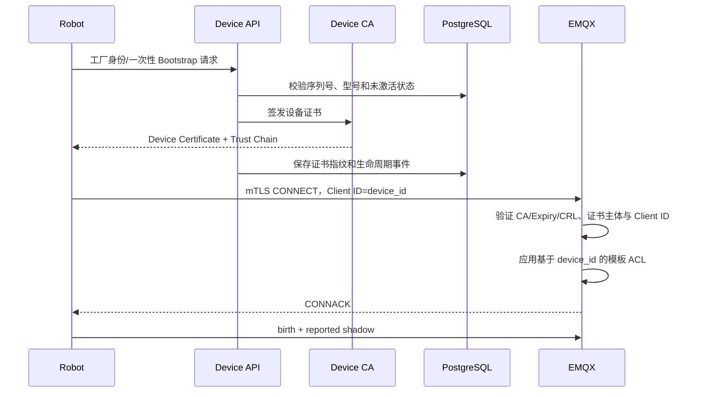
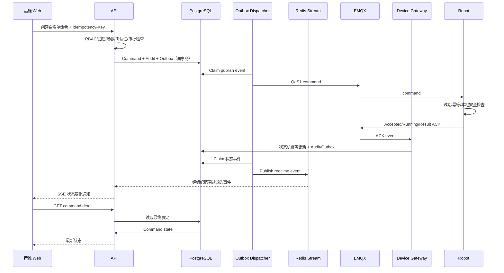
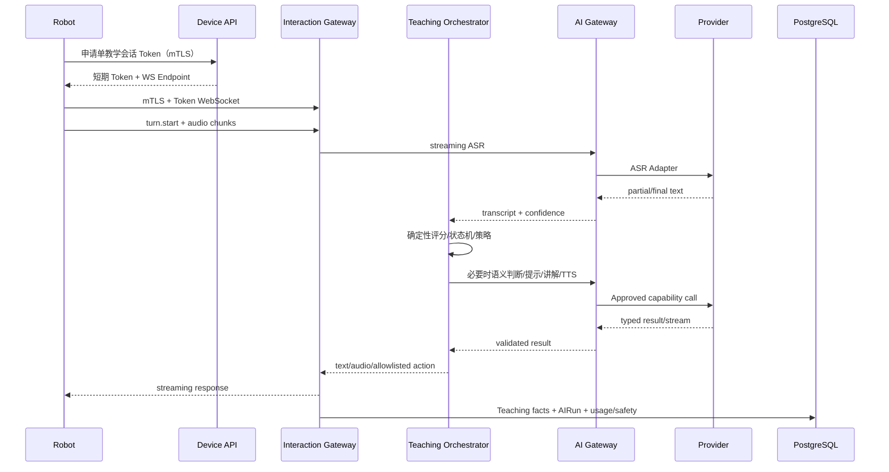
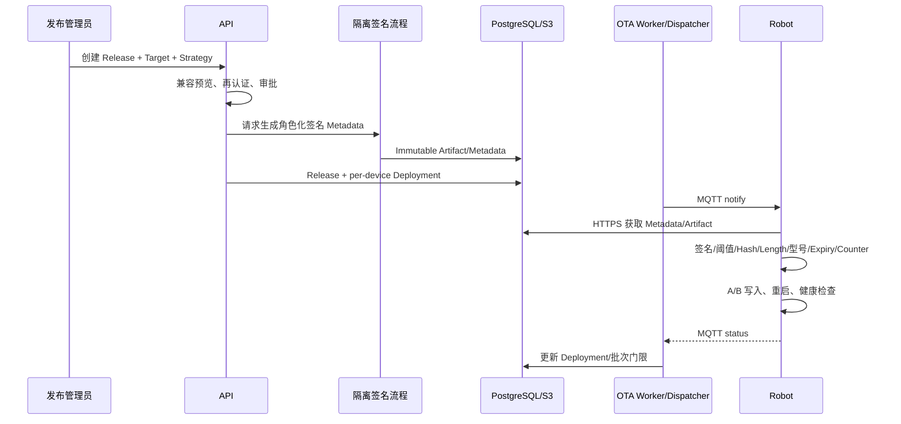
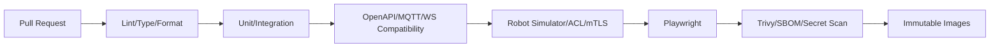

# 教育机器人云平台生产架构设计

> 更新时间：2026 年 8 月  
> 技术选型：[教育机器人云平台唯一生产级技术栈基线](01%20fastapi-vue-modern-tech-stack.md)  
> 产品与领域：[教育机器人云平台产品与系统设计](03%20ai-teaching-platform-design.md)

本文回答“已确认的技术如何组成可开发、可部署、可扩展的生产系统”。03 定义产品定位、角色、场景和业务规则；01 定义唯一技术选型；本文定义代码边界、进程职责、协议、数据流、一致性、安全、测试和部署约束。

三份文档的职责固定为：

```text
03 产品与系统设计：为什么建设、为谁建设、业务必须做什么
01 技术栈基线：统一使用哪些语言、框架和基础设施
02 生产架构设计：这些组件如何协作并满足生产要求
```

## 一、架构结论

平台采用“模块化单体代码库 + 按负载模型分进程 + 四平面协作”架构：

1. **Web 控制面**：Vue 管理后台 + FastAPI REST/SSE，负责人员、内容、设备管理和高风险操作。
2. **设备消息面**：EMQX + Device Gateway，负责 MQTT 长连接、设备状态、遥测、事件、命令 ACK 和通知。
3. **AI 互动面**：Interaction Gateway + 类型化 AI Gateway，负责低延迟 WebSocket、ASR/LLM/TTS 与教学编排。
4. **异步任务面**：PostgreSQL Outbox + Redis + Dramatiq Worker，负责可靠长任务、批处理、发布推进和数据维护。

所有 Python 进程共享同一代码库、领域模块、协议 Schema 和发布版本。进程隔离是为了适配 HTTP、MQTT、流式音频和后台任务不同的连接与伸缩模型，不代表拆成微服务。

### 1. 核心设计原则

- **设备是一等主体**：设备有独立身份、生命周期、能力、影子、版本和审计轨迹。
- **控制面与设备面隔离**：浏览器不能连接 MQTT，Web 用户的授权不能替代设备 ACL。
- **本地可继续教学**：云端、MQTT 或 AI 短时不可用时，机器人使用已签名内容包和确定性逻辑完成基础教学。
- **事实先持久化**：命令、OTA、内容发布、教学结果和 AI Run 先进入 PostgreSQL，再产生可靠异步效果。
- **至少一次交付、业务幂等**：MQTT、Worker 和重试均可能重复，所有业务效果必须按稳定 ID 去重。
- **AI 无设备权限**：AI 输出经过 Schema、教学状态机、能力目录和设备端安全检查，不能创建运维命令。
- **高风险默认受控**：命令、诊断、证书、内容发布与 OTA 具备再认证、理由、审批、过期和审计。
- **按测量结果扩展**：首期 Docker Compose；达到已量化边界后才启用 Kubernetes 或专用数据系统。

### 2. 当前非目标

- 不拆独立微服务，不引入 Service Mesh。
- 不引入 Kafka、RabbitMQ/Celery、GraphQL、CQRS/Event Sourcing。
- 不把平台设计成通用 LMS、视频课程商城或自由聊天机器人。
- 不提供任意 Shell、任意文件路径、任意 URL 或任意硬件控制。
- 不允许浏览器直连 EMQX，不允许 AI 直接发布 MQTT。
- 不默认上传或保存学生原始音视频。
- 不在当前阶段引入向量数据库、RAG 或通用 Agent 框架。

## 二、系统上下文



主要交互关系：

- 教研人员维护知识体系、题库、试卷、互动脚本并发布内容包。
- 教师发起或查看教学会话和学习结果。
- 运维人员监控机器人、处理告警、查询日志、发送白名单命令和管理 OTA。
- 管理员管理机构、场地、成员、设备型号、能力、AI 策略与审计。
- 学生主要通过机器人触摸、按键或语音互动，不以 Web 后台为主要入口。
- 机器人是外部不可信终端，即使由公司制造，也必须按可能被物理访问或攻陷设计。

## 三、四平面逻辑架构



### 1. Web 控制面

负责：

- Web 用户 Session、CSRF、RBAC、机构与资源授权。
- 机构、场地、成员、班级和策略管理。
- 题库、试卷、脚本、内容包及审核发布。
- 设备、影子、遥测、事件、告警、日志、命令和 OTA 管理。
- 教学会话、学习记录、AI Run 和基础分析查询。
- SSE 事件授权、过滤与推送。
- 所有高风险操作的再认证、审批和审计入口。

Web 控制面不消费原始设备 Topic，不把 MQTT ACL 映射给浏览器，也不执行长任务。

### 2. 设备消息面

负责：

- EMQX 终止每设备 mTLS，执行 Client ID、证书和 Topic ACL。
- Device Gateway 使用服务证书和 Shared Subscription 消费上行消息。
- 验证 MQTT Envelope、Schema、设备身份、大小、顺序和幂等键。
- 更新 Reported Shadow、在线状态、遥测、事件、ACK、OTA/内容状态。
- 将需 Web 实时展示的安全事件写入短期 Redis Stream。

EMQX 是消息传输层，不是设备事实数据库。消息完成 Schema 校验、租户映射和 PostgreSQL 提交后，才算完成业务处理。

### 3. AI 互动面

负责：

- 设备通过 mTLS 和短期 Session Token 建立 WebSocket。
- 接收控制帧和有上限的音频片段，执行背压、超时和取消。
- 调用 ASR、确定性教学编排、必要的 LLM 能力和 TTS。
- 只返回允许的教学内容、提示和动作 ID。
- 会话结束或关键阶段持久化教学事实、AI Run、安全结果和用量。

Interaction Gateway 不承担普通 Web 查询，也不通过 MQTT 传连续音频。每条连接只能绑定一个 `device_id + teaching_session_id`。

### 4. 异步任务面

负责：

- 题库导入导出、AI 出题、内容包构建和签名。
- 日志包解析、病毒扫描、脱敏确认和生命周期处理。
- 遥测聚合、告警计算、数据归档和分区维护。
- 命令/内容/OTA Outbox 发布、超时扫描和批次推进。
- AI 离线评测、报表、成本聚合和数据清理。

Worker 按职责使用独立队列和并发，不允许一个长耗时内容任务阻塞命令或 OTA 状态处理。

## 四、运行容器与网络边界

### 1. 生产进程

| 进程/组件 | 主要职责 | 可独立扩容 | 状态源 |
|---|---|---:|---|
| `caddy` | TLS、SPA、REST/SSE/WSS 反向代理和安全头 | 是 | 配置文件 |
| `web` | Vue 构建产物 | 否，静态复制 | 不保存状态 |
| `api` | Web REST、Device HTTPS、SSE 和授权 | 是 | PostgreSQL |
| `device-gateway` | MQTT 上行消费、验证、去重和落库 | 是 | PostgreSQL |
| `interaction-gateway` | AI WebSocket 和流式编排 | 是 | 连接内短期状态 + PostgreSQL |
| `outbox-dispatcher` | Claim Outbox、投递 Dramatiq/MQTT、记录结果 | 是，使用抢占锁 | PostgreSQL |
| `worker-content` | 导入、AI 出题、内容包 | 是 | PostgreSQL/S3 |
| `worker-operations` | 告警、日志、命令和 OTA | 是 | PostgreSQL/S3 |
| `worker-analytics` | 遥测/教学/AI 聚合和清理 | 是 | PostgreSQL |
| `scheduler` | 创建分区、扫描超时、周期任务 | 主实例 | PostgreSQL |
| `emqx` | MQTT 连接、认证、ACL 和路由 | 是 | Broker 配置/会话 |
| `redis` | Broker、短期 Stream、限流和协调 | 是 | 非事实状态 |
| `postgresql` | 唯一业务事实源 | 读扩展另行 ADR | 持久状态 |
| `s3/minio` | 不可变制品和大对象 | 由实现决定 | 持久对象 |
| `otel-collector` | Telemetry 接收与导出 | 是 | 非业务状态 |

### 2. 外部入口

```text
console.example.com:443
  /                    -> Vue SPA
  /api/v1/*            -> FastAPI Web API
  /api/v1/events       -> FastAPI SSE

device-api.example.com:443
  /device-api/v1/*     -> FastAPI Device API（设备 mTLS）
  /interaction/v1/*    -> Interaction Gateway（mTLS + Session Token）

provision.example.com:443
  /device-api/v1/provision/* -> FastAPI Provision API（工厂 mTLS/一次性 Bootstrap）

mqtt.example.com:8883
  MQTT 5/TLS           -> EMQX（每设备 mTLS）

S3/对象存储域名
  短期 Presigned GET/PUT，只允许指定 Object Key、方法、大小和期限
```

Caddy 对 Console、Provision 和 Device 使用不同 Host 与 TLS Policy。Device mTLS 在受信边界终止后，只能通过隔离内网把已验证证书指纹/主体传给应用；FastAPI 只信任来自 Caddy 固定地址的身份头，拒绝外部伪造的 `X-Forwarded-*` 或证书头。Provision Host 只接受工厂客户端证书或受控一次性 Bootstrap 凭证，不能退化成公开匿名注册。

### 3. 内部网络

| 网络区 | 可访问组件 | 禁止事项 |
|---|---|---|
| Public Edge | Caddy、EMQX TLS、S3 Presigned Endpoint | PostgreSQL/Redis/管理端口不得暴露 |
| Application | API、Gateway、Dispatcher、Worker | 不接受公网直连 |
| Data | PostgreSQL、Redis、S3 内部端点 | 仅允许所需服务账号和端口 |
| Observability | Collector、Prometheus、Loki、Tempo、Grafana | Dashboard 需管理身份，不收业务 Secret |
| Signing | 离线 Root 与发布签名环境 | 与普通应用运行网络隔离 |

EMQX Dashboard、PostgreSQL、Redis、MinIO Console、Grafana 和调试端口只能通过管理网络或受控跳板访问。

### 4. 健康检查

每个进程提供独立状态：

```text
/health/live   进程事件循环可运行，不检查所有下游
/health/ready  当前职责所需依赖可用，不能服务时退出流量
/metrics       仅供受信 Prometheus 抓取
```

- API Ready 检查 PostgreSQL；Redis/S3 根据当前路由能力标记部分降级，而非一律停止。
- Device Gateway Ready 检查 EMQX 订阅与 PostgreSQL。
- Interaction Gateway Ready 检查会话验证、关键 Provider/Fallback 配置，不要求所有 Provider 永远健康。
- Worker Ready 检查对应 Queue、PostgreSQL 和任务所需存储。
- Liveness 不执行昂贵 SQL 或外部 Provider 调用，避免依赖故障造成重启风暴。

## 五、Monorepo 与代码架构

### 1. 仓库结构

```text
lemoo/
├── apps/
│   ├── cloud/
│   │   ├── app/
│   │   │   ├── entrypoints/
│   │   │   │   ├── api.py
│   │   │   │   ├── device_gateway.py
│   │   │   │   ├── interaction_gateway.py
│   │   │   │   ├── outbox_dispatcher.py
│   │   │   │   ├── worker_content.py
│   │   │   │   ├── worker_operations.py
│   │   │   │   ├── worker_analytics.py
│   │   │   │   └── scheduler.py
│   │   │   ├── modules/
│   │   │   ├── infrastructure/
│   │   │   │   ├── database/
│   │   │   │   ├── redis/
│   │   │   │   ├── mqtt/
│   │   │   │   ├── storage/
│   │   │   │   ├── ai/
│   │   │   │   ├── security/
│   │   │   │   └── telemetry/
│   │   │   └── shared/
│   │   ├── migrations/
│   │   └── tests/
│   └── web/
├── packages/
│   ├── openapi/
│   ├── protocol-schemas/
│   └── content-package-schema/
├── tools/
│   ├── robot-simulator/
│   ├── ota-metadata/
│   └── data-maintenance/
└── infra/
```

### 2. 领域模块

```text
identity
organizations
device_models
device_fleet
device_operations
ota
taxonomy
question_bank
assessments
interaction_scripts
content_packages
teaching_sessions
learning_records
ai_interaction
ai_governance
jobs
audit
```

每个模块按需要包含：

```text
module/
├── public.py          # 其他模块允许依赖的命令、查询和事件
├── domain.py          # 实体、值对象、状态机和纯规则
├── schemas.py         # 边界 DTO，不导出 ORM
├── service.py         # 用例、授权与事务边界
├── models.py          # SQLAlchemy 映射
├── queries.py         # 模块专属复杂查询
├── events.py          # 领域/集成事件
├── router.py          # 可选 Web REST 边界
└── handlers.py        # 可选 MQTT/Job 入口适配
```

简单模块不强制创建所有文件，也不建立泛型 Repository 基类。SQLAlchemy 查询保留在模块内部；只有出现多个持久化实现时才引入模块专属 Port。

### 3. 依赖方向



固定规则：

- Entry 只做身份提取、Schema 验证、调用用例和边界响应。
- Service 决定授权、事务、状态转换和 Outbox。
- Domain 规则不导入 FastAPI、SQLAlchemy、Redis、MQTT 或 Provider SDK。
- Infrastructure Adapter 不反向调用 Router。
- 模块间同步调用只能通过对方 `public.py`；异步协作使用版本化事件。
- `shared/` 只放真正稳定的横切能力，不能成为所有模块互相穿透的工具箱。
- 禁止跨模块直接修改 ORM 对象或查询对方私有表。

### 4. 进程装配

每个 Entry Point 创建自己的 Lifespan/Resource Container：

```text
API                    PostgreSQL + Redis + S3 + Session/Auth
Device Gateway         PostgreSQL + Redis + EMQX Client
Interaction Gateway    PostgreSQL + Redis + S3 + AI Providers
Outbox Dispatcher      PostgreSQL + Redis + EMQX Publisher
Content Worker         PostgreSQL + Redis + S3 + AI Providers
Operations Worker      PostgreSQL + Redis + S3 + EMQX metadata
Analytics Worker       PostgreSQL + Redis
Scheduler              PostgreSQL + Redis
```

连接池、HTTP Client、MQTT Client 和 Telemetry Provider 通过 Lifespan 初始化并优雅关闭，不使用模块导入时的全局可变单例。

## 六、事务、事件与一致性

### 1. 数据库事务

- 每个 HTTP 请求、MQTT 消息或 Job Handler 创建独立 `AsyncSession`。
- Application Service 控制 `begin/commit/rollback`，底层查询不自行提交。
- 外部网络调用不放在长数据库事务中。
- 状态转换使用数据库约束、`SELECT ... FOR UPDATE` 或 `version` 乐观锁。
- 需要异步副作用的用例在同一事务写业务数据和 Outbox。
- Alembic 由部署 Job 独占执行，应用启动时不迁移。

### 2. Transactional Outbox



Outbox 行至少包含：

```text
event_id
event_type
schema_version
aggregate_type / aggregate_id
organization_id nullable
payload
occurred_at
available_at
attempt_count
state
last_error
```

Dispatcher 使用 `FOR UPDATE SKIP LOCKED` 抢占，发布失败执行有界指数退避；超过上限进入 Dead Letter 并告警。即使“发布成功但标记失败”导致重复投递，消费者也必须按 `event_id` 或业务 ID 幂等。

### 3. 一致性等级

| 场景 | 一致性 |
|---|---|
| 用户授权、机构隔离 | 强一致，事务内检查 |
| 命令创建与审计 | 同事务原子提交 |
| 命令发布与设备 ACK | 最终一致，状态机可追踪 |
| Shadow Desired 编辑 | 乐观锁 + 最终收敛 |
| Reported/Telemetry | 至少一次接收 + 幂等落库 |
| OTA 批次推进 | 单设备状态强约束，批次最终一致 |
| 内容包发布 | 不可变版本 + 原子切换当前版本 |
| TeachingSession 结果 | 本地事件补传 + 幂等合并 |
| Web SSE | 短期可重放通知，页面事实仍从 REST 查询 |
| AI 流式 Token/音频 | 尽力实时；最终只保存确认的事实和 Run |

## 七、协议边界

### 1. Web REST API

```text
/api/v1/organizations
/api/v1/sites
/api/v1/devices
/api/v1/device-models
/api/v1/device-groups
/api/v1/device-commands
/api/v1/telemetry
/api/v1/device-events
/api/v1/alerts
/api/v1/diagnostic-bundles
/api/v1/firmware-artifacts
/api/v1/ota-releases
/api/v1/questions
/api/v1/papers
/api/v1/interaction-scripts
/api/v1/content-packages
/api/v1/teaching-sessions
/api/v1/learning-records
/api/v1/ai/runs
/api/v1/jobs
```

统一约定：

- JSON REST + OpenAPI 3.1，不引入 GraphQL。
- 列表使用稳定排序和 Cursor Pagination。
- 创建命令、内容包、OTA 和批量任务支持 `Idempotency-Key`。
- 可编辑资源返回 ETag，更新使用 `If-Match`。
- 错误使用 RFC 9457 Problem Details，并增加稳定 `code` 和 `request_id`。
- `operationId` 稳定，Orval 生成的 Fetch Client 是前端唯一 API 入口。
- API 破坏性变更由 `oasdiff` 阻断。

```json
{
  "type": "https://example.com/problems/shadow-version-conflict",
  "title": "Device shadow version conflict",
  "status": 409,
  "code": "DEVICE_SHADOW_VERSION_CONFLICT",
  "detail": "The device shadow was changed by another request.",
  "request_id": "0198..."
}
```

### 2. Device HTTPS API

```text
/device-api/v1/provision/*
/device-api/v1/session-tokens
/device-api/v1/uploads
/device-api/v1/ota/metadata
/device-api/v1/content/metadata
/device-api/v1/time
```

约束：

- 制造/首次 Provision 使用隔离 Host、工厂 mTLS 或受控一次性 Bootstrap；签发完成后的 Device API 全部使用设备 mTLS。
- Device ID 来自证书映射，不接受 Body 自报身份。
- 不复用 Web Cookie、CSRF 或人员 RBAC。
- 每个端点具有独立 Scope、请求大小、速率和重放限制。
- Presigned URL 只允许固定 Object Key、HTTP Method、Content Length、Checksum 和短期过期。

### 3. MQTT

设备上行：

```text
v1/devices/{device_id}/state/reported
v1/devices/{device_id}/telemetry
v1/devices/{device_id}/events
v1/devices/{device_id}/logs/index
v1/devices/{device_id}/commands/{command_id}/ack
v1/devices/{device_id}/ota/status
v1/devices/{device_id}/content/status
v1/devices/{device_id}/session/events
```

云端下行：

```text
v1/devices/{device_id}/state/desired
v1/devices/{device_id}/commands
v1/devices/{device_id}/ota/notify
v1/devices/{device_id}/content/notify
```

QoS 和 Retain：

| 消息 | QoS | Retain |
|---|---:|---:|
| 高频遥测 | 0 | 否 |
| 事件/故障 | 1 | 否 |
| Reported/Desired Shadow | 1 | 是 |
| Command/ACK | 1 | 否 |
| OTA/Content Notify | 1 | 是 |
| 教学事实事件 | 1 | 否 |

所有消息包含 `schema`、`message_id`、`device_id`、`boot_id`、`sequence`、`sent_at`、`firmware_version` 和 `payload`。Broker ACL 根据证书映射限制 Topic，不能把 Topic 中的机构 ID 当作授权依据。

### 4. Interaction WebSocket

握手：

```text
设备 mTLS
+ 短期一次性/单会话 Token
+ device_id
+ teaching_session_id
+ protocol_version
```

Control Frame 使用 JSON：

```json
{
  "type": "turn.start",
  "version": 1,
  "interaction_turn_id": "0198...",
  "sequence": 12,
  "payload": {
    "question_version_id": "0198...",
    "input_mode": "voice"
  }
}
```

音频使用有上限的 Binary Frame，不能 Base64 填入 MQTT/JSON。协议必须定义：

- 支持的 Codec、采样率、Channel 和最大帧长。
- Client/Server Sequence、ACK 和背压窗口。
- `turn.start/audio.chunk/audio.end/turn.cancel`。
- `asr.partial/asr.final/orchestrator.state/text.delta/audio.chunk/action/safety/error/turn.done`。
- Idle、首包、单轮、Provider 和整会话超时。
- 断线后是否重连、从哪个确定性状态恢复，以及不能恢复时的离线 Fallback。

### 5. SSE

浏览器通过 `/api/v1/events` 接收经授权事件：

```text
device.presence.changed
device.alert.changed
device.command.changed
ota.deployment.changed
content.deployment.changed
job.progress.changed
```

流程为 `PostgreSQL 事实提交 -> Redis Stream 短期事件 -> API 按 Session/组织过滤 -> SSE`。事件带单调 ID，允许用 `Last-Event-ID` 在短期保留窗口内补发；超出窗口时前端使相关 TanStack Query 失效并从 REST 重取事实。

SSE 不承载原始遥测流。设备详情趋势使用 REST 时间窗查询；只有显式开启的单设备诊断才使用受限 WebSocket。

### 6. Job 与事件 Schema

每种 Job 使用 Pydantic Discriminated Union：

```json
{
  "job_type": "content_package.build",
  "schema_version": 1,
  "job_id": "0198...",
  "organization_id": "0198...",
  "aggregate_id": "0198...",
  "requested_by": "0198...",
  "payload": {}
}
```

Job Payload 只传稳定 ID 和必要参数，不传 ORM 对象、大文件或未受控 Prompt。Worker 从数据库读取当前受版本约束的输入，并按 `job_id` 幂等。

## 八、关键业务数据流

### 1. 设备 Provision 与绑定



机构绑定使用短期、单次 Binding Code，并在云端事务中检查设备状态、序列号和组织权限。绑定、转移、解绑、吊销和重新签发均写不可变审计事件。

### 2. 遥测、事件与在线状态

```text
Robot MQTT Publish
-> EMQX mTLS/ACL/Size Check
-> Shared Subscription
-> Device Gateway Schema/Identity/Dedup Check
-> PostgreSQL Partition Insert / Shadow Update
-> 重要状态同事务写 Outbox；瞬时 Presence 在提交后写 Redis Stream
-> Dispatcher 将状态 Outbox 投递到 Redis Stream
-> Web SSE / Alert Worker
```

- 遥测 QoS 0 可丢少量样本，事件/ACK 使用 QoS 1。
- `device_id + boot_id + sequence` 和 `message_id/event_id` 防止重复业务效果。
- 设备时间只作为 `occurred_at` 候选，云端同时保存 `received_at`。
- 在线状态综合 Connect/Disconnect/Will、心跳、`last_seen_at` 和 Debounce，不由单个 Disconnect 直接触发严重告警。
- 未知 Major Schema 进入隔离记录并告警，不能静默丢弃或按错误结构落库。

### 3. 远程命令



命令状态固定为：

```text
created -> approved -> published -> accepted -> running -> succeeded
       \-> cancelled       \-> expired         \-> failed/timed_out
```

批量操作先生成可审计的 Batch，再为每台设备生成独立 `DeviceCommand/Deployment`。禁止向设备组广播一个无法逐设备追踪的命令。

### 4. 题库、脚本与内容包发布

```text
题目/试卷/脚本 Draft
-> 教研审核
-> 发布不可变 Version
-> 创建 Content Package Job
-> Worker 解析依赖与设备 Capability
-> 构建 Manifest + 文件
-> Hash/签名/兼容矩阵校验
-> 上传不可变 S3 Object
-> 创建 Content Release + Deployments + Outbox
-> MQTT retained notify
-> 设备 HTTPS 下载、校验、原子切换
-> MQTT status
```

机器人只运行已发布的题目版本、试卷快照、脚本版本和内容包。包构建失败不能影响当前已发布版本；设备下载完成后先完整验证，再原子切换并保留已知可用版本以便回滚。

### 5. AI 互动教学



决策顺序固定为：

```text
本地/云端确定性答案匹配
-> 置信度足够则直接评分
-> 只有语义开放或模糊输入才调用 AI
-> 低置信度时澄清或使用预置提示
-> 动作 ID 通过 Capability Catalog
-> 设备端执行最终安全检查
```

AI Provider 超时、限流或不可用时，机器人使用题目预置提示、解析和离线 TTS/素材；不能把 Provider 故障记为学生错误。

### 6. OTA



发布顺序固定为内部设备、1%、10%、30%、100%，每批进入下一阶段前检查失败率、离线率、回滚率和关键健康指标。超过门限自动暂停；设备端负责 A/B 回滚和防回滚，云端“标记成功”不能替代设备验证。

### 7. 离线教学与补传

```text
已签名内容包 + 本地脚本 + 本地确定性评分
-> 断网期间创建 teaching_event
-> device_id + boot_id + sequence + session_id
-> 本地有界队列，优先保留教学结果/故障/命令结果
-> 重连 QoS1 批量补传
-> Gateway 幂等合并
-> 区分 student_incorrect / input_uncertain / system_failure
```

离线缓存达到上限时，先丢弃可重新采集的高频遥测，不丢最终作答、命令结果、OTA 状态和关键故障。

## 九、数据架构

### 1. PostgreSQL 作为事实源

主要数据类别：

| 类型 | 示例 | 存储方式 |
|---|---|---|
| 事务主数据 | 机构、用户、设备、题目、脚本、发布 | 普通关系表 + 约束 |
| 可变状态 | Shadow、命令、Job、Deployment | 状态表 + 版本/状态机 |
| 不可变版本 | QuestionVersion、PaperVersion、ContentPackage、FirmwareArtifact | 发布后不可变 |
| 高频事实 | Telemetry、DeviceEvent、TeachingEvent、AuditEvent | 原生 Range Partition |
| 聚合 | 小时/日遥测、教学分析、AI 成本 | Worker 生成的关系表 |
| 大对象元数据 | 固件、媒体、日志包 | PostgreSQL 元数据 + S3 Object Key |

统一规则：

- 主键使用 UUIDv7；外部显示为字符串。
- 时间持久化为 UTC `TIMESTAMPTZ`，场地时区只用于展示与调度。
- 不使用 EAV 万能遥测表；稳定字段使用列，可变扩展使用受 Schema 控制的 JSONB。
- ORM Model 不直接作为 API/MQTT/Job Schema。
- 外键、唯一约束、Check Constraint 和状态约束是最后防线。
- 列表查询根据真实 Filter/Sort 建复合索引，禁止为每列盲目建索引。

### 2. 多租户

- 所有机构业务表包含 `organization_id`，平台全局表明确标记为 Global。
- Web 请求完成 RBAC 和资源授权后，在事务中设置 RLS 租户上下文。
- Device Gateway 根据证书映射得到设备和机构，不信任 Payload 中的 `organization_id`。
- Worker 从 Job/Outbox 读取租户并设置同样的数据库上下文。
- 平台管理员跨租户操作使用独立权限和审计路径，不关闭 RLS 后复用普通查询。
- 测试必须证明跨机构 ID 枚举、批量导出、SSE 和对象存储访问均被阻断。

### 3. 分区

```text
device_telemetry       按 occurred_at 日/月 Range Partition，压测后确定粒度
device_events          月分区
device_command_events  月分区
teaching_events        月分区
audit_events           月分区
```

典型索引：

```text
(organization_id, device_id, occurred_at desc)
(organization_id, event_type, occurred_at desc)
(organization_id, severity, status, occurred_at desc)
```

Scheduler 提前创建未来分区，Analytics Worker 聚合后按策略 Detach/Drop 旧分区。CI 验证分区路由、默认分区为空、唯一约束策略和迁移回滚；分区缺失必须在写入前告警，不能让高频数据无限落入 Default Partition。

### 4. Redis

Redis 数据分类：

```text
dramatiq:*              任务 Broker
rate-limit:v1:*         登录、Device API、AI 会话限流
realtime:v1:*           SSE 短期 Redis Streams
presence-cache:v1:*     可重建的在线状态热点缓存
lock:v1:*               Scheduler/批次推进短期协调锁
```

所有 Key 有版本和 TTL。Stream 只用于短期重放；REST 始终从 PostgreSQL 读取最终事实。Redis 清空后，系统允许实时通知和任务调度短暂停顿，但不得丢失已提交命令、OTA、内容或教学结果。

### 5. S3

Object Key 不使用用户原始文件名：

```text
organizations/{org_id}/question-media/{object_id}/{version}
organizations/{org_id}/diagnostics/{bundle_id}/{part}
content-packages/{package_id}/{immutable_version}
firmware/{model_code}/{artifact_id}/{immutable_version}
ai-runs/{date}/{ai_run_id}/{redacted_artifact}
```

- 固件和内容包不可覆盖，使用新版本 Object Key。
- 数据库保存 Bucket、Key、Version、Hash、Length、Media Type、Owner 和 Retention。
- 下载先做人员/设备授权，再签发短期 URL。
- 上传限定大小、Checksum 和 Content Type，完成后由 Worker 验证。
- 诊断包默认 7 天生命周期并加密，下载再次鉴权和审计。
- PostgreSQL 删除流程必须同步创建 S3 删除/保留任务，防止孤儿对象和未完成的隐私删除。

### 6. 数据保留与恢复

沿用 03 的初始保留策略：遥测原始 30 天、事件 180 天、命令 1 年、OTA 事件 2 年、诊断包 7 天、AI 全文最长 90 天；学生原始音频默认不保存。机构政策只能在合规允许范围内缩短或明确延长。

恢复基线：

- PostgreSQL 每日完整备份 + WAL PITR。
- S3 版本控制、对象锁按制品风险启用、生命周期策略可审计。
- EMQX 配置、ACL、CA 链和吊销信息加密备份。
- Redis 不作为恢复业务事实的来源。
- OTA 离线 Root、角色 Key、元数据和已发布制品分别演练恢复。
- 每季度执行数据库、内容包和 OTA Metadata 恢复演练并记录 RPO/RTO。

## 十、后端运行架构

### 1. FastAPI 请求链

```text
Caddy
-> Request ID / Trusted Proxy
-> Session + CSRF 或 Device mTLS Identity
-> Rate Limit
-> Route Schema Validation
-> RBAC/Organization/Resource Authorization
-> Application Service
-> PostgreSQL Transaction + Outbox
-> Pydantic Response
-> Audit/Metric/Trace
```

Middleware 只做横切能力，业务权限留在应用服务。异常统一映射为 Problem Details；未知异常只向客户端暴露稳定错误码，完整堆栈进入 Sentry/Log。

### 2. Device Gateway

消费流水线：

```text
MQTT callback
-> 限制 Topic/Payload
-> 从服务端连接上下文确认设备身份
-> Pydantic/JSON Schema 验证
-> 幂等检查
-> 业务 Handler
-> PostgreSQL Commit
-> 记录消费指标
```

不同 Topic Class 使用独立 Shared Subscription Group 和并发上限，遥测不能挤占 ACK/状态通道。若数据库不可用，Gateway 停止/收缩消费并依赖 MQTT Persistent Session 短期缓冲 QoS 1；QoS 0 遥测允许丢失，不把 Broker 当长期队列。

### 3. Interaction Gateway

- 每连接建立有界输入/输出 Queue，慢设备触发背压而非无限占用内存。
- 每轮持有短期状态，不在音频流期间持有数据库事务。
- ASR/LLM/TTS 调用带连接取消信号、Timeout、并发配额和 Provider Circuit Breaker。
- Partial Result 可不持久化；Final Transcript、判定、提示、动作、安全结果和成本需要关联 AIRun。
- 设备断开时立即取消无用 Provider 调用，并按阶段写 `cancelled/disconnected` 结果。
- 同一 Session Token 只能消费一次或只允许一个活跃连接。
- 单机构、单设备和全局均有并发/音频时长/Token 预算。

### 4. Worker

队列隔离：

```text
content.high / content.default
operations.command / operations.ota / operations.logs
analytics.telemetry / analytics.teaching / analytics.ai
maintenance
```

每类 Actor 明确：

- 幂等键与重复执行结果。
- 最大尝试次数、退避和不可重试错误。
- 单次超时和软/硬取消行为。
- 所需租户上下文和权限。
- 进度事件频率，避免 Redis/SSE 风暴。
- Dead Letter 处理和人工重放入口。

FastAPI `BackgroundTasks` 不用于命令发布、导入、内容构建、日志处理、OTA 或任何不可丢任务。

### 5. Scheduler

Scheduler 只创建 Job/Outbox，不直接执行重业务：

- 提前创建 PostgreSQL 分区。
- 扫描命令、会话、Job 和 OTA 超时。
- 推进满足门限的 OTA/内容批次。
- 创建遥测、教学和 AI 聚合任务。
- 创建保留期清理与证书到期提醒任务。

多实例部署时使用 PostgreSQL Advisory Lock 或唯一调度记录保证单次创建；锁丢失后任务仍通过业务 ID 幂等。

## 十一、前端架构

### 1. 信息架构

```text
总览
内容中心
├── 知识体系
├── 题库
├── 试卷/活动
├── 互动脚本
├── AI 生成审核
└── 内容包发布

教学运营
├── 班级/学生
├── 教学会话
├── 作答结果
├── 知识点分析
└── 题目质量

设备运维
├── 设备/分组/详情
├── 实时状态与影子
├── 遥测、事件和告警
├── 日志与诊断包
├── 远程命令
└── OTA

系统管理
├── 机构/场地/成员
├── 设备型号/能力
├── 兼容矩阵
├── AI 模型/Prompt/预算
├── 审计日志
└── 数据策略
```

### 2. 目录

```text
apps/web/src/
├── app/
│   ├── router/
│   ├── providers/
│   ├── permissions/
│   └── styles/
├── pages/
├── layouts/
├── features/
│   ├── identity/
│   ├── organizations/
│   ├── device-fleet/
│   ├── device-operations/
│   ├── ota/
│   ├── question-bank/
│   ├── assessments/
│   ├── interaction-scripts/
│   ├── content-packages/
│   ├── teaching-sessions/
│   ├── learning-records/
│   └── ai-governance/
├── entities/
├── shared/
│   ├── api/generated/
│   ├── components/
│   ├── charts/
│   ├── composables/
│   ├── realtime/
│   ├── lib/
│   └── types/
├── App.vue
└── main.ts
```

Feature 可以依赖 Entity 和 Shared，不直接导入其他 Feature 的内部文件。跨功能工作流由 Page/Route 层编排或提取明确的公共接口。

### 3. 启动流程

```text
加载运行时非敏感配置
-> 获取 CSRF Token
-> GET /api/v1/session
-> 初始化 Permission Context
-> 挂载 Router
-> 启动 TanStack Query
-> 登录后建立 SSE
-> SSE 驱动 Query Invalidation/局部更新
```

启动失败显示可恢复错误页，不能因非关键 Dashboard Widget 失败导致整个应用白屏。路由权限守卫只用于体验，真实授权由 API 再验证。

### 4. 数据与实时更新

- 列表、详情、趋势和分析通过 Orval/TanStack Query 获取。
- URL 保存分页、筛选、排序、Tab 和时间窗口，页面可分享和恢复。
- SSE 只更新受影响 Query Key，不把所有事件存入 Pinia。
- SSE 重连超出事件保留窗口时，统一 invalidate 当前组织的活动 Query。
- 高频图表按时间窗聚合查询，不把无限遥测点保存在浏览器内存。
- OTA/命令/Job 的进度以 PostgreSQL 状态为准，SSE 只缩短可见延迟。

### 5. 高风险交互

远程命令、诊断、证书、内容与 OTA 页面必须：

- 显示影响设备数、兼容性、当前状态和风险摘要。
- 要求明确原因/Ticket；不能只有一个无上下文确认框。
- 对高风险动作要求重新认证和审批状态。
- 使用 Idempotency-Key 防止双击重复创建。
- 提交后展示每设备状态，而非只显示“请求成功”。
- 审计入口显示请求人、审批人、参数摘要、时间和结果。

## 十二、身份、安全与隐私架构

### 1. 信任边界与凭证

```text
Web User       HttpOnly Session Cookie + CSRF
Robot MQTT     X.509 mTLS Certificate
Robot HTTPS    X.509 mTLS Certificate
Interaction    Device mTLS + Short Session Token
Cloud Service  独立 Service Credential/Certificate
S3 Transfer    短期受限 Presigned URL
OTA Signing    离线 Root + 分角色发布 Key
```

凭证不得复用。设备证书不能登录 Web，Web Session 不能访问 MQTT，Interaction Token 不能调用 OTA/命令 API，普通服务 Secret 不能签署固件。

### 2. Web 安全

- 密码使用 Argon2id；数据库只保存密码 Hash 和一次性 Token Hash。
- Session 可撤销、有绝对/空闲过期，并记录设备/登录风险元数据。
- Cookie 使用 `HttpOnly`、`Secure`、合适的 `SameSite`；状态修改请求校验 CSRF。
- Caddy 设置 HSTS、CSP、`X-Content-Type-Options`、Referrer Policy 等安全头。
- CORS 使用精确 Allowlist；同域部署时默认不开放跨域凭证。
- 登录、找回、高风险操作、Device API 和 AI 会话均在 Redis 限流。
- API 对请求体、上传、分页、查询时间窗和导出规模设置上限。
- 前端日志和 Sentry 不记录 Cookie、Token、学生身份、原始音频或敏感请求体。

### 3. 设备身份与 ACL

- 一设备一证书，Client ID 必须与证书映射的 `device_id` 一致。
- Broker 拒绝匿名、共享设备账号、通配订阅和跨设备 Topic。
- 证书具备 Not Before/Expiry、状态、吊销原因和轮换流程。
- 设备凭证存放在平台安全存储；无法保护私钥的硬件不得宣称完成安全接入。
- 设备注销、转移和维修更换必须同步处理证书与历史归属。
- ACL、吊销、重连风暴和过期证书测试进入 CI/预发布环境。

### 4. 远程命令

允许命令由 Pydantic Discriminated Union 明确定义：

```text
refresh_shadow
sync_content
restart_application
collect_diagnostics
run_self_test
set_maintenance_mode
reboot_device
```

禁止任意 Shell、路径、URL、未签名代码和任意电机/硬件控制。设备端仍检查过期时间、命令 ID、当前电量、运动/教学状态和本地安全上限。

### 5. OTA 安全

- SHA-256 + ECDSA P-256 是默认制品与元数据基线。
- Metadata 具备角色、签名阈值、版本、Expiry、Target 授权、Hash、Length 和 Release Counter。
- Root、Target/Release 等角色 Key 分离，普通 API 不持有私钥。
- 设备验证型号、硬件版本、最低 Bootloader、依赖版本和可用空间。
- 使用 A/B 或等价原子安装、启动健康检查、Known Good Version 和自动回滚。
- 防止任意软件、回滚、冻结、混搭和无限重试耗尽设备。
- OTA 状态事件不可伪装成安装成功；必须来自设备端验签和健康检查结果。

### 6. AI 隔离

- Provider 只接收完成教学能力所需的最小数据。
- 运维日志、设备凭证、网络配置和完整学生身份不进入 AI Prompt。
- AI 输出必须通过 Pydantic Schema、Prompt Policy、安全过滤和 Capability Catalog。
- AI 动作只能引用已发布动作 ID，不能生成 MQTT Topic 或命令参数。
- Prompt、Model 和策略发布与内容发布一样版本化、审核和可回滚。
- 日志 AI 摘要明确标记为“建议”，不能自动触发修复或 OTA。

### 7. 未成年人数据

- 麦克风/摄像头工作时机器人给出可见或可听提示。
- 默认不持续上传环境音视频，不默认保存原始学生音频。
- Teaching Participant 使用最小 `learner_ref` 或匿名标识。
- 运维、教研、教师只能看到职责所需视图。
- 诊断包在设备端先脱敏，云端短期保存和受控下载。
- 删除请求覆盖 PostgreSQL、S3、AI Run 全文和可识别派生数据。

## 十三、可靠性、背压与降级

### 1. 超时与重试

| 调用 | 超时/重试原则 |
|---|---|
| Browser -> API | 明确请求超时；安全创建使用幂等键后才可重试 |
| API -> PostgreSQL | 不对整个事务盲目重试，按可识别瞬态错误处理 |
| Gateway -> PostgreSQL | 失败后停止/降低消费，QoS1 依赖 Broker 短期重投 |
| Provider ASR/LLM/TTS | 首包、单轮、总时长超时；有界重试并受会话取消 |
| Worker -> 外部系统 | 指数退避 + Jitter + 最大尝试 + Dead Letter |
| Robot -> Device API/S3 | 只对幂等 GET/PUT/Token 流程按协议重试 |
| Command/OTA | 由业务状态机重投，不使用无限网络层重试 |

所有重试必须有幂等键、Deadline 和可观测结果。用户主动取消 AI 轮次后，不继续消耗 Provider Token。

### 2. 背压

- 设备高频遥测在端侧采样、聚合和有界缓存。
- Device Gateway 按 Topic Class 设置并发，关键 ACK/状态优先。
- Interaction Gateway 每连接、机构和全局设置音频 Queue 与并发上限。
- Worker 按 Queue 隔离，长任务限制单实例 Prefetch/并发。
- PostgreSQL 连接池总量按所有 API/Gateway/Worker 实例统一预算。
- SSE 合并高频状态变化，不逐条推送遥测点。
- OTA/内容下载设置批次和并发，不对全部机器人同时唤醒下载。

连接池预算：

```text
Σ(每类进程实例数 × 每实例并发数据库连接上限)
  + Migration/Admin/Monitoring Reserve
  < PostgreSQL max_connections
```

### 3. 故障降级

| 故障 | 预期行为 |
|---|---|
| AI Provider 不可用 | 预置提示/解析和确定性评分继续 |
| Interaction Gateway 不可用 | 机器人切换离线教学脚本，MQTT 上报降级 |
| MQTT 短时断开 | 本地缓冲关键事件，已下载内容继续教学 |
| EMQX 不可用 | 无远程实时控制；设备本地教学不停止 |
| Redis 不可用 | 新任务和 SSE 暂缓；PostgreSQL 事实不丢 |
| PostgreSQL 不可用 | 云端控制暂停；设备继续已发布内容，不接受不可审计命令 |
| S3 不可用 | 暂停新固件/内容/日志包传输，不影响本地缓存 |
| 单设备异常 | 隔离设备和凭证，不影响场地其他设备 |
| OTA Canary 异常 | 自动暂停批次，未升级设备保留原版本 |

### 4. 初始 SLO

| 指标 | 目标 |
|---|---:|
| Web/API 月度可用性 | 99.9% |
| MQTT Broker 月度可用性 | 99.95% |
| 在线状态传播 p95 | < 5 秒 |
| 在线设备 Command Publish -> Accepted p95 | < 3 秒 |
| AI 互动首文本 p95 | < 2 秒 |
| AI 互动首音频 p95 | < 2.5 秒 |
| OTA 状态事件完整率 | > 99.9% |
| 跨设备/跨租户关键 ACL 测试 | 100% 阻断 |
| 未授权远程命令 | 0 |
| 未签名固件安装 | 0 |

容量测试必须覆盖 MQTT 并发连接、重连风暴、消息速率/大小、离线 Queue、AI 并发和音频带宽、OTA 并发下载、PostgreSQL 分区写入，而不能只测试 Web QPS。

## 十四、可观测性架构

### 1. 关联标识

```text
request_id
trace_id
organization_id
device_id
boot_id
teaching_session_id
interaction_turn_id
command_id
ota_release_id / deployment_id
ai_run_id
job_id
```

- HTTP 使用 W3C Trace Context。
- MQTT Envelope 保留 `message_id`，云端消费时创建/关联 Trace。
- Outbox 和 Job 传播 `trace_id`/业务 ID，但不传播人员 Secret。
- 业务 ID 进入结构化 Log/Trace，不进入高基数 Metric Label。

### 2. JSON 日志

统一字段：

```json
{
  "timestamp": "2026-08-12T06:00:00Z",
  "level": "info",
  "service": "device-gateway",
  "environment": "production",
  "event": "device_event_persisted",
  "trace_id": "...",
  "organization_id": "...",
  "device_id": "...",
  "message_id": "...",
  "duration_ms": 18,
  "result": "success"
}
```

日志不得记录密码、Cookie、Token、私钥、Wi-Fi 密码、原始学生音频、完整 Prompt 敏感文本或诊断包内容。

### 3. 指标

| 领域 | 关键指标 |
|---|---|
| HTTP | Rate、Error、Duration、Inflight、Connection Pool |
| EMQX | Connection/Auth/ACL、Publish、Dropped、Inflight、Offline Queue |
| Device | 在线率、重连、遥测延迟、故障、版本分布 |
| Command | 创建、发布、Accepted、成功、超时、过期 |
| OTA | 各状态漏斗、失败、暂停、回滚、下载流量 |
| Worker | Queue Depth、Age、Retry、Dead Letter、Duration |
| AI | 首包/总延迟、ASR 无结果、Fallback、Token、音频时长、成本 |
| Teaching | 会话完成、作答、输入不确定、系统故障、内容版本 |
| Data | PG Pool/Slow Query/Partition、Redis、S3 Error |

### 4. 告警

- Broker 连接、认证失败、内存或 Offline Queue 异常。
- 某机构、型号或固件集中离线/崩溃。
- 命令 ACK 超时或失败率骤增。
- OTA Canary 失败/回滚越过门限。
- 固件签名、Hash、Expiry 或 Release Counter 校验失败。
- AI 延迟、错误、Fallback 或成本异常。
- Worker Queue Age、Dead Letter 或 Outbox 积压。
- PostgreSQL 连接池耗尽、慢查询、WAL/备份或分区创建失败。
- 设备证书即将过期、吊销异常或跨 Topic ACL 拒绝激增。

告警必须有 Runbook、Owner、严重级别、去重 Fingerprint 和恢复条件；恢复事件与触发事件同样重要。

## 十五、测试架构

### 1. 分层

```text
纯 Domain/状态机单元测试
-> Module Service + PostgreSQL/Redis 集成测试
-> REST/MQTT/WebSocket/Job 契约测试
-> 多进程组件测试
-> Robot Simulator 端到端测试
-> Playwright Web E2E
-> 性能/重连/故障注入
-> 真实机器人 Hardware-in-the-loop
```

### 2. 后端与数据

- pytest 运行 Domain、Service、API、Gateway、Worker 和 Migration 测试。
- Testcontainers 启动真实 PostgreSQL、Redis、EMQX 和 MinIO。
- 测试事务、唯一约束、RLS、乐观锁、Outbox Claim、重复投递和 Dead Letter。
- 测试新旧分区、跨分区查询、保留清理和默认分区保护。
- 对命令、OTA、内容和教学状态机使用属性测试生成非法转换。
- AI Provider 使用 Adapter Fake/Recorded Contract，不在普通测试调用真实付费服务。

### 3. MQTT 与设备

- 证书正常、过期、吊销、错误 Client ID 和跨设备 ACL。
- Topic、QoS、Retain、Will、Persistent Session 和 Shared Subscription。
- Schema 兼容、未知 Major、超大 Payload、重复、乱序和时钟漂移。
- Gateway 崩溃前后重投、数据库不可用和 Broker 重启。
- Robot Simulator 批量连接、断网缓存、重连风暴和 ACK 超时。

### 4. OTA

- 合法签名、错误签名、错误 Hash/Length 和错误 Target。
- 过期 Metadata、旧 Release Counter、混搭 Metadata 和镜像重放。
- 型号/硬件/Bootloader/空间不兼容。
- 下载中断、断电、写入失败、启动失败、健康检查失败和 A/B 回滚。
- Canary 门限、自动暂停、人工停止和恢复发布。
- 签名密钥轮换和 Root Metadata 更新恢复。

### 5. AI 与教学

- 客观题不调用 LLM，开放回答仅在必要时语义判断。
- ASR 低置信度触发澄清，不记为学生错误。
- Prompt Injection、越权动作、非法 Action ID 和敏感数据泄漏被阻断。
- Provider 超时、限流、断流、乱序和部分结果取消。
- Prompt/Model 回归数据集评测，比较准确率、拒答、安全、延迟和成本。
- 云端不可用、弱网和离线内容包下仍能完成基础教学。

### 6. 前端

- Vitest 测试 Composable、Store、权限呈现和数据转换。
- Vue Test Utils 测试表格、表单、图表、脚本编辑器和高风险确认流程。
- MSW 使用 OpenAPI 示例模拟 Problem Details、延迟、冲突和部分失败。
- Playwright 覆盖登录、题目导入审核、内容发布、设备详情、命令审批和 OTA 向导。
- 可访问性检查键盘操作、焦点、Dialog、表格和状态颜色。

### 7. 架构约束测试

CI 自动验证：

- Domain 不导入 FastAPI/SQLAlchemy/Redis/MQTT/Provider SDK。
- 浏览器构建产物不包含 Secret 或设备凭证。
- 生成 OpenAPI Client 和协议 Schema 无未提交差异。
- 模块不能越过 `public.py` 引用其他模块私有实现。
- MQTT Topic 与 JSON Schema 兼容。
- AI Action 只能属于发布的 Allowlist。

## 十六、CI/CD 与发布架构

### 1. Pull Request 门禁



任一协议、RLS、ACL、命令白名单、OTA 签名或 AI 动作测试失败时不得合并。

### 2. 云端发布

```text
Merge
-> reproducible build
-> image scan + SBOM
-> image sign
-> push immutable digest
-> deploy staging
-> migrations job
-> smoke + Robot Simulator
-> deploy production by digest
-> readiness/metric/SLO verification
-> rollback to previous image if needed
```

Schema 变更采用 Expand/Contract：先发布向后兼容 Schema，再发布读写新字段的应用，确认旧版本不再使用后再删除旧结构。禁止在单次发布中同时做不可回滚破坏性迁移和应用切换。

### 3. 机器人软件发布

```text
Source
-> reproducible build
-> unit/HIL/protocol tests
-> SAST/dependency scan
-> SBOM
-> artifact hash
-> isolated metadata signing
-> immutable S3 upload
-> internal robot validation
-> OTA Release approval
-> canary/progressive rollout
```

云端部署权限、固件构建权限、OTA 签名权限和 OTA 发布审批权限分离。两条流水线使用不同凭证、审计记录和回滚机制。

## 十七、部署与扩展

### 1. Docker Compose 基线

首期生产 Compose 至少包含：

```text
caddy
web
api
device-gateway
interaction-gateway
outbox-dispatcher
worker-content
worker-operations
worker-analytics
scheduler
emqx
redis
postgresql
minio（本地/私有环境；生产可接外部 S3）
otel-collector
prometheus
grafana
loki
tempo
```

生产要求：

- 所有应用镜像非 root、只读根文件系统优先、资源限制明确。
- Secret 使用 Docker Secret/部署环境 Secret，不写入镜像或 Compose Git 文件。
- 数据卷目标、备份、恢复、加密和容量告警明确。
- 应用使用不可变 Digest；配置和 Schema 版本可追踪。
- Migration、备份、恢复、分区维护使用显式 Job，不进入 API 启动逻辑。
- 进程支持 SIGTERM、停止接收新流量、完成/退回在途消息并关闭连接池。

### 2. 水平扩展顺序

1. 将 PostgreSQL、S3、Redis、EMQX 移到独立持久节点或受管服务。
2. 按连接数扩展 EMQX 和 Device Gateway。
3. 按并发会话扩展 Interaction Gateway。
4. 按 Queue Depth/Age 分别扩展 Worker。
5. 按 Web QPS 扩展 API；静态 Web 由 Caddy/对象分发处理。
6. 调整 PostgreSQL 分区、索引、连接池和读查询，而不是先拆业务服务。
7. 单机编排、故障域或发布可用性无法满足目标时，通过 ADR 迁移 Kubernetes。

### 3. Kubernetes 预留边界

当前不创建 Helm、HPA 或 Service Mesh。迁移时保留现有容器和协议边界：

- API、Device Gateway、Interaction Gateway、Dispatcher 和 Worker 独立 Deployment。
- 每 Pod 一个 Uvicorn/进程，通过副本数扩展。
- EMQX 使用 Stateful/Operator 或受管方案，仍保持 MQTT/ACL 语义。
- Scheduler 使用 Leader Election/CronJob，但 Job 仍幂等。
- Redis、PostgreSQL、S3 优先采用经过验证的高可用服务，不在首次迁移时自建复杂 Operator 全家桶。

## 十八、架构决策记录

当前已确定 ADR：

| ADR | 决策 | 结果 |
|---|---|---|
| ADR-001 | 模块化单体代码库，多进程运行 | 共享领域与协议，负载独立扩展 |
| ADR-002 | PostgreSQL 为唯一事实源 | Redis/EMQX 不保存唯一业务事实 |
| ADR-003 | EMQX + MQTT 5/mTLS | 设备连接、ACL、QoS 与持久会话统一 |
| ADR-004 | REST 控制面、MQTT 设备消息、WSS AI 流、HTTPS 文件 | 每类数据使用适合的通道 |
| ADR-005 | Dramatiq + Redis + PostgreSQL Outbox | 可靠异步且可从数据库恢复 |
| ADR-006 | 浏览器 SSE，不直连 MQTT | Web 授权与设备 ACL 隔离 |
| ADR-007 | PostgreSQL 原生分区 | 首期不引入独立时序数据库 |
| ADR-008 | 确定性教学编排 + 类型化 AI Gateway | AI 不拥有设备和评分控制权 |
| ADR-009 | TUF/Uptane 思路的 OTA + A/B 回滚 | 防任意软件、回滚、冻结与混搭 |
| ADR-010 | Docker Compose 首期部署 | 达到量化边界后才迁移 Kubernetes |

新增 ADR 模板：

```markdown
# ADR-NNN 标题

## 背景
## 决策
## 备选方案
## 后果
## 协议与数据兼容影响
## 安全与隐私影响
## 运维与成本影响
## 迁移与回退方案
## 对 01/02/03 的文档更新
```

## 十九、实施顺序

### 阶段 0：协议与安全契约

- 确认机器人 OS、Runtime、硬件能力、网络、私钥存储和 A/B/Bootloader 能力。
- 固化 MQTT Topic、Schema、QoS、证书、ACL 和 Device HTTPS API。
- 固化 Interaction WebSocket Frame、音频格式、超时和离线策略。
- 建立 Robot Simulator、协议兼容和安全测试。

### 阶段 1：设备云 MVP

- 搭建 EMQX、设备 CA、Provision/Binding 和证书生命周期。
- 完成 Device Registry、Shadow、Online、Telemetry、Events 和分区表。
- 完成 Device Gateway、Outbox、Redis 实时流、设备 Web 列表/详情与审计。
- 完成单设备白名单命令、ACK、过期和幂等。

### 阶段 2：题库与内容

- 知识体系、题目版本、导入预览/验证/确认和审核。
- 试卷快照、互动脚本、Capability Catalog 和模拟预览。
- Content Package Worker、签名、兼容、同步、状态与回滚。

### 阶段 3：教学会话

- TeachingSession、Participant、AnswerAttempt、事件补传与确定性评分。
- 区分学生错误、输入不确定和系统故障。
- 教学/题目质量基础分析与数据保留。

### 阶段 4：AI 互动

- Interaction Gateway、短期 Token 和 Streaming ASR/LLM/TTS Adapter。
- Teaching Orchestrator、Prompt/Model/AIRun、成本与安全记录。
- 语义判断、提示、讲解、受控动作和弱网/离线 Fallback。

### 阶段 5：运维与 OTA

- 诊断包、告警、设备组、批量命令和双人审批。
- Firmware Artifact、签名 Metadata、OTA Release/Deployment。
- Canary、自动暂停、A/B 健康检查、安全回滚和故障聚合。

### 阶段 6：规模化

- 模拟真实设备并发、重连风暴、消息速率、AI 会话和 OTA 下载。
- 按 SLO 调整 EMQX/Gateway/Worker/分区/连接池。
- 达到 Compose 或单数据节点边界后通过 ADR 启用预留架构。

## 二十、架构完成定义

### 1. 代码与契约

- 领域模块、进程入口和依赖方向有自动化约束测试。
- OpenAPI、MQTT、WebSocket、Job 和内容包 Schema 均版本化并做兼容检查。
- 所有外部副作用通过 Outbox/幂等状态机可恢复，不依赖进程内存。
- ORM、Provider SDK 和设备协议类型不泄漏到不应依赖的层。

### 2. 设备与运维

- 每台机器人使用独立证书，跨设备 Topic 和跨租户访问关键测试 100% 阻断。
- 在线、Shadow、遥测、事件、命令在重复、乱序和断线重连下保持正确。
- 所有命令有请求人、审批、过期、ACK、结果和审计。
- OTA 验证签名、Hash、兼容、Expiry 和 Release Counter，并通过 Canary/A-B 回滚测试。

### 3. 教学与 AI

- 题目、试卷、脚本和内容包按不可变版本发布，机器人可以离线完成基础教学。
- 每次作答可关联题目、脚本、内容、设备和 AI 版本。
- ASR/网络/设备故障不会统计为学生错误。
- 客观题不使用 LLM 评分，AI 不能执行任意动作或运维指令。
- Prompt、Model、输入输出引用、安全结果、延迟和成本可追踪。

### 4. 可靠性与交付

- PostgreSQL、Redis、EMQX、S3、AI Provider 故障具有已测试降级行为。
- Robot Simulator 能在 CI 复现证书、ACL、断网、重连、命令、内容和 OTA。
- 达到目标 MQTT 连接、消息速率、AI 并发、OTA 下载和分区写入容量。
- 云端发布与机器人 OTA 使用独立签名、审批、灰度和回滚链路。
- PostgreSQL/S3/EMQX/设备 CA/OTA Metadata 完成备份和恢复演练。

完成以上条件后，01 的技术栈才真正以 03 所定义的“题库管理 + AI 机器人互动 + 设备远程运维”架构落地，而不是停留在通用 FastAPI + Vue 项目模板。
