# 教育机器人云平台产品与系统设计

> 状态：产品与系统设计输入；正式需求以 PRD-001 为准  
> 更新时间：2026 年 8 月  
> 背景来源：[高级全栈开发工程师入职要求](入职要求详细.md)（低权重，不作为验收依据）  
> 正式 PRD：[PRD-001 教育机器人云平台](product/PRD-001%20教育机器人云平台.md)  
> 需求追踪：[RTM-001 教育机器人云平台需求追踪矩阵](product/RTM-001%20教育机器人云平台需求追踪矩阵.md)  
> 技术基线：[教育机器人云平台唯一生产级技术栈](01%20fastapi-vue-modern-tech-stack.md)  
> 实施架构：[教育机器人云平台生产架构设计](02%20fastapi-vue-modern-architecture.md)

## 一、需求解读与产品定位

早期招聘材料给出了组织方向，但不构成正式产品需求。结合后续产品设计，平台方向不是传统在线课程/LMS，而是：

> 构建“题库管理 + AI 机器人互动 + 设备运维”三位一体的教育机器人云平台。

因此，本平台的中心对象是部署在学校、培训机构、展厅等现场的教育机器人。Web 系统主要服务教研教师、设备运维、机构管理员和平台管理员；学生主要通过机器人完成题目、语音问答和互动教学，也可使用有限的 Web 学习页面。

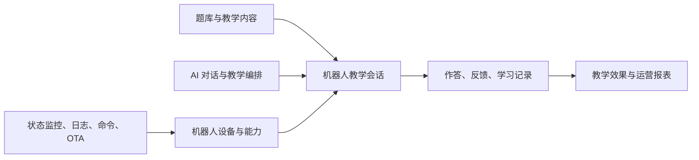

### 1. 唯一产品定义

平台是一套多机构、多型号教育机器人云端平台，提供：

- 机器人设备注册、绑定、在线状态、遥测、日志和告警。
- 远程诊断、受控指令、配置下发和安全 OTA 升级。
- 教研人员维护学科、知识点、题库、试卷和机器人教学脚本。
- 机器人通过语音、屏幕、灯光、动作等能力开展答题和 AI 互动。
- AI 根据题目、学生回答和知识点生成适龄讲解、提示、追问和鼓励。
- 互动结果回传云端，形成设备运行记录与基础学习分析。
- Web 管理后台统一承载内容、教学运营、设备运维和系统治理。

### 2. 与通用 AI 教学平台的区别

| 维度 | 本平台定位 |
|---|---|
| 核心终端 | 教育机器人，而非浏览器课程页面 |
| 核心内容 | 题库、试卷、互动脚本、知识点，不以完整课程 LMS 为首期核心 |
| 核心交互 | 机器人语音/屏幕/动作 + AI，而非普通聊天框 |
| 核心基础设施 | MQTT、设备影子、命令、日志、OTA、WebSocket 音频 |
| 学习身份 | 可匿名会话、班级模式或绑定学生，不强制每次人脸/实名登录 |
| AI 权限 | 生成教学语言与选择白名单互动动作，不能直接控制任意设备能力 |
| Web 用户 | 教研教师、运维、机构管理员、平台管理员为主 |
| 首期非目标 | 直播、复杂排课、招生支付、完整 LMS、AI 自主 Agent |

### 3. 产品目标

1. 机器人设备可安全、稳定、批量地接入云端。
2. 教研人员可以独立完成题库与互动内容生产、审核和发布。
3. 学生能通过机器人获得低延迟、适龄且与题目一致的 AI 反馈。
4. 运维人员可以快速定位设备故障，安全地下发命令和 OTA。
5. 教学、设备、AI 三条数据链能通过一次教学会话完整关联。
6. AI 或云端短时不可用时，机器人仍可执行已缓存的基础教学内容。

### 4. 非目标

首期不建设：

- 招生、营销、支付、财务和复杂教务排课。
- 直播课堂、视频会议和大规模视频点播。
- 学历认证、正式考试监考与高风险自动评分。
- 人脸识别、情绪识别或基于外貌推断学习能力。
- AI 自动发布题目、固件或正式教学策略。
- 允许大模型执行任意 Shell、URL、SQL 或机器人动作的自主 Agent。
- 在 Web 浏览器中直接开放 MQTT Broker。

### 5. 设计假设与入场确认项

岗位说明只给出了产品方向，没有给出机器人硬件和存量系统细节。本文给出目标架构，但以下事实必须在真实设备/机构试点前通过设备团队、产品和真实样机确认；确认结果只调整参数和设备 Adapter，不改变控制面/消息面/互动面边界。当前没有物理设备，已按 [PILOT-001](product/PILOT-001%20模拟器工程验证范围.md) 先进行 Simulator-only 阶段 1A；这不会把下列硬件假设变成事实。

| 必须确认           | 当前设计假设                                      | 不满足时的处理                          |
| -------------- | ------------------------------------------- | -------------------------------- |
| 机器人 OS/运行时     | Linux/Android 类系统，可运行 MQTT/HTTPS/WSS Client | 为现有运行时实现协议 Adapter               |
| 安全存储           | 可安全保存每设备私钥和可信 Root                          | 增加硬件安全模块或受限 Provision 方案，不使用共享密钥 |
| OTA Bootloader | 支持签名校验、A/B 或等价原子回滚                          | 先改造设备端 OTA，云端不开放批量升级             |
| 网络             | 现场 Wi-Fi/4G 可能弱网、断网和 NAT                    | 保留本地内容、事件缓冲、断点续传和重连退避            |
| 设备规模           | 从数百扩展到数万长连接                                 | 用真实目标数完成容量测试后确定实例资源              |
| 硬件能力           | 不同型号有屏幕、麦克风、扬声器、灯光或动作子集                     | 通过 Capability Catalog 和兼容矩阵适配    |
| AI 模态          | 云端 Streaming ASR/LLM/TTS 为主，部分设备可本地降级       | Provider Adapter 和设备本地能力协商       |
| 学生身份           | 同时支持匿名、班级和绑定学生三种模式                          | 按场景最小化身份，不强制人脸识别                 |
| 内容来源           | 教研自建题库，支持表格批量导入                             | 如有现存题库，新增一次性迁移和映射工具              |
| 存量协议           | 允许逐步升级到 MQTT 5 目标协议                         | Gateway 在边缘兼容旧协议，领域消息统一转换        |
| 部署区域           | 首期单区域/私有化 Compose                           | 若多区域或政企专有云，新增独立部署 Profile        |
| 合规要求           | 涉及未成年人，需机构明确隐私和留存政策                         | 法务/机构政策未确认前禁用原始音视频留存             |

特别注意：如果设备端不具备可信签名验证和安全回滚能力，则“远程 OTA”不能被视为已完成，不能只依靠云端 Hash 校验弥补设备端信任链缺失。

## 二、角色与核心场景

### 1. 角色

| 角色 | 主要职责 | 关键权限 |
|---|---|---|
| 教研教师 | 建知识体系、题目、试卷、互动脚本 | 内容创建、审核、发布、教学报表 |
| 一线教师 | 选择内容、发起课堂活动、查看结果 | 班级/机器人编排、会话控制、学习结果 |
| 设备运维 | 监控、诊断、日志、命令、OTA | 设备读取、受控指令、发布执行、告警处理 |
| 机构管理员 | 管理学校、场地、成员、机器人 | 机构范围配置与授权 |
| 平台管理员 | 型号、固件、模型、全局策略 | 平台级治理；跨机构操作强审计 |
| 学生 | 通过机器人参与教学互动 | 回答、求助、查看反馈；权限最小化 |
| 机器人 | 设备身份，不是普通用户 | 仅发布自身数据、订阅自身命令与内容通知 |

### 2. 核心用户故事

#### 教研

- 创建学科、年级、知识点和标签体系。
- 批量导入题目，维护答案、解析、难度和适用场景。
- 让 AI 生成题目或讲解草稿，人工审核后发布。
- 编排机器人教学脚本：开场、提问、等待、提示、反馈、动作、结束。
- 发布内容包到指定机构、型号或机器人组。

#### 教师

- 选择班级、机器人和试卷发起课堂答题。
- 实时查看机器人在线、学生参与和答题进度。
- 必要时暂停、跳题、重试或结束教学会话。
- 查看知识点正确率和典型错因。

#### 运维

- 查看机器人在线状态、最后心跳、网络、温度、电量、磁盘和当前版本。
- 查询结构化事件和按时间窗口上传的诊断日志。
- 下发重启应用、刷新配置、抓取诊断包等白名单命令。
- 创建 OTA 发布，灰度到测试组，观察指标后逐步放量。
- 快速停止发布、回滚到上一已知稳定版本。

#### 学生/机器人

- 机器人下载已发布的题库和互动脚本，离线也能完成基础答题。
- 学生通过触摸、按键或语音回答。
- 云端 AI 对模糊回答做语义判断，并给出提示或解释。
- 机器人同步播报与展示，同时执行安全的灯光/表情/动作。
- 互动事件批量回传，断网后恢复同步。

## 三、总体架构

### 1. 控制面与数据面

平台划分为四个平面：

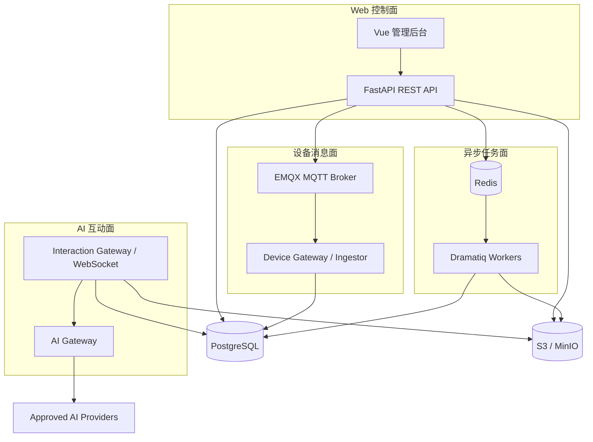

#### Web 控制面

- 人员鉴权、RBAC、机构隔离。
- 题库、试卷、互动脚本、内容发布。
- 设备、命令、OTA、告警和日志查询。
- 所有高风险动作的审批与审计。

#### 设备消息面

- 机器人 MQTT 长连接。
- 状态、遥测、事件、命令通知与 ACK。
- 设备在线/离线事件与 Device Shadow 更新。

#### AI 互动面

- 单次教学会话的低延迟 WebSocket。
- 文字/音频片段、ASR、教学状态和 AI Token/音频流。
- 会话结束后持久化教学事实和 AI Run。

#### 异步任务面

- 题库导入导出、AI 出题、内容包构建。
- 日志包解析、遥测聚合、告警计算。
- OTA 批次推进与超时扫描。
- AI 离线评测、报表和数据清理。

### 2. 技术增量

通用 FastAPI + Vue 技术基线保持不变，机器人平台增加：

| 领域 | 唯一选择 | 用途 |
|---|---|---|
| MQTT Broker | EMQX | MQTT 5、TLS、设备认证、ACL、共享订阅 |
| MQTT Python Client | paho-mqtt | Gateway、集成测试、运维工具 |
| 设备协议 | MQTT 5 over TLS | 遥测、状态、事件、命令和 ACK |
| AI 实时通道 | WebSocket over TLS | 双向文字/音频互动流 |
| 文件通道 | HTTPS + S3 Presigned URL | 固件、内容包、日志包、诊断包 |
| 任务 | Dramatiq + Redis + PostgreSQL Outbox | 可靠异步处理 |
| 时序数据 | PostgreSQL 分区表 | 遥测、事件、命令和日志索引 |
| AI 编排 | 内部类型化 AI Gateway | ASR/LLM/TTS、Prompt、模型、成本、安全 |
| OTA 安全 | TUF/Uptane 思路的签名元数据 | 完整性、防回滚、防冻结和授权目标 |

EMQX 支持 MQTT 5、TLS、认证授权、持久会话、Will 和共享订阅；设备连接优先使用 TCP/TLS，而不是 WebSocket。[EMQX MQTT 文档](https://docs.emqx.com/en/emqx/latest/connect-emqx/mqtt-over-websocket.html)

### 3. 部署形态

首期继续采用 Docker Compose 模块化单体部署，但按进程职责隔离：

```text
caddy
web
api
device-gateway-1..N
interaction-gateway-1..N
outbox-dispatcher
worker-content
worker-operations
worker-analytics
emqx
redis
postgresql
minio（本地/私有环境）
otel-collector
prometheus / grafana / loki / tempo
```

所有 Python 进程复用一个代码仓库和领域模块，不拆成独立微服务。容量达到单机边界后，才将 MQTT、Gateway 和 Worker 水平扩容或迁移到 Kubernetes。

## 四、领域架构

### 1. 领域模块

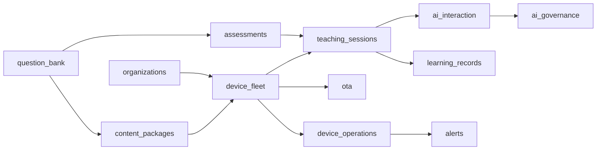

```text
identity              Web 用户、Session、角色与权限
organizations         机构、场地、班级、成员、策略
device_models         机器人型号、硬件能力、组件和兼容矩阵
device_fleet          设备、凭证、分组、标签、影子和绑定
device_operations     遥测、事件、日志、命令、告警和诊断
ota                    固件制品、签名、发布、批次和安装结果
taxonomy               学科、年级、知识点和标签
question_bank          题目、答案、解析、版本、审核和导入
assessments            试卷、规则、题目快照和发布
interaction_scripts    机器人教学状态机和动作模板
content_packages       题库/脚本/资源的离线内容包
teaching_sessions      教学会话、参与者、状态和事件
learning_records       作答、评分、提示、结果和基础统计
ai_interaction         ASR、语义判定、讲解、追问和 TTS
ai_governance          模型、Prompt、AI Run、评测、安全和成本
jobs                   Job、Outbox、Retry 和 Dead Letter
audit                  高风险操作审计
```

### 2. 核心实体

| 实体 | 关键字段 | 核心约束 |
|---|---|---|
| Organization | id, name, status | 业务租户根 |
| Site | organization_id, name, timezone | 学校/场地 |
| DeviceModel | model_code, hardware_revision | 型号与能力定义 |
| Device | serial_number, model_id, org/site, status | 序列号全局唯一 |
| DeviceCredential | device_id, cert/public_key, status | 每设备独立身份 |
| DeviceShadow | desired, reported, version | 配置期望态/上报态 |
| TelemetryRecord | device_id, occurred_at, metrics | 按时间分区 |
| DeviceEvent | event_id, type, severity | 设备幂等事件 |
| DeviceCommand | command_id, type, params, state | 白名单、过期、审计 |
| FirmwareArtifact | model/hw, version, hash, signature | 不可变制品 |
| OTARelease | artifact, targeting, strategy | 分批发布 |
| OTADeployment | release_id, device_id, state | 单设备状态机 |
| KnowledgePoint | subject, grade, code | 题目知识归属 |
| QuestionVersion | type, stem, answer, explanation | 发布后不可变 |
| PaperVersion | question snapshots, rules | 教学使用的快照 |
| InteractionScriptVersion | state machine, actions | 发布前验证 |
| ContentPackage | manifest, checksum, compatibility | 离线内容包 |
| TeachingSession | device, script/paper, mode, state | 互动事实根 |
| Participant | session_id, learner_ref/anonymous | 最小身份数据 |
| AnswerAttempt | question, input, correctness | 可重放事实 |
| AIRun | capability, model, prompt, input/output refs | AI 可追踪 |

### 3. 统一 ID 和时间

- 云端实体使用 UUIDv7。
- 设备自身产生的事件使用 `device_id + boot_id + sequence` 唯一键。
- 所有消息同时带 `sent_at` 和设备单调 `sequence`。
- 服务端记录 `received_at`，不完全信任设备时钟。
- 所有持久时间为 UTC `TIMESTAMPTZ`；场地时区只用于展示和教学安排。
- 每次机器人重启生成新的 `boot_id`，避免 Sequence 重置冲突。

## 五、设备生命周期与身份

### 1. 设备生命周期

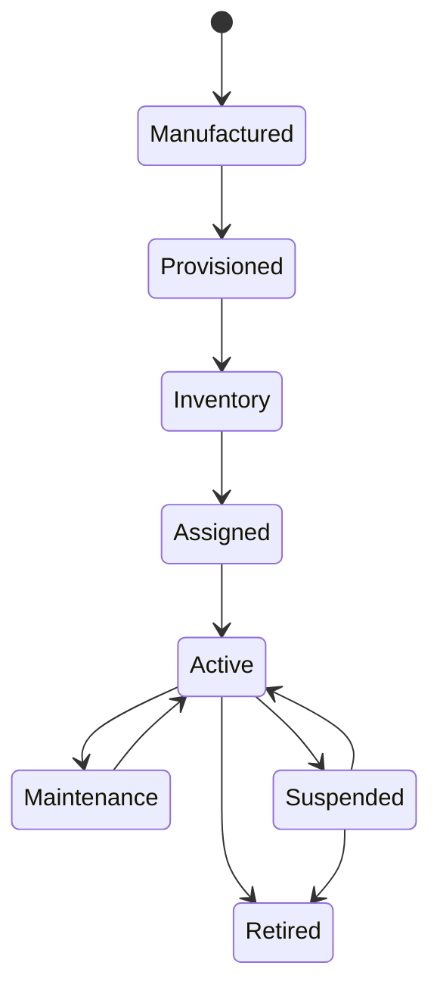

- `Manufactured`：录入序列号、型号和硬件修订。
- `Provisioned`：安全写入设备私钥/证书和可信根。
- `Inventory`：尚未绑定机构。
- `Assigned`：绑定机构和场地，未启用。
- `Active`：允许连接、教学与 OTA。
- `Suspended`：凭证暂停，不能连接 Broker。
- `Retired`：吊销凭证，清除教学身份和敏感配置。

### 2. 设备认证

固定使用每设备唯一 X.509 Client Certificate + MQTT mTLS：

- 私钥在制造/初始化阶段生成或写入安全存储，永不上传云端。
- Certificate Subject/SAN 绑定 `device_id`。
- MQTT `client_id` 必须与证书设备身份一致。
- 禁止共享用户名和密码。
- Broker 只信任设备 CA，不与 Web TLS 证书体系混用。
- 支持短期证书、轮换、吊销和 CRL/OCSP 或 Broker 等价策略。
- 设备遗失或异常时可以立即 Suspend 并撤销连接。

EMQX 安全清单建议为每个设备使用独立凭证，并将 Client ID 与认证身份绑定，避免凭证泄露后创建任意会话。[EMQX Security Checklist](https://docs.emqx.com/en/emqx/latest/access-control/security-checklist.html)

### 3. 首次绑定

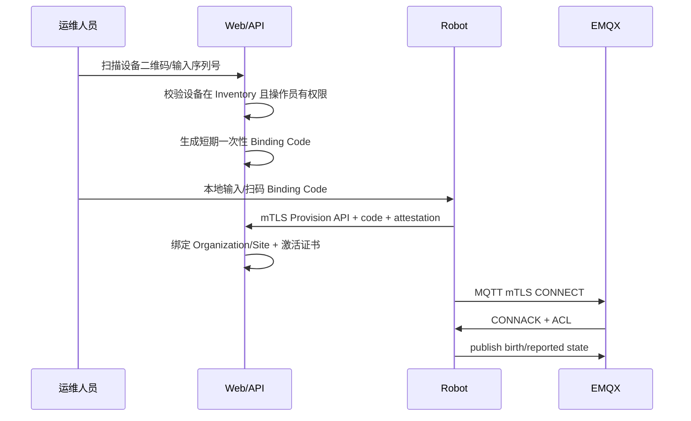

Binding Code 短期、单次使用并绑定设备序列号；绑定、转移和解绑全部写审计日志。

## 六、MQTT 设备协议设计

### 1. Topic 规范

```text
v1/devices/{device_id}/state/reported
v1/devices/{device_id}/telemetry
v1/devices/{device_id}/events
v1/devices/{device_id}/logs/index
v1/devices/{device_id}/commands
v1/devices/{device_id}/commands/{command_id}/ack
v1/devices/{device_id}/ota/status
v1/devices/{device_id}/content/status
v1/devices/{device_id}/session/events
```

云端发布：

```text
v1/devices/{device_id}/state/desired
v1/devices/{device_id}/commands
v1/devices/{device_id}/ota/notify
v1/devices/{device_id}/content/notify
```

Topic 不把机构 ID 当作授权依据，Broker 根据证书身份把设备限制在自己的 `{device_id}` 空间。

### 2. ACL

设备只能：

- Publish 自己的 `reported/telemetry/events/ack/status/session`。
- Subscribe 自己的 `desired/commands/ota/notify/content/notify`。
- 不能使用 `+` 或 `#` 通配订阅。
- 不能读取其他设备 Topic。
- 不能向命令 Topic 发布。

云端 Device Gateway 使用独立服务证书和 Shared Subscription 消费设备上行消息；EMQX Shared Subscription 可以将同组消息分发给一个消费者，实现水平扩展。[EMQX Shared Subscription](https://docs.emqx.com/en/emqx/latest/messaging/mqtt-shared-subscription.html)

### 3. QoS、Retain 与 Session

| 消息 | QoS | Retain | 说明 |
|---|---:|---:|---|
| 高频遥测 | 0 | 否 | 允许少量丢失，下一次会更新 |
| 设备事件/故障 | 1 | 否 | 服务端按 event_id 去重 |
| Reported Shadow | 1 | 是 | 只保留最新状态 |
| Desired Shadow | 1 | 是 | 设备重连取得最新期望配置 |
| Command | 1 | 否 | 有 Command 状态机、过期和幂等 |
| Command ACK | 1 | 否 | 幂等更新状态 |
| OTA/Content Notify | 1 | 是 | 通知最新可用发布，制品走 HTTPS |
| 互动细粒度事件 | 1 | 否 | 会话事实，可断网缓冲 |

- 使用 MQTT 5 Persistent Session 和合理 Session Expiry。
- Device 设置 Last Will；Broker 在异常断开时发布离线事件。
- Retained 只用于最新状态/通知，不用来保存历史命令。
- 不使用 QoS 2；业务幂等比增加协议复杂度更可控。
- 大文件、完整日志、音频和固件绝不放入 MQTT Payload。

### 4. 统一消息 Envelope

```json
{
  "schema": "robot.telemetry.v1",
  "message_id": "0198...",
  "device_id": "0198...",
  "boot_id": "0198...",
  "sequence": 1024,
  "sent_at": "2026-08-12T06:00:00Z",
  "firmware_version": "2.3.1",
  "payload": {}
}
```

- JSON Schema/Pydantic 按 `schema` 版本验证。
- 未知 Major Schema 进入隔离队列并告警。
- Message Size 设置严格上限。
- 重复 Message 通过唯一键丢弃，不产生重复业务效果。
- 新字段必须向后兼容；破坏性变化创建新 Major Topic/Schema。

### 5. 背压与降级

- 设备对遥测做采样、聚合和本地缓冲。
- 离线缓存设容量上限，优先保留故障、命令结果和教学结果。
- 云端高负载时降低非关键遥测采样，不能丢命令 ACK 和 OTA 状态。
- Device Gateway 失败时依靠 MQTT Persistent Session 短期缓冲 QoS 1 消息。
- Broker 消息不是长期事实，落库后才算完成业务处理。

## 七、设备影子与在线状态

### 1. Device Shadow

```json
{
  "version": 17,
  "desired": {
    "volume_limit": 70,
    "telemetry_interval_sec": 30,
    "interaction_policy_version": "v4"
  },
  "reported": {
    "volume_limit": 60,
    "telemetry_interval_sec": 30,
    "interaction_policy_version": "v3"
  }
}
```

- Web 修改 Desired 时增加 Shadow Version。
- 设备应用配置后上报 Reported 和处理结果。
- 云端计算 Desired/Reported Drift。
- 设备拒绝不兼容或超出本地安全上限的配置。
- Shadow 只保存配置和设备状态，不保存瞬时命令。

### 2. 在线状态

在线判断综合：

- Broker Connect/Disconnect/Last Will。
- 最后心跳。
- `last_seen_at`。
- 当前 `boot_id`。
- 心跳间隔和网络抖动容忍。

状态：

```text
online
degraded（在线但高延迟/关键指标异常）
offline
unknown（新设备或数据不足）
suspended
```

不把单次 MQTT Disconnect 直接判定为严重离线，使用短 Debounce 防止告警风暴。

## 八、遥测、日志与告警

### 1. 遥测范围

```text
system   cpu, memory, disk, uptime, process health
network  rssi, latency, reconnect count, bytes
power    battery, charging, voltage, temperature
device   motor/sensor/camera/microphone/speaker status
app      loop lag, crash count, queue depth, content version
ai       asr latency, interaction latency, fallback count
```

禁止默认上传原始音频、视频和持续环境录音。只有明确诊断操作、机构授权和可见提示下，才能上传限定时间窗口的诊断数据。

### 2. PostgreSQL 分区

使用按 `occurred_at` 的 Range Partition：

```text
device_telemetry      日分区或月分区，按实际量验证
device_events         月分区
device_command_events 月分区
teaching_events       月分区
audit_events          月分区
```

索引以典型查询为依据：

```text
(organization_id, device_id, occurred_at desc)
(organization_id, event_type, occurred_at desc)
(organization_id, severity, status, occurred_at desc)
```

- 高频 Telemetry 仅保留必要维度，不使用 EAV 万能表。
- 指标类型用稳定 Schema/JSONB + 必需生成列。
- 原始高频数据短期保留，小时/日聚合长期保留。
- 新分区提前创建，旧分区按策略 Detach/Drop。
- 数据规模超过单 PostgreSQL SLO 后再 ADR 评估 TimescaleDB/ClickHouse，不预先引入。

### 3. 日志

日志分两类：

1. **结构化运行事件**：通过 MQTT 上报并落 PostgreSQL，供检索和告警。
2. **诊断日志包**：设备本地打包压缩，通过短期 S3 Presigned URL 上传。

诊断日志流程：

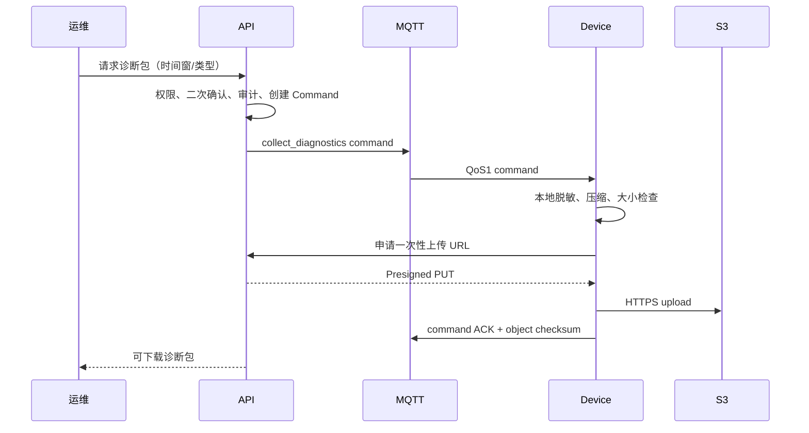

- 诊断包短期保留并加密。
- 默认脱敏 Wi-Fi 密码、Token、证书私钥、学生语音和 PII。
- 下载需要重新鉴权且写审计。

### 4. 告警

告警来源：

- 确定性规则：离线、高温、磁盘不足、崩溃循环、版本不一致。
- 时间窗口规则：重连率、错误率、延迟、OTA 失败率。
- 聚合规则：某型号/固件/机构集中异常。

状态机：

```text
open -> acknowledged -> resolved
  \-> suppressed（带原因和到期）
```

- 告警使用 Fingerprint 去重。
- 支持恢复事件，不只发送触发事件。
- AI 可以汇总日志和建议排障，但不能自动执行修复命令。
- 首期通过站内告警；外部通知后续按明确渠道接入。

## 九、远程命令设计

### 1. 命令白名单

初始命令：

```text
refresh_shadow
sync_content
restart_application
collect_diagnostics
run_self_test
set_maintenance_mode
reboot_device（高风险）
```

明确禁止：

- 任意 Shell。
- 任意文件读写路径。
- 任意 URL 下载/上传。
- 未签名代码执行。
- 绕过设备端安全控制的电机/硬件任意控制。

### 2. 命令状态机

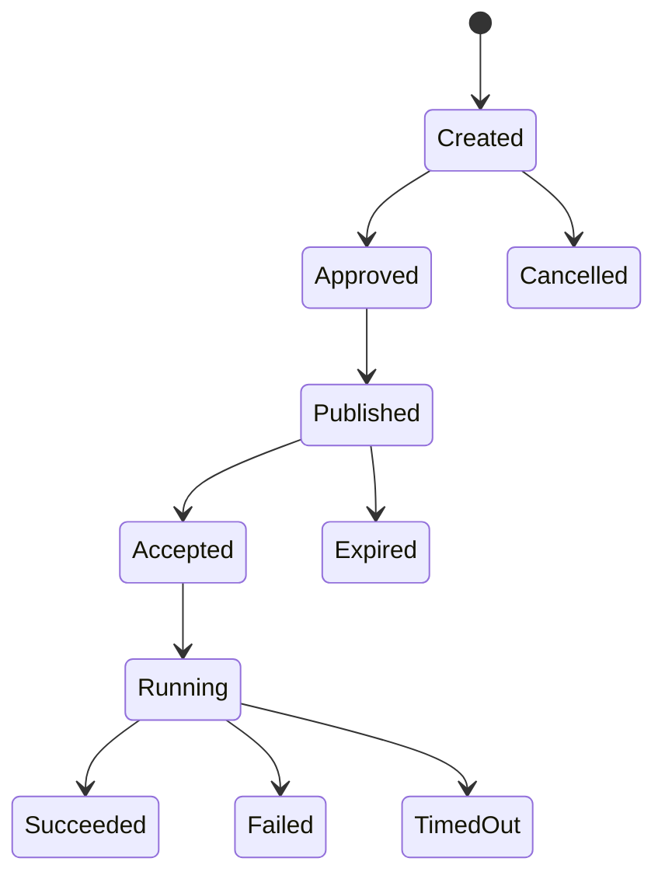

`DeviceCommand`：

```text
command_id
organization_id
device_id
type
validated_parameters
requested_by
approved_by nullable
reason/ticket
created_at/not_before/expires_at
state
attempt_count
result_code/safe_result
```

### 3. 安全控制

- Web 用户通过 REST 创建命令，浏览器不能直接向 MQTT 发布。
- Pydantic Discriminated Union 验证每种命令参数。
- 高风险命令要求二次认证和双人审批。
- 命令必须带短期 `expires_at`，设备拒绝过期命令。
- 设备按 `command_id` 幂等，重发只返回已有结果。
- 设备端再次检查当前状态，例如低电量时拒绝 OTA/重启。
- 命令请求、审批、发布、ACK 和结果全部审计。
- 批量命令按设备组生成单设备 Deployment，不直接广播不可追踪消息。

## 十、OTA 升级架构

OTA 是平台最高风险能力之一，不能只是“上传 ZIP 后发 MQTT 通知”。设计借鉴 TUF/Uptane 的签名元数据、目标授权、版本与过期校验，抵御任意软件、回滚、冻结和混搭攻击。[Uptane Standard](https://uptane.org/docs/2.0.0/standard/uptane-standard)

### 1. 制品模型

```text
FirmwareArtifact
├── artifact_id
├── component
├── semantic_version
├── release_counter（单调递增）
├── compatible_model_codes[]
├── hardware_revision_range
├── min_bootloader_version
├── size
├── sha256
├── object_key
├── signature/metadata_version
├── sbom_object_key
├── release_notes
└── status: uploaded/verified/approved/revoked
```

- 固件制品不可变、内容寻址。
- CI 构建、扫描、生成 SBOM，再由受控发布流程签名。
- 离线 Root Key 与在线 Targets/Timestamp Key 分离并轮换。
- API/Worker 只持有发布所需最低权限，不持有离线 Root Key。

### 2. OTA 发布策略

```text
internal test devices
-> 1% canary
-> 10%
-> 30%
-> 100%
```

每一阶段配置：

- 最小观察窗口。
- 最大同时升级数。
- 最低电量/必须接电。
- 允许网络类型。
- 教学会话外维护窗口。
- 成功率、启动失败率、崩溃率和关键遥测门限。
- 自动暂停条件，但继续发布必须人工确认。

### 3. 设备端升级

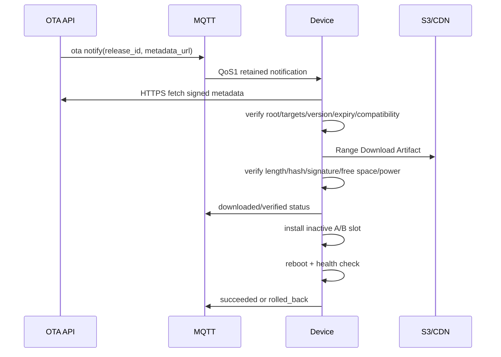

### 4. 安全与回滚

- 设备内置可信 Root Metadata/Public Key。
- 验证签名、长度、Hash、型号、硬件修订和 Release Counter。
- 拒绝过期元数据，防止 Freeze。
- 拒绝低于已安装 Release Counter 的版本，防止 Rollback。
- A/B 分区或等价原子切换，失败自动回到 Known Good Version。
- Boot Success 只有关键服务健康并持续观察后才确认。
- 数据库迁移需向后兼容，固件回滚后数据仍可读取。
- 紧急回滚仍发布一个更高 Release Counter 的已知稳定制品，而不是允许降级检查失效。
- Web 必须突出展示影响设备数、型号、当前阶段和失败原因。

### 5. OTA 状态

```text
eligible
notified
downloading
downloaded
verifying
installing
rebooting
health_checking
succeeded
failed
rolled_back
cancelled
ineligible
```

所有状态转换都有 `event_id`、设备时间、云端接收时间和错误码，可生成发布漏斗。

## 十一、题库管理系统

### 1. 内容结构

```text
Subject
└── Grade
    └── KnowledgePoint
        └── Question
            └── QuestionVersion
```

题目类型首期：

- 单选、多选、判断。
- 填空与短文本。
- 语音回答题。
- 排序/配对等屏幕交互题。
- 开放问答（AI 语义判定 + 教师规则）。
- 机器人动作互动题，例如“跟着机器人完成一个步骤”，但不做高风险人体动作判断。

### 2. Question Version

```text
stem
type
options
canonical_answer
accepted_answers
scoring_rule
explanation
hints[]
knowledge_points[]
difficulty
grade_range
language
media_assets[]
robot_requirements[]
status
source/copyright
```

- Draft 可修改，Published Version 不可原地修改。
- 试卷绑定题目版本快照。
- AI 生成题必须处于 `ai_draft`，通过规则验证和人工审核后才能发布。
- 删除已使用题目只做归档，不破坏历史教学会话。
- 题目媒体使用 S3，并随内容包生成兼容资源。

### 3. 导入

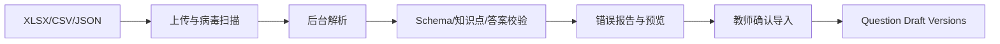

- 导入两阶段，解析成功不等于写入正式题库。
- 每行显示稳定错误码和定位。
- 支持幂等导入键和重复题提示。
- 大批量由 Dramatiq 处理，前端显示 Job Progress。

### 4. AI 出题

教师输入学科、年级、知识点、难度、题型和数量，AI Gateway 生成结构化草稿。流水线：

```text
生成
-> JSON Schema
-> 正确答案确定性校验（能校验的题型）
-> 年龄/内容安全
-> 重复题相似度
-> 知识点和难度一致性
-> 教师审核/修改
-> 发布
```

AI 永远不自动发布，也不能替代教师确认标准答案。

### 5. 试卷和活动

- 固定试卷：显式题目列表和顺序。
- 规则试卷：按知识点、难度、题型抽题，启动会话时生成不可变 Snapshot。
- 课堂活动：教师选择班级和机器人立即发起。
- 自主练习：机器人从已同步内容包中选择。
- 互动脚本定义每题前后机器人表现与 AI 策略。

## 十二、机器人教学脚本

### 1. 状态机

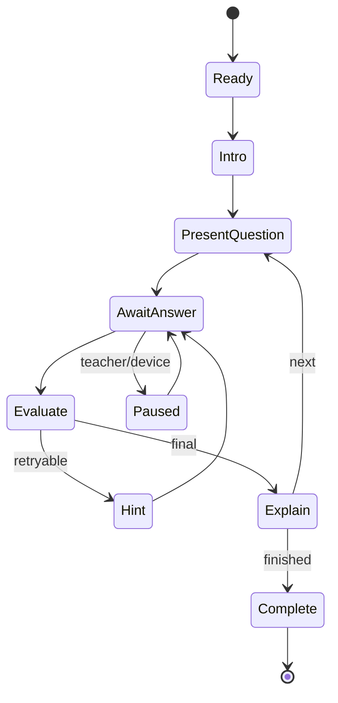

脚本节点：

```text
speak(text/template)
display(card/media/question)
play_audio(asset)
set_light(preset)
play_motion(approved_motion_id)
wait(duration/input)
ask(question_ref)
evaluate(rule/ai_policy)
branch(condition)
emit(event)
```

### 2. 安全动作目录

机器人动作不是模型自由文本。`DeviceModelCapability` 维护：

```text
capability_id
approved_action_ids
parameter ranges
preconditions
max duration
cooldown
age/location restrictions
```

AI 只能输出：

```json
{
  "speech": "我们再想一想……",
  "display_template": "hint_card",
  "emotion": "encouraging",
  "action_id": "nod_small"
}
```

服务端验证 Schema 和白名单，机器人端再次检查型号能力、当前状态、安全互锁和参数范围。AI 无法控制自由电机轨迹、摄像头上传或系统命令。

### 3. 内容包

机器人需要弱网/离线能力，发布内容生成签名 Content Package：

```text
manifest.json
questions.json
scripts.json
localized text
audio/image assets
compatibility metadata
checksums/signature
```

- Content Package 与固件分开发布，但同样不可变和签名。
- Manifest 指定最低 App/Firmware Version 和机器人型号能力。
- 机器人下载后先验证再原子切换。
- 保留当前和上一内容版本，切换失败可回滚。
- MQTT 只通知新版本，内容通过 HTTPS/S3 下载。

## 十三、AI 机器人互动

### 1. 能力边界

首期 AI Capability：

| Capability | 输入 | 输出 | 延迟目标 |
|---|---|---|---|
| asr.transcribe | 音频帧 | 实时/最终文本 | 首段小于 1 秒 |
| answer.semantic_match | 学生回答 + 标准答案 | 正确/部分/错误/不确定 | p95 小于 2 秒 |
| tutor.hint | 题目、知识点、历史提示 | 受控提示 | 首 Token 小于 2 秒 |
| tutor.explain | 题目、答案、解析 | 适龄讲解 | 首 Token 小于 2 秒 |
| tutor.follow_up | 当前回答 | 追问 | 首 Token 小于 2 秒 |
| tts.synthesize | 已审核文本流 | 音频流 | 首音频小于 1.5 秒 |
| author.question_draft | 教研约束 | 题目草稿 | 后台任务 |
| ops.log_summary | 脱敏日志 | 故障摘要草稿 | 后台任务 |

### 2. 互动架构

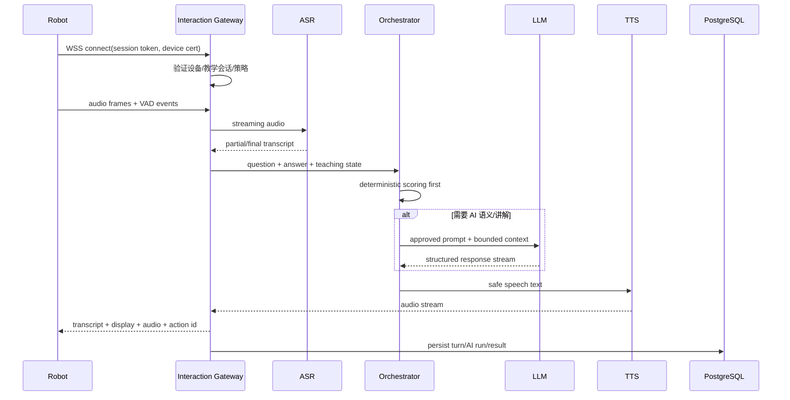

### 3. 为什么不用 MQTT 传连续音频

- MQTT 适合小型、离散、可路由消息，不适合高频双向音频帧。
- 互动会话使用 WSS，提供顺序流、取消、背压和半双工控制。
- MQTT 只发送 `interaction_session_ready/ended/fallback` 等状态事件。
- 语音原始帧默认不落库；仅保留转写和经策略允许的短期诊断样本。

### 4. 会话 Token

- Robot 先通过 MQTT 或 HTTPS 获取短期单会话 Token。
- Token 绑定 `device_id + teaching_session_id + capability + expiry`。
- Interaction Gateway 同时验证设备证书和 Token。
- Token 不能用于其他设备/会话，也不能访问 Web API。
- 断线恢复使用新 Token 或剩余有效 Token，并从服务器教学状态继续。

### 5. 教学编排器

AI 不是教学流程控制器。Orchestrator 先执行确定性规则：

```text
Question Type
-> deterministic scoring when possible
-> hint attempt policy
-> AI semantic match only when needed
-> confidence threshold
-> fallback to predefined explanation
-> select approved response/action
-> update teaching state
```

- 客观题不调用 LLM 评分。
- 填空先使用规范化、同义词和规则匹配。
- AI 语义判定低置信度时不武断判错，使用澄清或教师规则。
- 教学脚本限制最大追问、提示层数和输出长度。
- 模型不能改变试卷、正确答案、分数规则或教学会话状态。

### 6. 弱网和离线

降级顺序：

```text
云端 AI 正常
-> 云端文本模式（降低音频带宽）
-> 设备本地 ASR/TTS 或预生成语音（若型号支持）
-> 题目自带 hints/explanation
-> 纯题库离线教学
```

- 教学脚本和题目必须有非 AI Fallback。
- 机器人本地持久化 Teaching Events，联网后按 Sequence 补传。
- 云端不可用不能使机器人卡死；所有等待有超时和确定性分支。

### 7. AI 安全

- 学生语音、题目内容、检索文本均是不可信输入。
- Prompt 版本化，业务不能散落供应商调用。
- 模型输出经过 Pydantic Schema、内容安全和动作白名单。
- 不给模型任意 MQTT Publish、设备控制、OTA、文件或网络工具。
- 学生不能通过语音诱导机器人执行运维命令。
- 运维日志 AI 摘要不具有自动修复权限。
- 未成年人对话使用适龄 Policy，安全事件按机构流程人工处理。
- AI Provider 接收最少数据，不发送设备证书、网络密码、真实学生身份或完整诊断包。

## 十四、教学会话与学习数据

### 1. 会话模式

```text
individual_bound     绑定学生账户/学号的个人学习
individual_anonymous 不采集身份的临时练习
classroom_shared     多人课堂，只记录聚合或座位匿名 ID
teacher_demo         教师演示，不进入学生掌握度
diagnostic           运维测试，不进入教学数据
```

必须明确 Mode，禁止把设备运维测试误计为学生答题。

### 2. TeachingSession

```text
id
organization_id/site_id
device_id
class_id nullable
mode
paper_version_id
interaction_script_version_id
content_package_version
firmware/app versions
started_at/ended_at
state/end_reason
network_quality_summary
```

每次答题记录：题目版本、输入方式、规范化回答、规则/AI 判定、置信度、提示次数、耗时、最终结果和 AI Run ID。

### 3. 数据最小化

- 匿名模式使用随机 Participant ID，会话结束后无法反推个人。
- 不默认录制教室环境音频或视频。
- 语音转写仅为教学需要保留；原始音频默认实时处理后丢弃。
- 教师看到班级数据必须有班级归属权限。
- 运维人员默认看不到学生答案和转写正文，只看技术指标。
- 教研人员查看去标识的题目质量数据。
- 数据导出、删除和保留按机构和适用法律配置。

### 4. 基础学习分析

首期提供可解释指标：

- 题目/知识点正确率。
- 首次正确率与提示后正确率。
- 平均答题时间。
- 未作答、超时和识别失败率。
- 题目区分度与错误选项分布。
- 机器人/网络/ASR 故障对作答的影响。

不得将 ASR 识别失败计为学生错误；分析必须区分 `student_incorrect`、`input_uncertain` 和 `system_failure`。

## 十五、Web 管理后台

### 1. 信息架构

```text
总览
├── 设备在线/异常/版本
├── 今日教学会话
├── 待处理告警/命令/OTA
└── AI 用量与异常

内容中心
├── 学科与知识点
├── 题库
├── 试卷/活动
├── 互动脚本
├── AI 生成审核
└── 内容包发布

教学运营
├── 班级/学生（按机构需要）
├── 教学会话
├── 作答结果
├── 知识点分析
└── 题目质量

设备运维
├── 设备列表/详情
├── 实时状态/影子
├── 遥测趋势
├── 事件/告警
├── 日志/诊断包
├── 远程命令
└── OTA

系统管理
├── 机构/场地/成员
├── 设备型号/能力
├── 固件/内容兼容矩阵
├── AI 模型/Prompt/预算
├── 审计日志
└── 数据策略
```

### 2. 前端实时更新

浏览器通过 FastAPI SSE/WebSocket 获取后台实时数据，不直连 EMQX：

- 设备在线/离线、告警、命令和 OTA 进度：SSE。
- 高频单设备诊断实时流：受限 WebSocket，显式开始/结束。
- 普通列表：TanStack Query + 条件刷新。

FastAPI 从 PostgreSQL/Redis 读取经授权的事件并向浏览器推送，避免把 MQTT 设备 ACL 暴露给 Web 用户。

### 3. 关键页面

#### 设备详情

```text
Identity: 序列号、型号、机构、场地、标签
Status: 在线、最后心跳、网络、电量、温度
Versions: firmware/app/content/config
Shadow: desired/reported/drift
Telemetry: 可选时间窗口趋势
Events/Alerts
Commands: 历史与创建
OTA: 当前/历史
Logs: 结构化事件和诊断包
Audit
```

#### OTA 发布向导

```text
选择制品
-> 兼容性检查
-> 目标设备预览
-> 灰度策略和门限
-> 维护窗口
-> 风险摘要
-> 二次认证/审批
-> 发布监控
```

#### 题目编辑器

- 按题型显示差异化字段。
- 知识点、年级、难度和机器人能力约束。
- Markdown/公式/媒体预览。
- 标准答案、解析和分层提示。
- AI 草稿 Diff、验证错误和审核记录。
- 在目标机器人屏幕尺寸上的模拟预览。

## 十六、API 设计

### 1. Web REST API

```text
/api/v1/organizations
/api/v1/sites
/api/v1/devices
/api/v1/device-models
/api/v1/device-groups
/api/v1/device-commands
/api/v1/telemetry
/api/v1/device-events
/api/v1/alerts
/api/v1/diagnostic-bundles
/api/v1/firmware-artifacts
/api/v1/ota-releases
/api/v1/questions
/api/v1/papers
/api/v1/interaction-scripts
/api/v1/content-packages
/api/v1/teaching-sessions
/api/v1/learning-records
/api/v1/ai/runs
/api/v1/jobs
```

### 2. 设备 HTTPS API

设备面独立路径、认证依赖和限流：

```text
/device-api/v1/provision/*
/device-api/v1/session-tokens
/device-api/v1/uploads
/device-api/v1/ota/metadata
/device-api/v1/content/metadata
/device-api/v1/time
```

- 只接受 mTLS 设备身份。
- 不复用 Web Cookie Session。
- Device ID 从证书身份获得，不从 Body 决定。
- 每个 API 严格限制 Scope、大小和频率。

### 3. 幂等与并发

- 命令、OTA、内容发布使用 `Idempotency-Key`。
- Web 编辑使用 ETag/`If-Match`。
- 设备消息按 Message Unique Key 去重。
- Shadow 使用版本号，拒绝旧 Reported/Desired 更新覆盖新状态。
- Job/Outbox/Worker 都按业务 ID 幂等。

## 十七、数据库与数据保留

### 1. 多租户

- 所有机构业务表带 `organization_id`。
- Web API 使用 PostgreSQL RLS + Service 授权。
- Device Gateway 从 Broker 认证身份映射设备和机构，并为事务设置租户上下文。
- 平台级设备型号与固件制品使用独立全局域，发布目标仍按机构授权。

### 2. 分区与保留

初始保留策略：

| 数据 | 原始保留 | 聚合/元数据保留 |
|---|---:|---:|
| 高频遥测 | 30 天 | 小时/日聚合 13 个月 |
| 结构化设备事件 | 180 天 | 关键故障统计 2 年 |
| 命令记录 | 1 年 | 审计按机构政策 |
| OTA 部署事件 | 2 年 | 发布摘要长期保留 |
| 诊断日志包 | 7 天 | Hash、请求和结论 180 天 |
| 原始学生音频 | 默认不保存 | 转写按教学策略保留 |
| 教学会话与答题 | 机构教学政策 | 去标识聚合可长期保留 |
| AI Input/Output 全文 | 90 天或更短 | Run 元数据 1 年 |
| Web/设备审计 | 至少 1 年 | 归档按合规政策 |

定期任务创建新分区、归档聚合并 Drop 到期分区。删除设备或学生数据时，必须处理 S3、日志包、AI Run 和派生统计的关联。

### 3. 数据恢复

- PostgreSQL 每日完整备份 + WAL PITR。
- S3 开启版本控制和生命周期。
- EMQX 配置、ACL 和 CA 有加密备份。
- Redis 不是真实状态源；从 PostgreSQL Job/Outbox 可恢复任务。
- 固件签名密钥单独备份和灾难恢复演练。
- 每季度做数据库、内容包和 OTA Metadata 恢复演练。

## 十八、安全设计

### 1. 信任边界

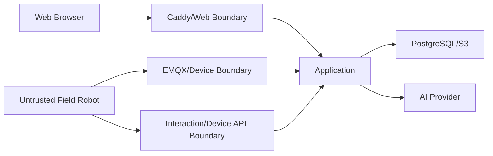

机器人处在用户现场，必须视为可能被物理访问或攻陷。设备凭证只允许该设备最小范围操作，不能因为在产品硬件中就默认可信。

### 2. 分层凭证

```text
Web User      HttpOnly Session Cookie + CSRF
Robot MQTT    X.509 mTLS Certificate
Robot HTTPS   X.509 mTLS Certificate
Interaction   Device mTLS + short session token
Cloud Service 独立 Service Certificate/Credential
OTA Signing   分角色签名 Key，不进入普通服务
```

不同用途凭证不得复用。

### 3. 高风险操作

以下操作要求重新认证、理由和审计，部分要求双人审批：

- 批量重启/维护模式。
- 采集诊断包。
- 机构间转移设备。
- 吊销/重新签发设备证书。
- 创建或推进 OTA Release。
- 回滚/停止全局发布。
- 修改 Device Model Capability。
- 发布 AI Prompt、互动脚本和题库内容包。

### 4. 机器人隐私

- 摄像头、麦克风启用时设备必须有可见/可听提示。
- 默认不持续上传环境音视频。
- 日志不能包含 Wi-Fi 密码、Token、证书私钥和原始学生身份。
- 远程诊断必须限定数据类型和时间窗。
- 运维、教研、教师三种数据视图隔离。
- AI Provider 不接收运维秘密和完整设备日志。

### 5. AI 与设备隔离

- AI 输出是建议数据，不是设备权限。
- 动作必须经过 Orchestrator Schema、Capability Catalog 和设备端安全检查。
- AI 无 OTA、命令、凭证、Broker、数据库或任意网络工具。
- Prompt Injection 无法越过确定性控制面。
- 日志 AI 摘要显示“建议”，所有命令由人显式创建。

## 十九、可靠性与降级

### 1. 故障隔离

| 故障 | 系统行为 |
|---|---|
| AI Provider 不可用 | 使用题目预置提示/解析，基础教学继续 |
| Interaction Gateway 不可用 | 机器人切离线脚本，MQTT 上报降级 |
| MQTT 短时断开 | 本地缓存事件，重连补传；教学可继续 |
| Redis 不可用 | 新后台任务暂缓，Web/设备核心状态继续 |
| PostgreSQL 不可用 | 云端控制暂停；机器人执行本地已发布内容 |
| S3 不可用 | 暂停新固件/内容下载，不影响已缓存内容 |
| 单设备异常 | 隔离该设备，不影响整个场地 |
| OTA 异常 | 自动暂停当前批次，未升级设备保持原版本 |

### 2. SLO

| 指标 | 初始目标 |
|---|---|
| Web/API 可用性 | 月度 99.9% |
| MQTT Broker 可用性 | 月度 99.95% |
| 设备在线状态传播 p95 | 小于 5 秒 |
| 命令 Publish 到 Accepted p95 | 在线设备小于 3 秒 |
| AI 互动首文本 p95 | 小于 2 秒 |
| AI 互动首音频 p95 | 小于 2.5 秒 |
| OTA 状态事件完整率 | 大于 99.9% |
| 跨设备/跨租户 ACL | 关键测试 100% 阻断 |
| 未授权远程命令 | 0 |
| 未签名固件安装 | 0 |

### 3. 容量关键参数

上线前必须以真实机器人模拟器验证：

```text
concurrent MQTT connections
connect/reconnect storm
messages per second
average/max payload
persistent session/offline queue memory
simultaneous AI interactions
audio bandwidth
OTA concurrent downloads/CDN egress
telemetry write throughput/partition size
```

容量计划不能仅按 Web QPS 推算。

## 二十、可观测性

### 1. 端到端关联

统一关联字段：

```text
request_id
trace_id
organization_id
device_id
boot_id
teaching_session_id
interaction_turn_id
command_id
ota_release_id / deployment_id
ai_run_id
job_id
```

Metric Label 禁止使用高基数 ID；这些 ID 进入 Log/Trace。

### 2. 关键指标

#### EMQX/设备

- 在线连接数、连接/认证失败。
- Publish/Subscribe、Dropped、Inflight、Offline Queue。
- 每 Topic Class 消息速率和大小。
- 重连风暴、异常 Client ID 和 ACL 拒绝。

#### 运维

- 在线率、离线时长、崩溃率。
- 命令成功率、延迟、过期率。
- OTA 各阶段漏斗、失败和回滚率。
- 设备型号/版本的故障聚合。

#### 教学/AI

- 会话完成率、答题与输入失败率。
- ASR 无结果率、AI 延迟与 Fallback。
- Token/音频时长/成本。
- AI 语义判定人工抽检一致性。

### 3. 告警

- Broker 连接数/内存/Offline Queue 异常。
- 某机构或型号集中离线。
- 命令 ACK 超时或失败骤增。
- OTA Canary 失败率越界。
- 固件签名/Hash/回滚校验失败。
- AI 互动延迟、错误、成本异常。
- 遥测分区创建失败、数据库连接池耗尽。
- 设备证书即将过期或异常认证激增。

## 二十一、测试策略

### 1. Robot Simulator

项目必须提供可编程机器人模拟器：

- mTLS MQTT Connect/Disconnect/Will。
- 状态、遥测、事件和 Session Expiry。
- 命令接收、重复、过期、ACK 和失败。
- Shadow Desired/Reported/Version。
- OTA 下载、断点、Hash 失败、安装、回滚。
- 内容包同步和教学脚本。
- WebSocket 音频/文本互动。
- 断网缓存、乱序、重复和重连风暴。

没有模拟器，设备云平台无法在 CI 稳定验证。

### 2. 协议测试

- MQTT Schema 兼容和未知版本隔离。
- 每设备证书、Client ID 绑定和 Topic ACL。
- QoS 1 重复交付幂等。
- Retained、Will、Persistent Session 和 Shared Subscription。
- Payload 上限、恶意 JSON、错误时间和 Sequence。
- WebSocket 鉴权、背压、超时、取消和断线恢复。

### 3. OTA 安全测试

- 无签名、错误 Hash、错误 Length。
- 过期 Metadata、Rollback、Freeze、Mix-and-match。
- 错误型号/硬件修订/Bootloader。
- 下载中断、磁盘不足、低电量。
- 安装崩溃、Boot Health 失败和 A/B 回滚。
- Canary 自动暂停和人工恢复。
- 批量发布幂等与取消。

### 4. 题库和教学测试

- 各题型验证、导入错误定位、版本不可变。
- 试卷抽题 Snapshot 可复现。
- 脚本静态检查：不可达状态、死循环、缺失 Fallback。
- 型号能力兼容检查。
- AI 出题永不自动发布。
- 系统故障不误判学生错误。

### 5. AI 测试

- 确定性评分优先，LLM 只用于必要语义任务。
- Prompt/模型版本回归。
- 学生语音 Prompt Injection 无法触发设备命令。
- Action ID 只来自 Capability Catalog。
- ASR 低置信度走澄清，不直接判错。
- Provider 故障走离线 Fallback。
- 隐私字段不发送给 Provider。

### 6. 负载与故障测试

- 数千/目标规模并发长连接。
- 场地断电后的重连尖峰。
- 遥测突发和 Slow Consumer。
- 多设备并发 OTA 下载。
- 并发 AI 音频会话和 Provider 限流。
- EMQX、Gateway、Redis、PostgreSQL 重启。
- Worker 重复处理和 Outbox 恢复。

## 二十二、CI/CD 与发布

### 1. 云端发布

继承通用基线：Ruff、Pyright、pytest、ESLint、vue-tsc、Vitest、Playwright、OpenAPI/Orval、Trivy、SBOM 和不可变镜像。

新增门禁：

```text
MQTT JSON Schema compatibility
Robot Simulator integration
EMQX ACL tests
Device API mTLS tests
Interaction WebSocket tests
PostgreSQL partition tests
OTA metadata/signature tests
AI action allowlist tests
```

### 2. 机器人软件发布

```text
Source
-> build reproducibly
-> unit/hardware-in-loop tests
-> SAST/dependency scan
-> generate SBOM
-> artifact hash
-> sign metadata
-> upload immutable artifact
-> internal device test
-> create OTA release
-> canary/progressive rollout
```

云端应用部署与机器人 OTA 是两套发布链，不能共用一个无区分的“发布”按钮。

## 二十三、实施路线

当前路线拆为阶段 1A/1B：阶段 1A 使用两个合成机构和一个虚拟设备组合开发云端闭环；阶段 1B 获得物理设备后补充 G1-Device/HIL，再进入真实机构试点。Simulator 通过不能用于声称真实硬件、现场网络或生产兼容。

### 阶段 0：设备协议与安全契约

- 收集实际机器人型号、OS、硬件能力和现有通信方式。
- 确定 MQTT Topic、Schema、QoS、证书和 ACL。
- 确定设备端 OTA A/B、签名验证和安全存储能力。
- 建 Robot Simulator 和 Protocol Conformance Tests。
- 这一步完成前不要先做漂亮的运维页面。

### 阶段 1A：Simulator-only 设备云 MVP

- EMQX、设备 CA、Provision/Binding。
- Device Registry、Shadow、Online、Telemetry、Events。
- Device Gateway、分区表和基础告警。
- Web 设备列表、详情、实时状态和审计。
- 单设备白名单命令与 ACK。
- 仅使用 PILOT-001 的合成租户、测试 CA 和六个模拟设备。

### 阶段 1B：真实设备/机构试点

- 确认真实机构、场地、授权联系人和设备组合。
- 验证 OS/Runtime、私钥存储、证书生命周期、网络和命令本地安全。
- 真实设备与 Simulator 运行同一 G1/G2-Device Conformance Suite。
- P0 差异为零后才允许现场试点或生产准入声明。

### 阶段 2：题库与内容

- 学科、年级、知识点和题目版本。
- XLSX/CSV 导入预览、验证和确认。
- 试卷、互动脚本和机器人能力校验。
- Content Package 构建、签名、同步和回滚。
- 教研 Web 工作台。

### 阶段 3：教学会话

- 教师发起、机器人自主和运维诊断三类会话。
- TeachingSession、Participant、AnswerAttempt 和事件补传。
- 确定性评分、提示和解析。
- 教学数据与设备故障分离。
- 基础学习/题目质量报表。

### 阶段 4：AI 互动

- Interaction Gateway 和会话 Token。
- Streaming ASR/LLM/TTS Adapter。
- 类型化 AI Gateway、Prompt/Model/AIRun。
- 语义判定、提示、讲解和受控动作。
- 弱网/离线 Fallback、隐私和安全评测。

### 阶段 5：远程运维强化

- 诊断日志包、告警去重和设备组。
- 高风险命令审批与批量 Deployment。
- OTA 制品、签名元数据、灰度、暂停和 A/B 回滚。
- 版本/型号故障聚合与运维 Dashboard。

### 阶段 6：规模化

- 基于真实设备量调整 EMQX/Gateway/分区。
- 长连接、重连风暴、OTA CDN 和 AI 并发压测。
- 多实例 Device/Interaction Gateway。
- 达到单机边界后通过 ADR 决定 Kubernetes，而不是预先微服务化。

## 二十四、需求逐项追踪

| 入职要求 | 设计落点 |
|---|---|
| 题库管理系统 | 第十一章：知识体系、题目版本、导入、AI 出题、试卷 |
| AI 机器人互动教学 | 第十二至十四章：脚本、内容包、WebSocket ASR/LLM/TTS、会话数据 |
| 机器人远程运维后台 | 第五至十章、第十五章：设备、影子、监控、日志、命令、OTA、Web 页面 |
| 设备管理 | Device Registry、Model、Credential、Group、Site、Lifecycle |
| 状态监控 | MQTT State/Telemetry、在线状态、分区存储、SSE 展示 |
| 日志查询 | 结构化事件 + S3 诊断日志包 + 脱敏与审计 |
| 远程指令 | REST 创建、白名单 Schema、MQTT QoS1、ACK、审批和幂等 |
| OTA 升级 | 签名制品、兼容性、灰度、A/B、回滚、防回滚/冻结 |
| FastAPI/REST | Web 控制面与 Device HTTPS API |
| PostgreSQL/分区/调优 | 遥测、事件、命令、教学记录分区和索引策略 |
| Vue/TypeScript | 题库、教学运营、设备运维和系统治理后台 |
| MQTT | EMQX、mTLS、Topic、QoS、ACL、Shadow、Will、Shared Subscription |
| HTTP | REST、Provision、S3 下载上传、OTA Metadata |
| WebSocket | AI 语音/文本互动与受限实时诊断 |
| IoT/机器人接入 | 设备身份、弱网缓冲、协议兼容、模拟器和 OTA 安全 |

## 二十五、生产完成定义

### 设备与协议

- 每台机器人使用独立证书，跨设备 Topic 访问关键测试 100% 阻断。
- 在线、Shadow、遥测、事件和命令在断线重连与重复交付下正确。
- Robot Simulator 可以在 CI 复现断网、乱序、重连、命令和 OTA。
- MQTT 消息版本化且与旧版本兼容策略明确。

### 教学

- 教研人员能完成题目导入、审核、试卷、脚本、内容包和发布闭环。
- 机器人在云端 AI 不可用时仍能完成基础题库教学。
- 每次作答能关联题目版本、脚本版本、设备版本和判定来源。
- ASR/设备故障不会被统计为学生答错。

### AI

- 客观题不使用 LLM 评分。
- AI 不能执行任意设备动作或运维指令。
- 模型、Prompt、输入输出、安全结果和成本可追踪。
- 低置信度回答有澄清/Fallback，不武断判定。
- 未成年人数据和设备秘密不发送给 AI Provider。

### 运维与 OTA

- 所有远程命令有请求人、审批、过期、ACK、结果和审计。
- 固件签名、Hash、兼容、Release Counter 和 Metadata Expiry 在设备端验证。
- OTA 支持 Canary、自动暂停、A/B 健康检查和安全回滚。
- 诊断日志按需、短期、脱敏并受控下载。

### 可靠性

- MQTT/AI/Redis/PostgreSQL/S3 故障都有已测试降级行为。
- 达到目标设备并发和重连风暴容量。
- PostgreSQL、S3、EMQX 配置与签名体系完成恢复演练。
- 设备云、题库教学和 AI 互动可以分别监控和定位故障。

满足以上条件后，产品才真正符合“题库管理 + AI 机器人互动 + 设备运维”三位一体的教育机器人云平台定位。
