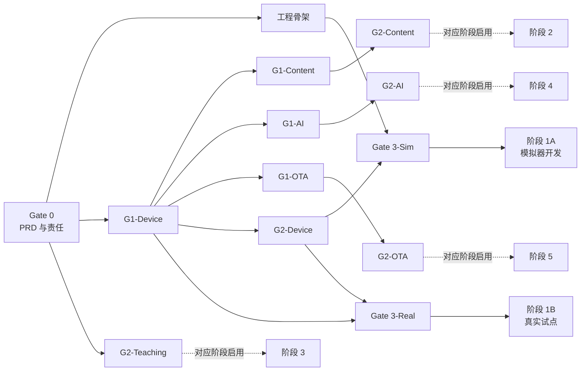
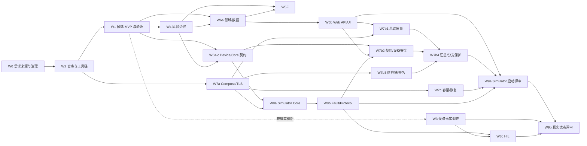

# 教育机器人云平台开发前准备与启动门禁

> 文档编号：04  
> 状态：开发启动前执行基线  
> 更新时间：2026 年 8 月 13 日  
> 技术基线：[01 教育机器人云平台唯一生产级技术栈](01%20fastapi-vue-modern-tech-stack.md)  
> 架构基线：[02 教育机器人云平台生产架构设计](02%20fastapi-vue-modern-architecture.md)  
> 产品设计输入：[03 教育机器人云平台产品与系统设计](03%20ai-teaching-platform-design.md)  
> 正式 PRD：[PRD-001 教育机器人云平台](product/PRD-001%20教育机器人云平台.md)  
> 需求追踪：[RTM-001 教育机器人云平台需求追踪矩阵](product/RTM-001%20教育机器人云平台需求追踪矩阵.md)  
> 当前验证范围：[PILOT-001 模拟器工程验证范围](product/PILOT-001%20模拟器工程验证范围.md)  
> 责任与授权：[OWNER-001 责任人与 AI 执行授权](governance/OWNER-001%20责任人与AI执行授权.md)  
> Gate 0：[需求与责任门禁](gates/gate-0.yaml)（Passed 2026-08-13）

本文回答一个具体问题：在开始编写业务功能之前，团队必须准备什么、由谁确认、产出什么证据，以及满足什么条件后才允许进入开发。

本文不是新的技术选型文档，不重新讨论 01 已确定的技术；不是架构替代文档，不改变 02 的四平面架构；也不扩展 03 的产品范围。出现冲突时，先停止实现，通过 ADR 或产品变更流程更新相应基线，再继续开发。

## 一、结论：现在还不能直接进入业务功能开发

编制本文时，`D:\git\lemoo` 只有 01、02、03 三份既有设计文档和非项目资料，尚未形成工程仓库。本文新增 04 作为开发前执行基线，但不会因此改变下列工程条件仍未就绪的事实：

- Git 仓库与远程代码托管。
- `README.md`、`AGENTS.md`、贡献规范和代码所有权。
- FastAPI/Vue 工程骨架与锁文件。
- Docker Compose 本地依赖环境。
- OpenAPI、MQTT、WebSocket、Job 和内容包协议 Schema。
- 数据库迁移、RLS、分区与种子数据。
- Robot Simulator。
- CI/CD、Secret 扫描和质量门禁。
- 真实机器人硬件、协议、OTA 与安全能力确认记录；当前已明确无物理设备。
- 产品 MVP、验收标准、隐私与数据留存的正式签字结论。

`docs/入职要求详细.md` 已于 2026-08-13 补充，仅作为产品方向背景。招聘 JD 只能说明组织希望建设“题库管理 + AI 机器人互动 + 设备运维”平台，不能代替用户研究、可验收需求或产品批准。正式需求入口已建立为 `docs/product/PRD-001 教育机器人云平台.md` 和 RTM-001；OpenAI Codex 按 OWNER-001 承担五类执行职责，高端阳统一承接阶段 1A 五类临时最终责任并已批准两份文档。W0 自动校验 28/28 通过，Gate 0 已形成结构化记录并标记为 `passed`。

因此，正确顺序是：

```text
归档需求来源、建立正式 PRD 与明确 Owner
-> 冻结 PILOT-001 模拟器范围
-> 冻结 G2-Device 契约
-> 建工程仓库、环境、Simulator 和质量门禁
-> 通过 Gate 3-Sim
-> 进入阶段 1A 模拟器设备云开发
-> 获得实机后补 G1-Device/HIL
-> 通过阶段 1B 真实试点评审
```

“准备完成”不是安装完 Python 和 Node，而是团队已经消除了会导致协议返工、安全降级和产品方向漂移的关键不确定性。

## 二、本文的准备范围

### 1. 包含

- 产品范围、角色、用户故事和验收标准冻结。
- 机器人硬件、运行时、网络、协议、能力与 OTA 事实确认。
- 安全、隐私、数据保留和 AI 使用边界确认。
- REST、MQTT、WebSocket、Job、内容包和 OTA 契约基线。
- 数据模型、多租户、RLS、分区和容量假设确认。
- Monorepo、开发环境、测试环境、CI/CD 和可观测性骨架。
- Robot Simulator、测试夹具和最小基础设施/协议冒烟链路。
- 团队职责、审批人、分支策略、Definition of Ready/Done。
- 第一阶段 Backlog、依赖顺序和回退机制。

### 2. 不包含

- 完整设备云、题库、AI 互动或 OTA 业务实现。
- 正式生产部署和真实大规模压测。
- Kubernetes、Kafka、OpenSearch、ClickHouse 或 RAG 的预先引入。
- 在硬件能力未确认时“先把 OTA 页面做出来”。
- 通过 Mock 掩盖协议、安全或设备端能力缺失。

## 三、当前准备度快照

### 1. 工作区状态

| 检查项             | 当前状态         | 结论                                      |
| --------------- | ------------ | --------------------------------------- |
| 01 技术栈基线        | 已存在          | 可作为唯一选型来源                               |
| 02 生产架构         | 已存在          | 可作为代码与运行边界来源                            |
| 03 产品与系统设计      | 已存在          | 可作为产品与领域来源                              |
| 原始《入职要求详细》      | 已补充，低权重背景来源  | 已归档；不作为验收或 PRD 替代品                      |
| 正式 PRD / RTM    | 1.0.0 已批准       | 高端阳批准阶段 1A Simulator-only 基线；Gate 0 已通过 |
| Git 仓库          | W2 已完成        | `main` 保存已验证工程基线；后续变更强制使用 Branch/PR |
| 远程仓库            | W2 已公开并保护    | Public `keyboardgdy/lemoo-ai-teaching-platform`；Apache-2.0；原有公开 `keyboardgdy/Lemoo` 为不相容 C# 项目且未被覆盖 |
| 工程代码            | W2 空业务骨架已建立 | FastAPI/Vue 只提供系统状态与健康检查；领域能力保持禁用 |
| CI/CD           | W2 最小 CI 已通过 | Windows 本地与 PR #1 Linux 五项检查均通过 |
| 本地依赖环境          | W2 Core Compose 已验证 | PostgreSQL、Redis、MinIO、EMQX 本地健康；不代表生产环境 |
| 真实设备证据          | 当前无物理设备      | 不阻塞阶段 1A Simulator 开发；硬阻塞真实设备/机构试点和生产声明 |
| 协议 Schema       | 仅有边界占位       | G2-Device 前仍为硬阻塞，禁止被实现代码依赖               |
| Robot Simulator | 仅有目录占位       | W8a 前仍不可用，设备云 MVP 开发前硬阻塞                  |
| PILOT-001       | 已确认          | 两个合成租户、一个虚拟组合、六个模拟设备；非真实机构试点            |

### 2. 当前开发机工具

2026-08-13 W2 本机验证结果：

| 工具             | 当前状态                | 基线要求            | 处理                                 |
| -------------- | ------------------- | --------------- | ---------------------------------- |
| Windows        | Windows 11 Pro 64 位 | 支持              | 保持；容器使用 Linux Engine               |
| Git            | 2.51.0              | 需要              | 可用                                 |
| GitHub CLI     | 2.93.0              | 推荐              | 已认证，可创建私有仓库与 PR                    |
| Python         | 主机 3.12.10；项目 3.14.7 | Python 3.14     | uv 项目运行时已锁定并验证 3.14.7               |
| uv             | 0.12.2              | 需要              | 可用                                 |
| Node.js        | 24.11.1             | Node 24 LTS     | 可用                                 |
| pnpm           | 11.2.2              | 需要              | 可用；通过 `packageManager` 锁定          |
| Docker CLI     | 29.1.3              | 需要              | 已安装                                |
| Docker Compose | 5.0.1               | 需要              | 已安装                                |
| Docker Engine  | 29.1.3，Linux Engine 可用 | 需要              | Core Compose 四项服务健康                    |
| Task           | 3.46.4              | Taskfile 基线     | 本机与 CI 固定 3.46.4                       |
| OpenSSL CLI    | 未发现                 | 本地证书/协议调试需要等价能力 | 安装受控工具或采用容器化 PKI 工具                |
| VS Code CLI    | 未发现                 | 可选              | 不阻塞；由个人 IDE 选择决定                   |
|                |                     |                 |                                    |

机器资源约为 12 逻辑处理器、64 GiB 内存，足以运行首期本地 Compose；最终资源配额仍必须通过实际容器和模拟器负载测量确定。

工具版本检测只代表“命令存在”，不代表环境可用。Docker Engine、网络代理、证书信任、端口占用和依赖镜像拉取必须通过本地冒烟测试证明。

## 四、分级启动门禁



### Gate 0：需求与责任可追踪

必须满足：

- 恢复/归档原始 JD 或其他需求来源，保留来源约束。
- 由 Product Owner 批准独立的版本化 PRD/MVP Specification；JD 不能作为其替代品。
- 建立 `JD/来源 -> PRD Capability -> Story -> Acceptance -> Test/Evidence` 双向追踪矩阵。
- 产品 Owner、技术 Owner、设备 Owner、安全/隐私 Owner 和验收人明确。
- 首期 MVP、非目标和成功指标得到书面确认。
- 01、02、03 的状态、负责人和变更流程明确。
- 所有未决事项进入 Decision Log，有 Owner、截止时间和默认行为。

Gate 0 未通过时，可以做资料整理和无业务含义的工具验证，不应开始领域建模或页面开发。

当前状态：**Passed（2026-08-13）**。依据为高端阳对 PRD/RTM 与一人多角色风险的明确批准，以及 `docs/gates/verify-w0.ps1` 的 28/28 自动检查；结构化记录见 [gate-0.yaml](gates/gate-0.yaml)。这只允许进入工程骨架、G2-Device 契约和 Gate 3-Sim 准备，不放行真实设备、真实数据、生产或后续产品能力。

### Gate 1：按能力证明设备事实与安全能力

MVP 范围内每个 `model_code × hardware_revision × bootloader_major × firmware_major` 组合至少有一台样机，或有经设备、QA、产品 Owner 共同批准的等价性证明。事实门禁按能力独立判定：

| 子门禁 | 必须证明的实机事实 | 不通过时的影响 |
|---|---|---|
| G1-Device | OS/CPU/内存/存储/Runtime/服务；MQTT 与 Device HTTPS；每设备私钥安全存储、证书更新/吊销；低风险命令本地白名单/参数/状态校验；正常、弱网、断网、重启、时钟漂移 | 阻塞阶段 1B 真实设备/机构试点与所有依赖真实设备身份的能力；不阻塞阶段 1A Simulator 开发 |
| G1-Content | 可用存储；HTTPS 断点续传；Manifest/Hash/签名验证；空间预检；原子激活与内容回滚；屏幕/音频/动作 Capability | 只阻塞 G2-Content 和阶段 2，设备云仍可开发 |
| G1-AI | WSS Client、音频 Codec/采样率/分片、麦克风/扬声器、背压/取消/重连、时钟与真实弱网时延 | 只阻塞 G2-AI 和阶段 4，AI 保持禁用 |
| G1-OTA | Bootloader/Updater 角色化签名验证、可信时间/计数器、A/B 或等价原子安装、健康确认、断电恢复和防回滚 | 只阻塞 G2-OTA 和阶段 5，OTA 保持禁用 |

Gate 1 子门禁未通过时，仍允许建立无业务含义的工程骨架、对应 `draft` 契约和 Simulator，但不允许把假设协议标记为 `frozen`，也不允许启用受阻能力。G1-OTA 未通过不阻塞 G1/G2-Device；G1-AI 未通过不阻塞设备云、题库或确定性教学。

Adapter 只能解决协议、运行时和字段映射兼容，不能替代相应能力的硬件安全事实。对不满足某子门禁的型号，必须将该能力标记 `unsupported/disabled`，或由 Product Owner 从该阶段范围移除；整改计划不等于子门禁通过。

当前项目没有物理设备，因此 G1-Device 状态固定为 `blocked_no_physical_device`。该状态不阻塞 PILOT-001 的内部 Simulator 开发，但阻塞任何真实机器人接入、客户现场试点、硬件兼容和生产准入声明。

### Gate 2：按能力冻结契约与数据边界

Gate 2 不设一个阻塞全部阶段的“大一统冻结”。每项能力在进入自己的开发阶段前通过对应子门禁：

| 子门禁 | 进入阶段 | 必须冻结的内容 |
|---|---|---|
| G2-Device | 阶段 1A/1B 设备云 MVP | MQTT Topic/ACL/QoS/Session/Will/Envelope、Device API/Provision、Device/Shadow/Telemetry/Event、低风险命令、租户/RLS/审计 |
| G2-Content | 阶段 2 题库与内容 | Taxonomy/QuestionVersion/PaperVersion、导入、Capability Catalog、Content Manifest/签名/兼容/原子切换 |
| G2-Teaching | 阶段 3 教学会话 | TeachingSession/Participant/AnswerAttempt、事件补传、确定性评分、学生错误与系统失败分类 |
| G2-AI | 阶段 4 AI 互动 | Interaction WSS、音频格式/背压/超时/取消/重连、Provider 数据边界、Prompt/Model/AIRun、Action Allowlist、Fallback |
| G2-OTA | 阶段 5 OTA | Artifact/SBOM、角色化 Metadata、规范化签名字节、阈值、轮换、吊销、可信时间、Expiry、Release Counter、A/B/回滚 |

当前计划的第一个开发切片只要求 G2-Device 通过。后续能力不能借用 G2-Device 的批准；例如 G2-OTA 未通过时，OTA 必须保持禁用，即使设备云已经上线。

“冻结”表示 v1 进入版本控制并按兼容策略演进，不表示以后永远不能修改。

### Gate 3-Sim：模拟器工程基础可执行且可验证

必须满足：

- Gate 0 与 G2-Device 已通过。
- Git/远程仓库、分支保护、CODEOWNERS、锁文件和 Secret 规则已启用。
- Compose、Migration/Reset、API、Device Gateway、Dispatcher、Worker 和 Web 骨架可重复启动。
- PILOT-001 的两个合成租户、六个模拟设备和负向证书 Fixture 可重复初始化。
- Robot Simulator 完成 MQTT/Device API、ACL/mTLS、状态、命令、断网/重复/乱序和跨租户正反测试。
- 阶段 1A 的 Required Checks、可观测性、容量假设和恢复 Smoke 通过。
- 所有未进入阶段的内容、教学、AI、诊断和 OTA 能力保持 `disabled`。

Gate 3-Sim 只授权内部模拟器开发和合成数据 Demo，不允许真实机构数据、真实设备或生产部署。

### Gate 3-Real：真实设备工程基础可执行且可验证

必须满足：

- Git/远程仓库、分支保护、CODEOWNERS 和 Secret 规则已启用。
- Monorepo 骨架与锁文件可从全新机器重复安装。
- 最小 Compose 可以启动 PostgreSQL、Redis、EMQX、MinIO 和必要观测组件。
- 当前阶段所需的 API、Device Gateway、Dispatcher 和 Worker 入口能启动并通过健康检查；Interaction Gateway 在 G2-AI 前只保留明确边界，不要求假实现。
- Migration 可在空库成功执行；开发环境 Reset/Seed 可重复。生产级恢复演练按环境门禁单独验收，不能用空库迁移代替。
- Robot Simulator 能使用独立证书连接 EMQX，完成 ACL 正反例测试。
- 阶段 1B 范围内真实设备的 G1-Device 证据已链接，P0 Conformance 差异为零；Simulator 不能替代实机身份、私钥和本地命令安全证明。后续能力的差异只阻塞各自 G1/G2。
- CI 完整实现 01 第八章固定门禁，不允许由 04 缩减。
- 第一批 Backlog 满足 Definition of Ready。

Gate 0、G2-Device 与 Gate 3-Sim 通过后，允许阶段 1A Simulator-only 设备云开发。G1-Device、G2-Device、Gate 3-Real 与 HIL 通过后，才允许阶段 1B 真实设备/机构试点。题库、教学、AI 和 OTA 分别等待自己的 G1/G2 子门禁；没有设备事实前置的纯业务子门禁只要求对应 G2。

### Gate 证据记录

每次 Gate 判定都提交 `docs/gates/gate-<id>.yaml`，至少包含：

```yaml
gate: G2-Device
status: passed
scope:
  device_models: []
  hardware_revisions: []
  firmware_majors: []
inputs:
  requirements_version: ""
  schema_commit: ""
evidence: []
exceptions: []
approved_by: []
approved_at: ""
review_expires_at: ""
```

`WORK_COMPLETE` 与 `GATE_PASS` 是不同状态。工作包可以完成并产出“不支持”的事实，但只要范围内仍存在未关闭的 P0 安全差异，Gate 就不能标记为 `passed`。Gate 证据必须指向具体 Commit/Digest、测试报告和设备组合，不能只写“已签字”或“CI 全绿”。

## 五、开始开发前必须作出的决策

### 1. P0：不决策就不能进入相关开发

| 编号 | 决策 | 必须回答的问题 | Owner | 证据/产物 | 阻塞范围 |
|---|---|---|---|---|---|
| D-001 | 权威需求链 | 原始 JD/业务来源归档在哪里，正式 PRD 由谁批准，范围变化如何追踪 | 产品 Owner | 来源归档 + 版本化 PRD + Requirement Trace Matrix + 变更记录 | 全部领域开发 |
| D-002 | MVP 业务边界 | 首期到底交付哪些角色、场景和闭环 | 产品 Owner | PILOT-001 Simulator Scope + 验收矩阵 | 阶段 1A Backlog/UI/API |
| D-003 | 设备 OS/运行时 | 可运行哪些 Client、服务管理和升级程序 | 设备 Owner | Device Fact Sheet | Gateway/设备 Adapter |
| D-004 | 设备身份 | 私钥存储、制造 Provision、轮换、吊销如何实现 | 安全 + 设备 | PKI/Provision Threat Model | 设备接入 |
| D-005 | OTA 信任链 | 设备端是否验签、A/B、健康检查和防回滚 | 设备 + 安全 | 实机测试报告 | OTA 全部 |
| D-006 | 设备协议现状 | 是否已有协议/Topic/Payload，兼容期多长 | 设备 + 云端 | 样本 Capture + v1 Schema | MQTT/Gateway |
| D-007 | 设备规模 | 首期/一年连接数、消息率、地域和弱网比例 | 产品 + 运维 | 容量输入表 | EMQX/PG/资源 |
| D-008 | 学生身份模式 | 匿名、班级、绑定学生哪些进入 MVP | 产品 + 隐私 | Identity Decision | Session/数据模型 |
| D-009 | 隐私适用性与处理依据 | 适用法域、控制者/处理者角色、机构或监护人授权、音频/转写/教学记录/诊断包的处理依据和保留期是什么 | 隐私/法务 | Privacy Applicability + Processing Authority + Data Classification | 身份/AI/日志/删除 |
| D-010 | AI Provider | ASR/LLM/TTS 使用哪些地区、模型、协议和预算 | AI + 产品 | Provider ADR + Eval Plan | AI 互动 |
| D-011 | 内容来源 | 自建、表格导入还是迁移存量题库 | 教研 Owner | 样本数据 + Mapping | 题库/导入 |
| D-012 | 部署形态 | 云服务、私有化、网络/域名/证书归属 | 运维 + 安全 | Environment ADR | 部署/Secret/网络 |
| D-013 | 内容权利与治理 | 题目、解析、语音、图片的权利来源、许可、审核、下架和追溯如何证明 | 教研 Owner | Content Rights Register + Review/Withdrawal Policy | 题库/内容包/AI 生成内容 |
| D-014 | 恢复目标与容量预算 | 各环境 RPO/RTO、首期峰值、资源上限和扩容触发器是什么 | 运维 Owner | Recovery/Capacity Worksheet + 演练计划 | 数据库/对象存储/EMQX/发布 |
| D-016 | 无实机开发路径 | 没有物理设备时是否允许开发、能声称什么、何时必须补 HIL | 项目发起人 | PILOT-001；已确认 Simulator-only，G1-Device 保持阻塞 | 阶段 1A/1B 边界 |

### 2. P1：可使用 Fake/默认值启动，但上线前必须决策

| 决策 | 准备阶段默认值 | 最晚确认时间 |
|---|---|---|
| 邮件/外部告警渠道 | 仅站内告警 | 告警闭环开发前 |
| 生产对象存储供应商 | 本地 MinIO + S3 Port | Staging 建设前 |
| 生产 PostgreSQL/Redis/EMQX 托管方案 | 本地 Compose | Staging 建设前 |
| 企业 SSO | 邮箱/用户名密码 Session | 首个机构验收前 |
| 多区域 | 单区域 | 容量与合规评审前 |
| CDN | 不引入 | OTA/内容下载压测后 |
| 专用时序/分析库 | PostgreSQL 原生分区 | PostgreSQL SLO 失效后 |
| RAG/向量检索 | 不引入 | 有明确知识库场景和评测集后 |

### 3. 不得伪决策

以下写法不算完成决策：

- “先按常规做，后面再改”。
- “MQTT 大概就是这些字段”。
- “设备应该支持 A/B”。
- “AI Provider 以后随便切”。
- “先把所有学生数据存下来再说”。
- “先用共享证书，量大后再一机一证”。

决策必须包含事实、选择、Owner、风险、验证证据和不满足时的回退行为。

## 六、必须准备的权威文档与契约

### 1. 产品与领域

| 产物 | 最低内容 | 通过条件 |
|---|---|---|
| MVP Scope | In/Out、目标用户、首期闭环、成功指标 | 产品/技术/验收三方签字 |
| 正式 PRD | 用户问题、业务规则、约束、非目标、可量化结果 | Product Owner 批准；不能用招聘 JD 代替 |
| Requirement Trace Matrix | 来源条款 → PRD Capability → Story → Acceptance → Test/Evidence | 每个 P0 可双向追踪，不存在孤立条款或孤立 Story |
| User Story Map | 角色、主路径、异常路径、优先级 | 每个 P0 Story 有验收标准 |
| 领域词汇表 | Device、Session、QuestionVersion、Deployment 等 | 同词同义，无关键歧义 |
| 权限矩阵 | 角色 × 资源 × 动作 × 机构范围 | 后端和测试可直接使用 |
| 状态机目录 | Device/Command/OTA/Content/TeachingSession/Job | 非法转换明确 |
| 错误分类 | 学生错误、输入不确定、系统失败、设备失败 | 报表与接口一致 |
| Content Rights Register | 内容来源、许可范围、作者/供应方、审核人、适用区域、到期/下架 | 每个可发布内容版本可追溯且可撤回 |

### 2. 设备与协议

所有协议文件进入 `packages/protocol-schemas/`，至少包含：

```text
mqtt/
├── envelope.v1.schema.json
├── reported-shadow.v1.schema.json
├── telemetry.v1.schema.json
├── device-event.v1.schema.json
├── command.v1.schema.json
├── command-ack.v1.schema.json
├── ota-status.v1.schema.json
├── content-status.v1.schema.json
└── teaching-events.v1.schema.json

websocket/
├── interaction-control.v1.schema.json
├── interaction-server-event.v1.schema.json
└── audio-profile.v1.md

jobs/
├── job-envelope.v1.schema.json
├── job-progress.v1.schema.json
├── job-result.v1.schema.json
└── job-error.v1.schema.json

ota/
├── root.v1.schema.json
├── targets.v1.schema.json
├── snapshot.v1.schema.json
├── timestamp.v1.schema.json
├── release-manifest.v1.schema.json
└── canonical-signing-bytes.v1.md

catalogs/
├── device-capabilities.v1.yaml
├── telemetry.v1.yaml
├── commands.v1.yaml
├── errors.v1.yaml
└── compatibility.v1.yaml

fixtures/
├── accepted/
├── rejected/
└── backward-compatibility/
```

内容包契约继续使用 01/02 已固定的 `packages/content-package-schema/`，至少包含版本化 Manifest、资源索引、题目/脚本引用、完整性摘要、签名输入规范，以及 accepted/rejected/backward-compatibility Fixtures。Job、内容包与 OTA 不允许只靠 Markdown 或 Pydantic 类作为唯一契约。

每个协议必须定义：

- 生产者、消费者和身份来源。
- 字段类型、单位、范围、必填/可选和默认值。
- 大小、速率和批次上限。
- 顺序、重复、丢失、重试和过期语义。
- 版本兼容与未知 Major 行为。
- 敏感字段和日志脱敏要求。
- 至少一个正常样例和一个拒绝样例。
- Simulator 测试与真实设备 Capture。
- 契约状态（`draft`/`frozen`/`deprecated`）、兼容窗口和 Owner。

OTA 元数据还必须定义 Root/Targets/Snapshot/Timestamp 角色、签名阈值、确定性序列化/规范化字节、可信时间、单调 Release Counter、防回滚、密钥轮换/吊销/恢复和过期行为。内容签名密钥与 OTA 签名密钥必须分域、分权、分审计，不得复用。

### 3. REST 与前端契约

- OpenAPI 3.1 骨架覆盖 Web API 和独立 Device API；W5b 负责 Device API/Provision，W6b 负责 Web API，路径和 Security Scheme 不得重叠所有权。
- 资源名、状态码、游标分页、过滤、排序和 RFC 9457 错误统一。
- 创建命令、内容包、OTA、批量任务定义 `Idempotency-Key`。
- 可编辑资源定义 ETag/`If-Match`。
- Web Session、CSRF 和 Device mTLS 使用不同 Security Scheme。
- 前端只通过 Orval 生成的 Fetch Client 访问 REST。
- 页面信息架构、权限状态、Loading/Empty/Error/Degraded 状态有线框图。
- 高风险页面有影响范围、理由、再认证、审批和逐设备结果设计。

### 4. 数据契约

准备 ERD 和首批 Migration 设计，至少覆盖：

- Organization、Site、User、Role、Session。
- DeviceModel、Device、Credential、Shadow、Lifecycle Event。
- Outbox、Job、Audit Event。
- Telemetry/Event 分区父表与分区策略。
- Question/QuestionVersion 和基础 Taxonomy。

每张机构业务表说明：

- `organization_id` 来源。
- RLS Policy。
- 平台管理员跨租户路径。
- 唯一约束与索引。
- 删除、保留和审计策略。
- 敏感等级与是否允许进入日志/AI。

### 5. 安全与隐私

必须形成：

- 系统信任边界图和 STRIDE 风险表。
- Web Session/CSRF/RBAC/RLS 威胁模型。
- Device PKI、Provision、轮换、吊销和维修转移流程。
- MQTT ACL 矩阵与跨设备负向测试。
- Command 风险分级、审批与设备端二次校验。
- OTA Root/Role Key、签名环境、备份和恢复方案。
- AI 数据流、Provider 数据处理和 Prompt Injection 边界。
- 未成年人数据分类、最小化、保留、导出与删除流程。
- 隐私适用性与处理依据：法域、控制者/处理者角色、机构/监护人授权、Provider DPA、子处理者、跨区域传输、数据主体请求和事件通报流程。
- 内容权利来源、AI 生成内容标记、人工审核、版本追溯、下架和已下发内容撤回策略。
- Secret Inventory，不保存真实 Secret 值。

### 6. 测试与验收

- 测试金字塔和各层 Owner。
- 关键状态机的 Model/Property Tests。
- REST/MQTT/WebSocket/Job 契约测试。
- RLS/ACL/mTLS 跨租户和跨设备负向测试。
- Robot Simulator 场景矩阵。
- AI 评测集、评分规则、阈值和人工抽检流程。
- 弱网、断网、重连风暴、重复/乱序和时钟漂移场景。
- OTA 错签名、回滚、冻结、断电、低电量和启动失败场景。
- 第一阶段验收 Demo Script。

## 七、团队、权限与协作准备

### 1. 最小责任矩阵

| 工作 | 产品 | 云端 | Web | 设备 | AI | QA | 安全/隐私 | 运维 |
|---|---|---|---|---|---|---|---|---|
| MVP/验收 | A/R | C | C | C | C | C | C | C |
| MQTT/Device API | C | A/R | I | R | I | C | C | C |
| 设备 PKI | I | R | I | R | I | C | A | C |
| 题库/教学脚本 | A/R | R | R | C | C | C | C | I |
| AI 互动 | C | R | C | R | A/R | C | C | C |
| 远程 Command | C | A/R | R | R | I | C | C | R |
| OTA 制品/Updater | C | R | I | A/R | I | C | C | R |
| OTA 签名/发布治理 | I | R | I | R | I | C | A | R |
| 数据/RLS/保留 | C | A/R | C | I | C | C | R | C |
| 测试与发布门禁 | C | R | R | R | R | A/R | C | R |

`A` 为唯一最终负责，`R` 为执行，`C` 为协商，`I` 为知会；每行必须且只能有一个 `A`。实际人员可以一人多角色，但任何高风险操作不能由同一自然人同时完成构建、签名、审批和发布。

### 2. AI 执行授权

项目发起人已指定 **OpenAI Codex** 为统一 `AI Execution Agent`。Codex 对产品、技术、模拟设备协议、安全/隐私工程和 QA 工作承担 `R`，可以编写实现、运行检查、维护追踪并给出 Gate 建议；所有 `A` 仍必须由有权自然人承担。Codex 不得批准自己的产物，不得处理真实学生/客户数据，不得把 Simulator 证据写成实机证据，也不得自行接受风险或发布生产。详细边界见 [OWNER-001](governance/OWNER-001%20责任人与AI执行授权.md)。

高端阳已作为阶段 1A 临时项目责任人统一承接五类 `A`，并接受一人多角色风险；真实数据、实机和生产范围仍必须补充专业或独立复核。

### 3. 必须开通的访问

- 源码托管与 Issue/PR 权限。
- 容器镜像仓库。
- 开发/测试域名与 DNS 管理。
- 开发对象存储、数据库、Redis 和 EMQX 环境。
- 设备样机、串口/ADB/SSH 或正式调试方式。
- 工厂 Provision 测试环境。
- AI Provider 开发账号、限额和独立非生产 Key。
- Sentry/可观测平台。
- Secret 管理器和独立环境权限。
- 安全签名测试环境；不得向普通开发机分发生产签名 Key。

### 4. 协作规则

- 一个需求必须有一个最终 Product Owner。
- 一个协议必须有云端和设备端共同 Owner。
- 所有跨边界变更先改契约与兼容测试，再改实现。
- ADR 只记录真正影响架构、协议、安全、运维或成本的决策。
- PR 必须关联 Story/Defect、验收条件和验证证据。
- 不在即时聊天里作出无法追踪的生产安全决策。
- 文档与代码同 PR 更新，不能先合并代码后“以后补文档”。

## 八、工程仓库准备

### 1. 初始化顺序

当前目录不是 Git 仓库，因此仅 W0 使用 Blueprint Direct Mode 保存治理与需求基线；W2 建立受保护仓库后，W1 及其后的工作一律使用 Branch/PR Mode。准备阶段按以下顺序建立版本控制：

1. 确认仓库归属、可见性、默认分支和管理员。
2. 恢复原始需求文件并检查是否包含敏感信息。
3. 初始化 Git，创建首个基线提交。
4. 建立远程仓库并配置受保护默认分支。
5. 启用 PR Review、Required Checks 和禁止 Force Push。
6. 添加 `.gitignore`、`.editorconfig`、`.gitattributes` 和 Secret 扫描。
7. 添加 CODEOWNERS、Issue/PR 模板、Security Policy 和贡献说明。
8. 再创建应用骨架，避免大量未跟踪文件无法审计。

### 2. 目标目录

```text
lemoo/
├── apps/
│   ├── cloud/
│   │   ├── app/entrypoints/
│   │   ├── app/modules/
│   │   ├── app/infrastructure/
│   │   ├── migrations/
│   │   └── tests/
│   └── web/
│       ├── src/
│       └── e2e/
├── packages/
│   ├── openapi/
│   ├── protocol-schemas/
│   └── content-package-schema/
├── tools/
│   ├── robot-simulator/
│   ├── ota-metadata/
│   └── data-maintenance/
├── infra/
│   ├── compose/
│   ├── caddy/
│   ├── emqx/
│   ├── observability/
│   └── docker/
├── docs/
│   └── decisions/
├── scripts/
├── .github/workflows/
├── AGENTS.md
├── README.md
├── compose.yaml
├── pnpm-workspace.yaml
├── Taskfile.yml
└── .env.example
```

### 3. 仓库规则

- `apps/cloud` 只有一套 `pyproject.toml` 和 `uv.lock`，所有 Python 进程共享。
- 前端通过 pnpm Workspace 管理并提交 `pnpm-lock.yaml`。
- 生成的 OpenAPI Client 可提交，但 CI 必须验证无漂移。
- 协议 Schema、Migration 和 ADR 必须版本化。
- `.env.example` 只包含变量名和安全示例，不包含任何真实 Key。
- 固件、媒体、日志包、数据库 Dump 和证书私钥不得进入 Git。
- 大型测试夹具使用去标识、小尺寸样本或受控对象存储。

## 九、本地开发环境准备

### 1. 运行时

固定：

```text
Python 3.14 + uv
Node.js 24 LTS + pnpm
Docker + Docker Compose
Git + GitHub CLI
Taskfile
```

必须提交：

```text
.python-version
apps/cloud/pyproject.toml
apps/cloud/uv.lock
.node-version
package.json#engines
package.json#packageManager
pnpm-lock.yaml
Taskfile.yml
```

开发者不得使用本机 Python 3.12 生成项目锁文件；应由 uv 安装和选择 Python 3.14，再执行 `uv sync --locked`。

### 2. Compose 分层

建议定义三种本地启动集合：

```text
core
  postgresql redis emqx minio

app
  api device-gateway interaction-gateway outbox-dispatcher workers scheduler web caddy

observability
  otel-collector prometheus grafana loki tempo
```

Profile 只用于减少个人开发时的资源占用；CI 集成测试不能省略 PostgreSQL、Redis、EMQX 和 MinIO。

### 3. 端口与域名

在仓库中维护端口表，避免开发机冲突。至少规划：

- Console HTTPS。
- Device HTTPS/Provision。
- Interaction WSS。
- MQTT TLS 8883。
- PostgreSQL、Redis、MinIO API。
- EMQX/Grafana/MinIO 管理界面，仅绑定本机或管理网络。

本地使用稳定开发域名或 Hosts 记录，确保 Cookie、CSRF、mTLS、SSE 和 WSS 行为接近生产，而不是所有链路长期依赖 `localhost + 任意端口`。

### 4. 本地证书

准备阶段建立独立开发 PKI：

```text
Dev Web CA
├── console.dev
├── device-api.dev
└── provision.dev

Dev Device CA
├── simulator-device-001
├── simulator-device-002
└── negative-test-device
```

要求：

- 开发 CA 与生产 CA 完全隔离。
- 每个 Simulator 使用独立设备证书。
- 有过期、吊销、错误设备 ID 和错误 CA 夹具。
- 私钥权限和清理方式明确。
- 证书生成脚本可重复，不依赖某个成员手工操作。
- 生产 Root/OTA Signing Key 永不进入本地环境。

### 5. 配置与 Secret

配置分为：

```text
可公开默认值      version、log level、local endpoint
环境配置          database URL、bucket、broker endpoint
Secret            password、private key、provider key
不可进入普通服务   OTA Root/发布签名私钥
```

应用启动时通过 Pydantic Settings 校验必需配置；缺失、空值或不安全生产默认值应直接失败。测试使用专用凭证和独立 Namespace，不复用个人账号。

## 十、工程质量和 CI 准备

### 1. 本地统一命令

Taskfile 至少提供：

```text
task bootstrap
task infra:up
task infra:down
task dev
task lint
task typecheck
task test
task test:integration
task test:protocol
task test:e2e
task test:rls
task test:ota
task test:ai-actions
task device:facts:check
task ci:baseline:check
task openapi:generate
task schemas:check
task docs:check
task migrate
task migrate:test
task simulator:smoke
task image:verify
task verify
```

所有 CI 命令必须能在开发机执行；不允许 CI 中存在只有云端知道的神秘脚本。

### 2. Pull Request 门禁

01 第八章是唯一的 CI 基线，04 只能补充实施次序，不能减少检查。W7b4 必须把 01 第八章解析/同步为 `docs/ci/required-checks.yaml`，`task ci:baseline:check` 校验两者集合完全一致；04 的下列清单只是便于执行的镜像，不构成第二份权威来源。`task ci:baseline:check` 自身也是每个 PR 的 Required Check，并受分支保护。首个业务 PR 之前必须将其全部设为 Required Check：

```text
task ci:baseline:check

uv lock --check
ruff check / ruff format --check
pyright
pytest unit/integration/api/worker
alembic empty-database upgrade test
PostgreSQL RLS/partition/跨租户 negative tests

pnpm install --frozen-lockfile
eslint / prettier --check
vue-tsc --noEmit
vitest
vite build
Playwright smoke/e2e

OpenAPI export + Orval generation drift
oasdiff breaking check
MQTT/WS/Job/Content/OTA Schema compatibility
Command allowlist/idempotency/expiry/state-machine tests
OTA signature/role-threshold/expiry/rollback tests
AI structured-output/action-allowlist/prompt-injection tests
EMQX ACL/mTLS negative tests
Device HTTPS API mTLS tests
Robot Simulator smoke
architecture dependency constraints
Trivy + Secret scan + dependency audit + SBOM
immutable image digest + provenance + artifact/image signature verification
```

准备阶段可以只保留最小 Playwright Smoke 场景，但检查本身不得延后或设为 Optional；后续 UI Story 在同一个 Required Check 中逐步扩充场景。

### 3. 最小质量政策

- 关键领域状态机和安全边界覆盖率必须高于普通展示代码，不能只追求单一全仓百分比。
- 新功能先有失败测试或可复现验收脚本。
- 修复缺陷必须增加回归测试。
- 不允许通过删除断言、跳过测试或扩大 Ignore 让 CI 变绿。
- Flaky 测试必须建立 Issue、Owner 和期限，不能永久重试掩盖。
- 所有协议兼容和安全负向测试属于 Required Check。

## 十一、Robot Simulator 准备

Robot Simulator 必须在正式设备云功能之前建立，因为真实机器人数量少、状态不可重复、硬件故障难在 CI 中稳定复现。

### 1. 首版能力

- 从独立证书配置创建多个模拟设备。
- MQTT 5 mTLS Connect/Disconnect、Will 和 Session Expiry。
- 发布 Birth、Reported Shadow、Telemetry 和 Device Event。
- 订阅 Desired、Command、Content Notify 和 OTA Notify。
- 模拟 Command Accepted/Running/Succeeded/Failed/Expired。
- 模拟重复、乱序、丢包、断网缓冲、重连和时钟漂移。
- 发送错误 Schema、超大 Payload、跨 Topic 和伪造 Device ID。
- 通过 Device API 获取受限上传/下载 URL。
- 建立最小 Interaction WebSocket 文本会话；音频可先用固定夹具。

### 2. 使用模式

```text
单设备手动调试
小规模 CI 协议测试
多设备连接与重连测试
故障注入
真实设备协议对照测试
```

### 3. Simulator 不能替代什么

- 真实设备私钥安全存储。
- 真实弱网驱动与系统睡眠行为。
- 麦克风/扬声器的音频质量和时钟。
- 电机、传感器和设备端安全控制。
- Bootloader、断电、A/B 和实际 OTA 回滚。
- Hardware-in-the-loop 验收。

Simulator 与真实设备必须运行同一版 Schema Conformance Suite；若两者行为不一致，以真实设备事实推动协议或 Adapter 决策，而不是偷偷修改 Simulator 迎合云端。

## 十二、数据与测试夹具准备

### 1. 基础种子数据

准备最小、可重复且无真实个人信息的 Seed：

```text
1 个平台管理员
2 个机构
每机构 2 个场地
教研/教师/运维/机构管理员角色
2 个 DeviceModel
每型号不同 Capability
10 个模拟设备
学科/年级/知识点
各题型最小样本
1 个试卷版本
1 个互动脚本版本
```

特意包含跨租户负向夹具，证明机构 A 的用户不能查询机构 B 的设备、题目、会话、SSE 或 S3 对象。

### 2. 协议夹具

- 正常、缺字段、未知字段和未知 Major。
- 最小/最大合法值。
- 重复 Message ID 和 Sequence。
- 设备时钟超前、落后和不可解析。
- 错误 Topic 与 Payload Identity 不一致。
- Command 过期、重复和设备状态拒绝。
- WebSocket 断流、取消、慢消费者和非法 Action ID。

### 3. AI 评测夹具

- 客观题标准答案和不应调用 LLM 的 Case。
- 同义回答、含糊回答、无关回答和低置信度 ASR。
- 不同年龄段讲解预期。
- Prompt Injection、索要系统 Prompt 和诱导设备动作。
- 不应发送给 Provider 的学生身份、设备 Secret 和诊断数据。
- Provider 超时、限流、内容拒绝和不合法结构化输出。

准备阶段使用 Fake Provider 和固定响应完成系统集成；真实 Provider 只用于受控 Eval，不应成为普通 CI 的外部依赖。

## 十三、可观测性和运行手册准备

### 1. 最小可观测性

在第一条纵切前统一：

- JSON Log Schema。
- `request_id`、`trace_id`、`organization_id`、`device_id` 等关联字段。
- HTTP、MQTT、Worker、AI 和数据库基本指标。
- `/health/live`、`/health/ready`、`/metrics` 行为。
- 本地 Grafana 最小 Dashboard。
- 不允许进入 Log/Trace/Sentry 的字段清单。

### 2. 首批 Runbook

- 本地环境无法启动。
- Migration 失败。
- EMQX 认证/ACL 失败。
- Device Gateway 消费积压。
- Redis 不可用。
- PostgreSQL 不可用或连接池耗尽。
- S3/MinIO 上传失败。
- 证书过期/吊销测试。
- 模拟器重连风暴停止与清理。
- AI Provider 超时/限流 Fallback。

Runbook 至少包含症状、检查命令、指标、日志字段、安全注意、恢复步骤和升级联系人。

## 十四、准备阶段工作包与依赖关系

以下是开发前工作流，不包含正式业务纵切。带字母的编号（如 W5a）是最小叶子工作包，也是 PR 边界；W5/W6/W7/W8 只是分组名，不可直接作为 PR。W0 因仓库尚不存在使用 Direct Mode；W2 创建并保护基线；自 W1 起全部使用 Branch/PR Mode。若叶子包仍大到无法单 PR 审阅，必须先按第十九章拆出新编号，不能边做边藏入多个 PR。



可并行路径：

```text
W0 → W2 → W1 → W4
W1 + W4      → W5a-c；W5d-g 按后续能力排期，不阻塞阶段 1A
W1 + W4      → W6a → W6b
W2           → W7a
当前阶段契约 + W7a → W7b1-b3 → W7b4；W7a → W7c
Device 契约 + W7a → W8a → W8b → W9a（Simulator 开发启动）
获得实机后：W1 → W3；W3 + W8b → W8c；W9a + W3 + W8c → W9b
```

### 工作包通用执行合同

每个 PR 描述必须复制本工作包的依赖、允许/禁止修改范围、不变量、非目标、验证命令和证据路径。默认规则如下：

- **Branch/PR**：`prep/w<id>-<slug>`，标题 `[PREP-W<id>] ...`，其中 `<id>` 可为 `5a`；W0 例外，直接形成待 W2 纳入的版本化基线。
- **允许修改**：仅限执行卡列出的目录；需要越界时先修改计划并获得相应 CODEOWNER 批准。
- **禁止修改**：生产 Secret、生产 CA/签名私钥、真实学生/音频数据、已发布 Schema/Migration 历史、与本包无关的业务实现。
- **全局不变量**：租户隔离、一机一身份、设备端危险动作校验、AI 不直发设备动作、未批准能力默认关闭、不可丢任务使用持久化 Job/Outbox。
- **证据**：写入 `docs/gates/evidence/W<id>/`，引用 Commit SHA、镜像 Digest、Fixture、命令和原始报告；不得只提交截图或口头结论。
- **完成语义**：工作产物齐全只能标记 `WORK_COMPLETE`；满足对应门禁的全部硬条件后才可标记 `GATE_PASS`。

### W0：恢复需求来源与项目治理

**执行卡**：依赖：无；先读：01/02/03/04 与 03 的失效来源链接；允许修改：`docs/product/`、`docs/governance/`、`docs/gates/` 和现有设计文档链接；禁止修改：应用代码与架构结论；不变量：来源事实与产品决策分开保存；非目标：技术选型和业务实现；证据：`docs/gates/evidence/W0/`；模式：Direct Mode，W2 将产物纳入仓库基线。

**上下文**：原始招聘 JD 已补充但仅是低权重背景；正式 PRD/RTM 1.0.0 已由高端阳批准为阶段 1A Simulator-only 基线；OpenAI Codex 的统一执行授权和人类最终责任均已登记，工作区还不是 Git 仓库。

**任务**：

- 归档《入职要求详细》和后续真实业务来源，记录权重；不得把招聘材料当作客户事实。
- 无论来源是否找回，都另行建立 Product Owner 批准的正式 PRD；招聘 JD 不能代替 PRD。
- 建立“来源条款 → PRD Capability → Story → Acceptance → Test/Evidence”的 Requirement Trace Matrix。
- 按 OWNER-001 由 OpenAI Codex 统一承担产品、技术、模拟设备、安全/隐私工程和 QA 执行，并指定至少一名实名自然人承接最终负责/批准角色。
- 建立 Decision Log、Risk Register 和文档变更规则。
- 明确 01/02/03/04 的职责和批准状态。
- 创建不依赖 Taskfile 的 `docs/gates/verify-w0.ps1`，检查必需文件、Trace ID、Owner、截止时间和本地链接。

**输出**：来源归档、正式 PRD、Requirement Trace Matrix、OWNER-001 责任与授权表、Decision Log、Risk Register。

**验证**：`powershell -NoProfile -File docs/gates/verify-w0.ps1`；所有本地链接有效；任一 P0 条款可双向追踪到验收与证据；任一 P0 决策都有 Owner 和截止时间。W2 创建 Taskfile 后，再由 `task docs:check` 持续执行同类检查，但不反向阻塞 W0。

**退出条件**：Gate 0 已于 2026-08-13 通过；W0 完成。

**回退**：若原始文件无法恢复，保留 03 的需求摘要作为二手材料，新增正式 PRD，修复失效引用并记录来源缺失风险；不将摘要伪装成原始来源。

### W1：批准 PILOT-001 模拟器 MVP 与验收矩阵

**执行卡**：依赖：W0、W2；先读：正式 PRD、RTM、PILOT-001、03 第五/六章、04 Gate 0/1；允许修改：`docs/product/`、`docs/gates/evidence/W1/`；禁止修改：设备协议、数据库和应用代码；不变量：模拟组合不得冒充真实硬件，未来能力保持禁用；非目标：选择真实机构或证明真实设备能力；证据：`docs/gates/evidence/W1/`；Branch/PR：`prep/w1-mvp-scope`。

**上下文**：03 给出完整目标架构；项目发起人已确认当前没有物理设备，首轮使用 PILOT-001 做内部 Simulator 工程验证。

**任务**：

- 批准 `ORG-SIM-A/ORG-SIM-B`、六个模拟设备和虚拟组合 `SIM_EDU_ROBOT_V1 × sim-r1 × sim-1 × sim-1`。
- 明确该组合的所有版本字段均为模拟协议维度，`production_supported=false`。
- 将用户故事分为 P0/P1/Out。
- 为每个 P0 Story 编写正常、权限、异常和降级验收标准。
- 明确可量化成功指标与 Demo Script。

**输出**：Approved Simulator MVP Scope、Story Map、Acceptance Matrix、合成数据 Demo Script、PILOT-001。

**验证**：`task docs:check`；不存在“设备云、题库、AI、OTA 全部一次性交付”的无阶段 Backlog；每个 P0 Story 可测试；每个 Story 可回溯 PRD。

**退出条件**：产品 Owner 与验收人批准阶段 1A 范围；G1-Device 保持 `blocked_no_physical_device`，真实设备范围留给阶段 1B。

**回退**：若范围过大，优先保留设备接入/状态/单命令和题库版本基础；AI 与 OTA 不以假实现凑范围。

### W2：建立仓库与工具链

**执行卡**：依赖：W0；先读：01 技术栈/CI 章节、02 目录与依赖规则、04 第八至十章；允许修改：仓库根、`.github/`、空应用骨架和工具配置；禁止修改：领域业务逻辑与生产环境；不变量：锁文件唯一、工具版本固定、无真实 Secret；非目标：业务页面/API/Handler；证据：`docs/gates/evidence/W2/`；Branch/PR：初始化基线完成后立即启用保护分支，后续变更用 `prep/w2-repo-toolchain`。

**执行状态（2026-08-13）**：`complete`。实现、Windows 验证、PR #1 与合并后 `main` 的 Linux `governance/backend/frontend/compose/security` 五项检查已通过，证据见 [`docs/gates/evidence/W2/`](gates/evidence/W2/README.md)。高端阳随后明确决定开源，远端已改为 Public 并采用 Apache-2.0；`main` 已强制 Required Checks、分支最新、PR、线性历史、管理员约束、禁止强推/删除和对话解决。账户内原有公开 C# `keyboardgdy/Lemoo` 仍保持不变。

**任务**：

- 初始化并保护 Git/远程仓库。
- 创建 02 规定的 Monorepo 目录。
- 固定 Python 3.14、Node 24、uv、pnpm 和 Taskfile。
- 建立最小 FastAPI/Vue/pytest/Vitest 骨架。
- 配置格式、Lint、类型、Secret 和依赖扫描。

**输出**：可克隆仓库、锁文件、基础应用、最小 CI。

**验证**：在全新目录 Clone 后执行 `task bootstrap && task verify` 即可通过 Lint、Type Check、Unit Test 和 Build；Windows 和 CI Linux 均验证。

**退出条件**：空业务骨架 CI 全绿，没有真实 Secret。

**回退**：未合并时关闭 PR 并删除临时分支；已合并时提交显式 Revert PR。不得删除共享 Commit、重写共享历史或用破坏性命令覆盖用户文件。

### W3：完成真实设备事实调查

**执行卡**：依赖：W1、W2；先读：候选设备组合、03 设备平面/安全/OTA、04 Gate 1；允许修改：`docs/device/`、去敏 Capture、`docs/gates/evidence/W3/`；禁止修改：用 Adapter 结论替代 PKI/OTA 安全能力；不变量：覆盖每个范围内组合或经设备/QA/产品批准的等价类；非目标：编写云端 Handler；证据：`docs/gates/evidence/W3/`；Branch/PR：`prep/w3-device-facts`。

**上下文**：当前没有物理设备，本包状态为 `blocked_no_physical_device`，不是阶段 1A 的依赖。03 的 OS、PKI、A/B、网络和能力均为设计假设；获得样机后再启动本包。

**任务**：

- 获取每个范围内 `model_code × hardware_revision × bootloader_major × firmware_major` 组合的样机与恢复镜像；只有有证据证明行为等价时才可抽样一个等价类代表。
- 记录硬件/OS/Runtime/网络/进程/存储/时钟/音频。
- 捕获现有 HTTP/MQTT/WebSocket 或私有协议样本。
- 实测证书私钥、升级器、签名、A/B、断电和回滚。
- 形成每型号 Capability/Compatibility 表。

**输出**：Device Fact Sheet、Protocol Capture、OTA Capability Report、Capability Matrix。

**验证**：`task device:facts:check`；每个组合/等价类运行同一 Fact/Conformance Probe；设备团队现场复现；关键结论有命令输出、日志、抓包或视频证据，而非口头判断。

**退出条件**：事实产物齐全可标记 `WORK_COMPLETE`；各 G1 子门禁独立判定。阶段 1B 只在范围内真实设备的 G1-Device 身份、私钥、MQTT/HTTPS 和低风险命令安全全部满足，且协议/runtime 差异已有验证过的 Adapter 后通过。AI、内容或 OTA 不满足时将对应能力标记 `unsupported/disabled`，不阻塞无关阶段。

**回退**：真实设备不满足目标能力时，缩减首期范围或增加设备端改造；不得降低云端安全基线伪装完成。

### W4：冻结安全、隐私与 AI 边界

**执行卡**：依赖：W1、W2；先读：正式 PRD、03 第九/十/十一章、D-008～D-014；允许修改：`docs/security/`、`docs/privacy/`、`docs/content/`、`docs/decisions/`、证据目录；禁止修改：真实 Key/个人数据与 Provider 生产写操作；不变量：数据最小化、高风险默认关闭、职责分离；非目标：实现 AI/OTA/内容发布；证据：`docs/gates/evidence/W4/`；Branch/PR：`prep/w4-risk-boundaries`。

**上下文**：平台涉及未成年人、远程设备控制、原始音频和第三方 AI Provider。

**任务**：

- 完成数据分类、留存、删除和 Provider 数据流。
- 明确法域、控制者/处理者角色、机构/监护人授权、DPA/子处理者/跨区域、数据主体请求和事件通报流程。
- 建立内容权利登记、人工审核、AI 生成内容标记、下架与撤回规则。
- 完成 Web/Device/AI/OTA 威胁模型。
- 确定再认证、双人审批和审计范围。
- 确定 AI 能力白名单、预算、评测和 Fallback。
- 确定开发、测试、生产 PKI 和 Secret 隔离。

**输出**：Threat Model、Privacy Applicability、Processing Authority、Data Policy、Content Governance、AI Provider ADR、Approval Matrix、Secret Inventory。

**验证**：`task docs:check`；数据流中的每个处理目的都有依据、Owner、保留和删除路径；不存在“默认保存原始音频”“AI 可直接发 MQTT”“普通服务持有 OTA Root Key”等路径。

**退出条件**：安全/隐私 Owner 批准。

**回退**：未批准的数据类型默认不采集、不保存、不发送 Provider；未批准的高风险能力默认关闭。

### W5：跨边界契约工作流（仅分组，不直接提交 PR）

公共上下文：跨进程数据必须由机器可验证 Schema、Fixture 和兼容策略定义，不能由各端自行解释 Markdown。当前没有真实 Capture，W5a～W5c 冻结的是 PILOT-001 目标协议，不代表存量设备兼容；获得实机后必须用 Capture/HIL 复核。所有叶子包共享不变量：真实事实可用时优先、Schema First、已冻结版本不原地重写、内容与 OTA 签名密钥隔离。

#### W5a：冻结 MQTT/ACL 契约

**执行卡**：依赖：W1、W4；先读：PILOT-001、G2-Device、03 MQTT 章节；允许修改：`packages/protocol-schemas/mqtt/`、ACL Fixture/测试；禁止修改：Device/Web API 与业务 Handler；不变量：证书身份绑定唯一 Device ID、契约标注 Simulator-first；非目标：真实设备兼容、内容/AI/OTA；证据：`docs/gates/evidence/W5a/`；Branch/PR：`prep/w5a-mqtt-acl`。

**任务/输出**：冻结 Topic、ACL、QoS、Session、Will、Envelope、Reported/Telemetry/Event/Command/ACK、Catalog 与 Compatibility Policy。

**验证**：`task schemas:check && task test:protocol`；跨设备、伪造身份、未知 Major、重复、乱序、过期和超限均有确定结果。

**退出条件**：设备/云端/QA 批准 G2-Device 的 MQTT 部分。

**回退**：破坏性变更新建 Major；未合并关闭 PR，已合并通过 Revert PR 回退。

#### W5b：冻结 Provision 与 Device API

**执行卡**：依赖：W1、W4；先读：PILOT-001、PKI/Provision Threat Model、G2-Device；允许修改：Device OpenAPI、测试 CA/mTLS Fixture/测试；禁止修改：Web OpenAPI/MQTT/业务实现；不变量：Web Session 与 Device mTLS Security Scheme 隔离、测试 CA 不得进入生产；非目标：证明真实私钥存储、互动 WSS；证据：`docs/gates/evidence/W5b/`；Branch/PR：`prep/w5b-device-api`。

**任务/输出**：冻结 Provision、Binding、证书轮换/吊销、受限上传下载 URL 和 Device API OpenAPI 3.1。

**验证**：`task schemas:check && task test:protocol`；Device HTTPS mTLS、错误 CA、过期/吊销证书、路径身份不一致测试通过。

**退出条件**：设备/云端/安全/QA 批准 G2-Device 的 HTTPS/身份部分。

**回退**：Security Scheme 或身份语义变化按新版本演进；不得放宽 mTLS 来兼容旧设备。

#### W5c：冻结核心 Job 与命令状态契约

**执行卡**：依赖：W5a、W5b、W4；先读：02 Outbox/Job、Command 状态机；允许修改：`packages/protocol-schemas/jobs/`、核心 Catalog 与契约测试；禁止修改：Worker/Handler 实现和未来能力契约；不变量：Job 可恢复、Command 幂等且设备端二次校验；非目标：内容/AI/OTA Job 业务逻辑；证据：`docs/gates/evidence/W5c/`；Branch/PR：`prep/w5c-core-jobs`。

**任务/输出**：冻结 Job Envelope/Progress/Result/Error、Command 状态转换、幂等、Expiry、错误分类与 accepted/rejected/backward Fixtures。

**验证**：`task schemas:check && task test:protocol`；非法转换、重复请求、超时、取消和未知 Job Type 行为确定。

**退出条件**：云端/设备/QA 批准，G2-Device 的核心契约完整。

**回退**：保留已发布 Fixture；修正使用新 Minor/Major 和兼容窗口。

#### W5d：建立 Content Draft 契约

**执行卡**：依赖：W1、W4；先读：G1/G2-Content、Content Governance；允许修改：`packages/content-package-schema/` 与内容 Fixture；禁止修改：发布 Worker/设备安装实现；不变量：Manifest/资源不可变、签名域独立；非目标：通过 G1/G2-Content 或证明设备安装；证据：`docs/gates/evidence/W5d/`；Branch/PR：`prep/w5d-content-draft`。

**任务/输出**：建立 Manifest、资源索引、Capability、Hash/签名输入、原子切换/撤回的 `draft` Schema 和正反/兼容 Fixture。

**验证**：`task schemas:check`；签名篡改、缺资源、能力不兼容和空间不足 Fixture 可被拒绝。

**退出条件**：Draft 机器可验且 Owner 明确；仅在 G1-Content 实机证据齐全并正式评审后才可冻结 G2-Content。

**回退**：Draft 可弃用并新建版本；冻结后不得原地修改。

#### W5e：建立 Teaching Draft 契约

**执行卡**：依赖：W4、W6a；先读：G2-Teaching、确定性评分与错误分类；允许修改：Teaching Schema/Fixture；禁止修改：教学业务实现和 AI 判分；不变量：客观题确定性评分、学生错误与系统失败分离；非目标：通过 G2-Teaching；证据：`docs/gates/evidence/W5e/`；Branch/PR：`prep/w5e-teaching-draft`。

**任务/输出**：建立 TeachingSession/Participant/AnswerAttempt、事件补传、判定来源与错误分类的 `draft` Schema/Fixture。

**验证**：`task schemas:check`；重复/迟到事件、设备失败、ASR 不确定和客观题评分 Fixture 有确定结果。

**退出条件**：Draft 机器可验且 Owner 明确；进入阶段 3 前另行冻结 G2-Teaching。

**回退**：保持 Draft 状态，未经能力评审不得被生产代码依赖。

#### W5f：建立 Interaction/AI Draft 契约

**执行卡**：依赖：W1、W4；先读：G1/G2-AI、AI Provider ADR；允许修改：`packages/protocol-schemas/websocket/` 与 AI Fixture；禁止修改：Interaction Gateway/Provider 实现；不变量：AI 只输出类型化教学结果和 Action ID；非目标：冻结 WSS、通过 G1/G2-AI 或证明真实音频；证据：`docs/gates/evidence/W5f/`；Branch/PR：`prep/w5f-ai-draft`。

**任务/输出**：建立 WSS 控制/事件、音频 Profile、背压/取消/重连、结构化 AI 输出、Action Allowlist 与 Fallback 的 `draft` 契约。

**验证**：`task schemas:check && task test:ai-actions`；非法 Action、Prompt Injection、Provider 超时/拒绝和非结构化输出被拒绝或降级。

**退出条件**：Draft 机器可验；Interaction WSS 在 G1-AI 与 G2-AI 均通过前不得标记 `frozen`。

**回退**：删除未被依赖的 Draft 或标记 Deprecated；不以假 WSS 实现凑 Gate。

#### W5g：建立 OTA Draft 契约

**执行卡**：依赖：W1、W4；先读：G1/G2-OTA、03 OTA 设计；允许修改：`packages/protocol-schemas/ota/`、`tools/ota-metadata/` 测试向量；禁止修改：Updater/发布流水线和任何真实 Key；不变量：角色分权、阈值签名、可信时间/计数器、防回滚；非目标：启用 OTA、通过 G1/G2-OTA 或证明设备端验签；证据：`docs/gates/evidence/W5g/`；Branch/PR：`prep/w5g-ota-draft`。

**任务/输出**：建立 Root/Targets/Snapshot/Timestamp/Release Manifest、规范化签名字节、轮换/吊销/恢复和 accepted/rejected/backward 测试向量。

**验证**：`task schemas:check && task test:ota`；错误角色/阈值/签名、过期、旧 Counter、冻结和回滚攻击均被拒绝。

**退出条件**：Draft 机器可验；只有 G1-OTA 实机 Updater/A-B 证据齐全后才可冻结 G2-OTA。

**回退**：保留旧测试向量与 Root 历史；不复用内容签名 Key，不以云端校验替代设备端验签。

### W6：领域、数据与 Web 契约工作流（仅分组，不直接提交 PR）

#### W6a：冻结领域与数据设计

**执行卡**：依赖：W1、W4；先读：正式 PRD/RTM、PILOT-001、03 领域/数据章节；允许修改：领域词汇、ERD、Migration 设计、RLS/状态机测试骨架；禁止修改：OpenAPI 与业务实现；不变量：Organization/RLS、版本不可变、UTC/UUIDv7、合成数据不与真实数据混用；非目标：创建业务表实现；证据：`docs/gates/evidence/W6a/`；Branch/PR：`prep/w6a-domain-data`。

**任务/输出**：冻结词汇、实体关系、状态机、Organization/RLS、ID/时间/审计、首批 Migration 与分区测试设计。

**验证**：`task docs:check && task test:rls && task migrate:test`；跨租户负向用例、空库升级和重复运行设计可执行。

**退出条件**：技术/数据/安全/QA 批准 Gate 3-Sim 的领域数据部分。

**回退**：用后续 Migration 修正；已发布 Migration 不重写。

#### W6b：冻结 Web API 与 UI 状态设计

**执行卡**：依赖：W6a、W5b、W5c；先读：Web IA、权限矩阵、Device OpenAPI；允许修改：Web OpenAPI、Orval 配置、线框图；禁止修改：Device API、数据库和页面实现；不变量：Web Cookie/CSRF 与 Device mTLS 分离、权限后端强制；非目标：实现 Endpoint/页面；证据：`docs/gates/evidence/W6b/`；Branch/PR：`prep/w6b-web-contracts`。

**任务/输出**：冻结 Web API 骨架、RFC 9457、分页、幂等、ETag、信息架构、权限与 Loading/Empty/Error/Degraded 状态。

**验证**：`task schemas:check && task openapi:generate` 后生成文件无漂移；命名与 W6a 一致。

**退出条件**：产品/云端/Web/QA 批准 Gate 3-Sim 的 Web 契约部分。

**回退**：未发布契约按评审修正；已发布契约使用 Expand/Contract。

### W7：本地平台、质量与恢复工作流（仅分组，不直接提交 PR）

#### W7a：建立 Compose 与本地 TLS

**执行卡**：依赖：W2；先读：02 部署/可观测章节、04 第九章；允许修改：`infra/compose/`、本地 PKI、`.env.example`、Bootstrap Runbook；禁止修改：CI 门禁和生产凭证；不变量：Linux 容器语义、Dev/Prod CA 隔离；非目标：生产部署；证据：`docs/gates/evidence/W7a/`；Branch/PR：`prep/w7a-compose-tls`。

**任务/输出**：建立 PostgreSQL/Redis/EMQX/MinIO、健康检查、本地 TLS、固定端口与可重复 Bootstrap。

**验证**：Windows 与 CI Linux 执行 `task bootstrap && task infra:up` 后健康检查通过，重启 Docker Engine 后可恢复。

**退出条件**：本地核心依赖可从空环境重复启动，不含真实 Secret。

**回退**：未合并关闭 PR；已合并 Revert 到上一个可启动 Compose 配置。

#### W7b：Required Checks 工作流（仅分组，不直接提交 PR）

后续能力未进入阶段时，01 规定的 OTA/AI 检查仍需运行，但其当前断言是“能力默认禁用、无签名 Key、AI 无设备动作出口”。对应 G1/G2 通过后，在同名 Required Check 内增量加入完整正反例；检查名和强制状态不变。

##### W7b1：建立基础质量门禁

**执行卡**：依赖：W6a、W6b、W7a；先读：01 第八章 Backend/Frontend、04 第十章；允许修改：Backend/Frontend/Migration/Playwright Workflow、Taskfile 与测试配置；禁止修改：契约/安全/供应链 Workflow；不变量：本地命令与 CI 同源、失败即关闭；非目标：协议与镜像签名；证据：`docs/gates/evidence/W7b1/`；Branch/PR：`prep/w7b1-quality-checks`。

**任务/输出**：实现锁文件、格式/Lint、类型、单元/集成/API/Worker、Migration、前端类型/单测/Build 和 Playwright Smoke 门禁。

**验证**：`task lint && task typecheck && task test && task test:e2e && task migrate:test`；逐类注入失败证明检查会阻止合并。

**退出条件**：Backend/Frontend 基础 Required Checks 有稳定名称和独立结果。

**回退**：只允许 Revert 到同样覆盖上述类别的版本；不得把失败检查改为 Optional。

##### W7b2：建立契约与设备安全门禁

**执行卡**：依赖：W5a、W5b、W5c、W6b、W8b；先读：01 第八章 Contracts/Robot and security、G2-Device、PILOT-001；允许修改：契约/Simulator/安全 Workflow 和对应 Task；禁止修改：未来能力实现与供应链；不变量：阶段 1A 模拟协议完整验证、未来能力 Fail Closed；非目标：G1-Device/HIL、冻结 W5d-g；证据：`docs/gates/evidence/W7b2/`；Branch/PR：`prep/w7b2-contract-security`。

**任务/输出**：实现 OpenAPI/Orval Drift、oasdiff、MQTT/WSS/Job Schema、Simulator、EMQX ACL、Device API mTLS、Command、RLS/分区门禁；OTA/AI 在未启用时验证默认关闭、无 Key、无动作出口。

**验证**：`task schemas:check && task test:protocol && task test:rls && task test:ota && task test:ai-actions`；主动注入跨设备、错误证书、越权命令、启用未批准 OTA/AI 的失败样本。

**退出条件**：01 Contracts/Robot and security 的每个检查名都有 Required 结果；阶段 1A 模拟协议正反例完整，未来能力不会因缺少 Draft 而被误启用。

**回退**：保留 Fail Closed 检查；不得通过删除未来能力的禁用断言回退。

##### W7b3：建立供应链与签名门禁

**执行卡**：依赖：W2、W7a；先读：01 第八章 Supply chain；允许修改：镜像/制品构建、Trivy/Secret/依赖扫描、SBOM、Provenance、签名 Workflow；禁止修改：应用业务代码和生产签名 Key；不变量：不可变 Digest、签名与构建身份可追踪；非目标：发布到生产；证据：`docs/gates/evidence/W7b3/`；Branch/PR：`prep/w7b3-supply-chain`。

**任务/输出**：实现 Trivy、Secret/依赖扫描、SBOM、不可变镜像、Provenance、Artifact/Image Signature 与验证报告。

**验证**：`task image:verify`；篡改 Artifact、错误签名和可变 Tag 不能通过。

**退出条件**：01 Supply chain 每项有独立 Required 结果，验证仅使用测试签名身份。

**回退**：Revert 到前一已签名 Digest；不允许使用 unsigned/latest 作为回退。

##### W7b4：同步 CI 基线并启用分支保护

**执行卡**：依赖：W7b1、W7b2、W7b3；先读：01 第八章与前三包 Workflow；允许修改：`docs/ci/required-checks.yaml`、`task ci:baseline:check`、分支保护配置/Runbook；禁止修改：各测试实现；不变量：01 唯一权威、集合完全一致；非目标：新增测试类别；证据：`docs/gates/evidence/W7b4/`；Branch/PR：`prep/w7b4-branch-protection`。

**任务/输出**：同步 Required Check 清单，启用分支保护，将 `task ci:baseline:check` 本身设为 Required，并记录平台配置证据。

**验证**：`task ci:baseline:check && task verify && task image:verify`；删除/改名任一 01 检查时漂移检查必须失败；尝试绕过保护分支必须被拒绝。

**退出条件**：01 全量检查和漂移检查均在保护分支生效，Device API mTLS 与 Artifact Signature 有独立结果。

**回退**：只允许 Revert 到仍满足 01 完整门禁的版本；不存在“临时取消 Required”的回退路径。

#### W7c：建立容量预算与恢复矩阵

**执行卡**：依赖：W7a、W6a；先读：D-007/D-012/D-014、02 SLO/备份章节；允许修改：容量模型、恢复脚本/Runbook、测试环境配置；禁止修改：生产数据和未批准的生产基础设施；不变量：Migration/Reset/Restore 分开验证；非目标：正式大规模压测；证据：`docs/gates/evidence/W7c/`；Branch/PR：`prep/w7c-capacity-recovery`。

**任务/输出**：量化连接/消息/并发 Job/数据增量/SLO/资源预算/扩容触发器；为当前阶段实际部署的 PostgreSQL、MinIO、EMQX Auth/ACL/Device CA 建立环境级 RPO/RTO 和演练矩阵。OTA Metadata 等未来能力先登记 Owner、目标和 `disabled/not_deployed`，只在对应 G1/G2 通过并部署前转为演练硬门禁。

**验证**：`task migrate:test` 加独立 Reset 与 Restore Smoke；每项能力有测量值或明确假设、Owner、复测日期。

**退出条件**：本地/CI/集成环境对应演练通过；尚不存在的 Staging/Production 演练有进入该环境前的硬门禁。

**回退**：恢复脚本失败时停止扩大环境范围并 Revert；不得用空库 Migration 报告冒充 Restore。

### W8：Robot Simulator 与实机一致性工作流（仅分组，不直接提交 PR）

#### W8a：建立 Simulator Core

**执行卡**：依赖：W5a、W5b、W7a；先读：G1/G2-Device、MQTT/Device API Fixture；允许修改：`tools/robot-simulator/` Core 与证书 Fixture；禁止修改：WSS/Content/OTA 模拟和协议 Schema；不变量：一模拟设备一证书；非目标：故障注入与 HIL；证据：`docs/gates/evidence/W8a/`；Branch/PR：`prep/w8a-simulator-core`。

**任务/输出**：按 PILOT-001 实现六个固定模拟设备、多设备 MQTT 连接、Birth/Shadow/Telemetry/Event、低风险 Command ACK 和最小 Device API Client；初始化 ORG-SIM-A/B 与 SITE-SIM-A1/B1。

**验证**：`task simulator:smoke`；多证书身份、正常连接/上报/ACK 和 Device API mTLS 通过。

**退出条件**：Core 遵循 W5a/W5b，无自定义旁路字段；所有输出显式标注 `is_physical_hardware=false` 和 `production_supported=false`。

**回退**：按 Schema 版本固定；不通过放宽 ACL/证书恢复可用性。

#### W8b：建立故障注入与协议套件

**执行卡**：依赖：W8a、W5c；先读：核心 Contract/Fixture 与弱网模型；允许修改：Simulator 场景和 CI Protocol Suite；禁止修改：真实设备固件与 Schema；不变量：故障结果可重复、随机种子可记录；非目标：HIL 与未来能力模拟；证据：`docs/gates/evidence/W8b/`；Branch/PR：`prep/w8b-fault-suite`。

**任务/输出**：实现重复、乱序、丢包、断网、重连风暴、时钟漂移、错误 Schema/Topic/身份、命令过期与状态拒绝场景。

**验证**：`task test:protocol`；每个 accepted/rejected Fixture 至少被一个场景消费，固定种子可复现。

**退出条件**：阶段 1A P0 模拟协议正反例稳定通过。

**回退**：保留旧场景回归；新增场景不能修改冻结 Fixture 的预期。

#### W8c：完成范围内 HIL Conformance

**执行卡**：状态：`blocked_no_physical_device`；依赖：W3、W8b；先读：设备组合/等价类、G1-Device、Conformance Suite；允许修改：HIL Harness、去敏报告和证据；禁止修改：为迎合 Simulator 修改设备事实；不变量：同一套件、具体固件/硬件 Digest、阶段相关判定；非目标：阶段 1A、替代后续 G1-Content/AI/OTA 的 HIL；证据：`docs/gates/evidence/W8c/`；Branch/PR：`prep/w8c-hil-conformance`。

**任务/输出**：对每个阶段 1B 真实设备组合或等价类运行 G1/G2-Device 套件，形成差异与复现报告。

**验证**：`task device:facts:check && task test:protocol`；报告关联设备组合、固件 Digest、Schema Commit 和原始输出。

**退出条件**：阶段 1B 范围内 P0 差异为零；后续能力的 HIL 差异只阻塞对应 G1/G2，并保持 `disabled`。

**回退**：差异存在时退回 W3/W5a-c 修正或缩减阶段范围；不能修改 Simulator 掩盖差异。

### W9：开发启动评审工作流（仅分组，不直接提交 PR）

#### W9a：举行 Simulator 开发启动评审

**执行卡**：依赖：W5a、W5b、W5c、W6a、W6b、W7b4、W7c、W8b；先读：PILOT-001、Gate 0/G2-Device/Gate 3-Sim YAML、Decision/Risk Log、当前阶段证据和 Backlog；允许修改：`docs/gates/`、`docs/backlog/`、评审纪要；禁止修改：应用业务实现和任何 Required Check；不变量：合成范围、缺证据即不通过、未来能力保持禁用；非目标：真实设备/机构验收或业务纵切实现；证据：`docs/gates/evidence/W9a/`；Branch/PR：`prep/w9a-simulator-launch-review`。

**上下文**：阶段 1A 准备是否完成必须由结构化证据证明；G1-Device 保持阻塞不影响本评审，但必须作为明确限制显示。

**任务**：

- 校验 Gate 0、G2-Device、Gate 3-Sim 的 YAML Schema、Owner、Commit/Digest 和证据链接。
- 确认 G1-Device=`blocked_no_physical_device`，所有对外/生产路径不可用。
- 对 G1-Content/G1-AI/G1-OTA 分别记录状态；未进入当前阶段的能力允许 `not_started/blocked`，但必须保持 `disabled`。
- 对 G2-Content/G2-Teaching/G2-AI/G2-OTA 分别标记 `not_started`、`blocked`、`passed` 或 `not_applicable`；W5d-g 未执行时允许为 `not_started`，不得被 Gate 3-Sim 隐式放行，也不得阻塞阶段 1A。
- 复核 PILOT-001 的两个合成租户、一个虚拟组合、六个模拟设备和禁用能力。
- 运行全部 Required Checks，复核容量、恢复、隐私、内容权利和高风险职责分离。
- 逐条审查首批 Story 的 Definition of Ready，并确认第十六章首个正式切片。

**输出**：签名 Gate YAML、Simulator Gate Review 纪要、阶段 1A Backlog、禁用/未验证能力清单。

**验证**：`task docs:check && task ci:baseline:check && task verify && task image:verify`；所有 Gate 证据链接可解析，Required Checks 全绿，PILOT-001 模拟协议 P0 差异为零；随机抽取一个 Story 可追踪到 PRD、契约、测试和回退。

**退出条件**：Gate 0、G2-Device、Gate 3-Sim 通过，产品/技术/设备/QA/安全共同允许进入第十六章阶段 1A 模拟器切片；设备 Owner 只批准目标协议，不签署硬件事实。G1-Device 及其他能力 Gate 不被隐式放行。

**回退**：评审不通过时保持 `blocked`，退回对应工作包新建修正 PR；不得在 Gate YAML 中人工覆盖失败检查，也不得以会议纪要替代机器证据。

#### W9b：举行真实设备/机构试点评审

**执行卡**：状态：`blocked_no_physical_device`；依赖：W9a、W3、W8c；先读：真实 Pilot Scope、G1/G2-Device、Gate 3-Real 和 HIL 证据；允许修改：真实试点 Gate/Backlog/纪要；禁止修改：用 Simulator 证据替代 HIL；不变量：具体机构授权、具体硬件/固件 Digest、P0 差异为零；非目标：内容/AI/OTA 放行；证据：`docs/gates/evidence/W9b/`；Branch/PR：`prep/w9b-real-pilot-review`。

**任务/输出**：获得实机后确认机构、场地、联系人、设备组合和授权；校验 G1-Device、G2-Device、Gate 3-Real、HIL 与恢复证据；形成真实试点批准或拒绝记录。

**验证**：`task device:facts:check && task test:protocol && task verify`；每项证据关联真实序列号、硬件/固件 Digest 和 Schema Commit。

**退出条件**：G1-Device、G2-Device、Gate 3-Real 与 HIL 全部通过，才允许真实机构试点。

**回退**：缺少样机、授权或 P0 一致性时维持阻塞；不降低云端安全基线，也不修改 Simulator 掩盖差异。

## 十五、第一批开发 Backlog 的 Definition of Ready

一个 Story 只有同时满足以下条件才能进入 Sprint：

- 用户、业务价值和范围明确。
- 正常、权限、异常、弱网/降级验收标准明确。
- 所依赖 Gate 已通过。
- API/消息/数据契约已存在或契约变更已先评审。
- 目标设备型号和 Capability 明确。
- 数据分类、保留和日志限制明确。
- 风险等级、审批和审计要求明确。
- 依赖的 UI 线框和状态齐全。
- 测试层级、Fixture 和验证命令明确。
- 不依赖尚未批准的生产 Secret 或外部写权限。
- 工作量足以在一个 PR 内完成；过大则拆分。
- 回滚或 Feature Flag/禁用路径明确。

不满足 Definition of Ready 的任务留在 Refinement，不能以“先做起来再说”进入开发中状态。

## 十六、首个阶段 1A 模拟器开发切片

通过 Gate 3-Sim 后，首个开发切片是 PILOT-001 的 Simulator-only 设备云最小闭环，而不是 AI 聊天或 OTA：

```text
Organization/Site
-> DeviceModel/Device Registry
-> 每设备证书接入
-> Reported Shadow + Online State
-> 最小 Telemetry/Event
-> Web 设备列表/详情
-> 一个低风险命令 refresh_shadow
-> ACK + Audit + SSE
```

选择该切片的原因：

- 它验证 03 的“机器人是中心对象”。
- 同时贯穿 Web 控制面、设备消息面和异步/实时链路。
- 先证明身份、租户、ACL、幂等和可观测性，再叠加题库、AI 和 OTA。
- 能使用六个固定模拟设备和两个合成机构重复验收；只验证云端协议与业务行为。
- 失败时影响可控，不涉及未成年人音频或固件安装。

该切片完成不等于真实设备兼容。获得物理设备后必须执行 W3、W8c、W9b；在此之前不得进行真实机构试点或生产发布。题库的 Taxonomy/QuestionVersion 基础可以与设备切片并行，但内容包发布必须等待 Capability 与协议契约。AI 互动等待隐私、Provider、WebSocket 和离线 Fallback 就绪。OTA 等待设备端信任链和 A/B 实机验证。

## 十七、风险登记表

| 风险 | 概率 | 影响 | 早期信号 | 缓解 | Owner |
|---|---:|---:|---|---|---|
| 真实设备不支持目标协议 | 高 | 高 | 无 MQTT5/mTLS/WSS 库 | Adapter/设备端升级，早做样机 Spike | 设备 Owner |
| 私钥无法安全保存 | 中 | 极高 | 明文文件或共享 Key | 安全存储/制造改造；不开放正式接入 | 安全 Owner |
| OTA 无 A/B/回滚 | 中 | 极高 | 单分区覆盖安装 | 先改设备端；云端 OTA 保持禁用 | 设备 Owner |
| 需求范围持续扩大 | 高 | 高 | 首期加入 LMS/支付/直播 | MVP Scope + Change Control | 产品 Owner |
| 协议由云端单方定义 | 中 | 高 | 设备端只能事后适配 | 共同 Owner + Conformance Suite | 技术 Owner |
| 未成年人数据过度采集 | 中 | 极高 | 默认保存音频/日志 PII | Data Policy + 默认不采集 | 隐私 Owner |
| AI 输出越权控制设备 | 中 | 极高 | Prompt 可生成命令/Topic | 确定性编排 + Action Allowlist | AI/安全 |
| 本地环境过重难以使用 | 中 | 中 | 全栈启动慢、频繁 OOM | Compose 分层、资源预算、远程共享环境 | 运维 |
| Windows/Linux 行为差异 | 中 | 中 | 路径、证书、Shell 脚本失败 | CI Linux + Windows 冒烟、跨平台脚本 | 技术 Owner |
| PostgreSQL 分区策略错误 | 中 | 高 | 默认分区增长、查询扫全表 | 真实量模型 + 分区测试 | 数据 Owner |
| Simulator 偏离真实设备 | 中 | 高 | CI 绿、样机失败 | 同一 Conformance Suite + HIL | QA/设备 |
| 外部 Provider 成为 CI 依赖 | 中 | 中 | Flaky/费用/限流 | Fake Adapter + 独立 Eval | AI Owner |

Risk Register 每周更新；高/极高风险没有 Owner 或下一步时，启动评审不得通过。

## 十八、反模式清单

准备阶段禁止：

- 先做漂亮 Dashboard，再确认设备能上报什么。
- 先写 MQTT Handler，再补 Topic/Schema/ACL。
- 让浏览器直连 EMQX 以“快速实现实时”。
- 用共享设备账号或共享证书简化测试。
- 使用 SQLite 替代 PostgreSQL 集成测试。
- 把 Redis、EMQX 或进程内存当业务事实源。
- 在 FastAPI `BackgroundTasks` 中执行不可丢长任务。
- 将音频、固件、内容包或诊断包塞进 MQTT。
- 让 AI 生成 Topic、命令参数或任意设备动作。
- 在没有设备端验签/A-B 的情况下宣称 OTA 完成。
- 在普通开发机保存生产 CA 或 OTA Root Key。
- 先建十几个空领域目录和通用 Repository 基类。
- 同时引入微服务、Kafka、Kubernetes、向量数据库和独立时序库。
- 只写成功路径，不写跨租户、跨设备、重复、乱序和失败路径。
- 用文档中的假设替代真实样机证据。
- 让“准备阶段”无限延长而没有 Gate、Owner 和截止时间。

## 十九、计划变更协议

准备计划允许变化，但必须可追踪：

### 1. 新增工作

- 说明触发事实和不处理的影响。
- 指定依赖、Owner、输出和退出条件。
- 判断是否影响 Gate 或已冻结契约。
- 更新依赖图、Risk Register 和时间计划。

### 2. 修改已冻结契约

- 建 ADR/协议变更记录。
- 说明向后兼容、设备升级窗口和回退策略。
- 先更新 Schema/Fixture/Conformance Test。
- 再更新 Simulator、云端和设备端实现。
- 已发布 Major 不原地重写历史。

### 3. 跳过或延后工作

- 只能延后不阻塞相关 Gate 的工作。
- P0 安全、隐私、协议和设备事实不得以排期为由跳过。
- 延后项必须进入 Backlog，有重新评估条件。
- 不以 Feature Flag 包装一个缺少安全基础的功能。

### 4. 放弃方案

- 保存已经获得的事实、测试和决策记录。
- 撤销未发布的配置和临时凭证。
- 标记废弃 Schema/文档，防止后续误用。
- 说明替代路线和重新进入 Gate 的位置。

## 二十、开发启动评审清单

### 产品

- [ ] 原始 JD/业务来源已归档；缺失来源已作为风险记录，没有伪造补全。
- [ ] 独立正式 PRD 已由 Product Owner 批准，未用 JD 或 03 摘要代替。
- [ ] 来源 → PRD Capability → Story → Acceptance → Test/Evidence 可双向追踪。
- [ ] MVP In/Out 和首期闭环已签字。
- [ ] 每个 P0 Story 有可测试验收条件。
- [ ] 非目标没有被悄悄加入 Backlog。

### 阶段 1A 模拟设备

- [ ] PILOT-001 的 ORG-SIM-A/B、虚拟组合和六个模拟设备可重复初始化。
- [ ] 每个模拟设备使用独立测试证书，错误/过期/吊销/跨设备身份被拒绝。
- [ ] MQTT/Device HTTPS、状态、命令、重复/乱序、弱网、时钟和隔离场景通过。
- [ ] 所有模拟输出标记 `is_physical_hardware=false`、`production_supported=false`。
- [ ] G1-Device 明确为 `blocked_no_physical_device`，真实接入/试点/生产路径不可用。
- [ ] WSS、内容安装、教学、诊断、批量命令、AI 和 OTA 保持 `disabled`。

### 阶段 1B 真实设备附加项（当前不阻塞阶段 1A）

- [ ] 真实试点机构、场地、授权联系人和设备组合已确认。
- [ ] 每个范围内设备组合或批准等价类有样机、恢复方式和调试权限。
- [ ] OS/Runtime/网络/私钥/命令安全有实测事实。
- [ ] 真实设备与 Simulator 的阶段 1 P0 Conformance 差异为零。

### 契约

- [ ] MQTT Topic/ACL/QoS/Envelope v1 已共同批准。
- [ ] Device API/Provision 已冻结 v1；Interaction WSS 仍为 `draft`，只有 G1-AI 与 G2-AI 通过后才能冻结。
- [ ] Command/Telemetry/Capability/Error Catalog 已版本化。
- [ ] OpenAPI、Problem Details、幂等和 ETag 规则已建立。
- [ ] Schema Compatibility 和 Expand/Contract 规则已建立。
- [ ] 当前阶段的 MQTT/Device API/Core Job 有冻结的版本化 Schema 与 accepted/rejected/backward Fixtures；未来能力要么已有 `draft`，要么明确 `not_started/disabled`，不允许被实现代码依赖。
- [ ] G2-Device 已通过；其他能力 Gate 状态独立记录，未被 Gate 3-Sim 隐式放行。

### 数据与安全

- [ ] Organization/RLS/跨租户路径已设计并有负向测试。
- [ ] 分区、索引、保留和删除策略已确认。
- [ ] 未成年人数据和原始音频默认策略已批准。
- [ ] 法域、控制者/处理者、机构/监护人授权、DPA/子处理者/跨区域、数据主体请求与事件通报路径已确认。
- [ ] 内容权利来源、人工审核、AI 标记、下架和撤回路径可追踪。
- [ ] AI Provider 数据边界、预算和 Fallback 已批准。
- [ ] Command/OTA/诊断的再认证、审批和审计已确认。
- [ ] 若 OTA 进入本阶段，角色/阈值、规范化签名字节、可信时间、Release Counter、轮换/吊销/防回滚已冻结；否则 OTA 为 `disabled`，无签名 Key、发布入口和隐式启用路径。
- [ ] 内容与 OTA 签名密钥分域；构建、签名、审批、发布由不同责任链控制。
- [ ] 开发/测试/生产 Secret 与 PKI 隔离。

### 工程

- [ ] Git/远程仓库/分支保护/CODEOWNERS 已就绪。
- [ ] Python 3.14、Node 24、锁文件和 Bootstrap 可重复。
- [ ] Docker Engine 与最小 Compose 可运行。
- [ ] 空库 Migration、开发 Reset/Seed、备份恢复是三项独立验证，报告均通过。
- [ ] 当前阶段实际部署的数据/配置系统具有环境级 RPO/RTO 与恢复演练矩阵；未来能力已登记进入其阶段前的恢复门禁。
- [ ] 连接数、消息率、并发 Job、数据增量、SLO、资源预算和扩容触发器已量化。
- [ ] Robot Simulator 和 ACL/mTLS 负向测试通过。
- [ ] CI Required Checks 全绿。
- [ ] CI 包含 Playwright Smoke、命令白名单/幂等、OTA 签名/回滚、AI Action Allowlist、架构约束和不可变镜像签名验证。
- [ ] 日志、Trace、Metric 和健康检查可用。

### 管理

- [ ] Decision Log 与 Risk Register 有 Owner 和截止时间。
- [ ] Gate YAML 通过 Schema 校验，并绑定 Commit/Digest、虚拟组合和原始证据；不得标记为 HIL。
- [ ] 第一批 Story 满足 Definition of Ready。
- [ ] 每个工作包有回退路径。
- [ ] 产品、技术、设备、QA、安全/隐私同意启动。

阶段 1A 只要以下任一项为否就不得启动：测试设备身份、跨设备/跨租户 ACL、远程命令边界、未来能力默认禁用。真实私钥、硬件和 OTA 项为阶段 1B/5 的硬门禁，不能由 Simulator 通过。

## 二十一、准备完成定义

开发准备只有在以下结果均可证明时才完成：

1. **需求可追踪**：原始来源与正式 PRD 分离保存，MVP、Story、Acceptance、Test/Evidence、Owner、决策和风险可双向追踪。
2. **验证范围诚实**：阶段 1A 只声明 Simulator 和云端契约结果；所有真实硬件事实明确为未知且被生产门禁阻断。
3. **契约可执行**：当前阶段的 REST、MQTT、Job 有冻结且机器可验证的 Schema/Fixture；WSS、内容和 OTA 由独立能力 Gate 管理，未进入阶段时可以 `not_started`，但必须保持 Fail Closed 且不能被生产实现依赖。
4. **安全默认关闭**：未获批准的数据和高风险能力不会因配置疏漏自动启用。
5. **环境可重建且可恢复**：新开发者和 CI 可从空环境按同一命令启动、迁移、测试和构建；Reset、Migration 与恢复各有独立策略和证据。
6. **模拟器可重复**：Robot Simulator 按 PILOT-001 固定身份、场景、随机种子和 Conformance Suite，能复现关键故障；不宣称等价真实设备。
7. **工程底座已验证**：完整 Required Checks、镜像不可变性、最小基础设施 Smoke、可观测性和容量/恢复计划都有证据；不以业务纵切作为开发前置伪实现。
8. **Backlog 可开发**：第一批 Story 小而明确，依赖、验收、测试和回退齐全。
9. **门禁不可绕过**：协议、安全、RLS、ACL、Migration、Playwright Smoke、命令/OTA/AI 安全和构建供应链检查都是 Required Checks。
10. **启动已签字**：高端阳已统一批准阶段 1A 的产品、技术、模拟设备协议、安全/隐私工程和 QA 责任，并接受一人多角色风险；OpenAI Codex 负责执行。该签字不批准实机事实、真实人员数据或生产发布。

满足以上条件后，项目才从“设计文档阶段”进入“Simulator-only 可持续开发阶段”。进入真实设备/机构试点还必须通过 G1-Device、Gate 3-Real、W8c HIL 和 W9b。准备工作的目标不是一次性把所有事情想完，而是建立一套让未知事实可发现、跨边界变化可管理、每次交付可验证且高风险能力不会失控的工程系统。
